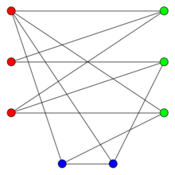
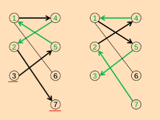

- [Typora 代码块折叠](https://blog.csdn.net/shisanxiang_/article/details/136006137)
- [董晓博客园](https://www.cnblogs.com/dx123)

# 数据结构

## 链表

### 单链表

- 作用：存储树和图

- 常用的是邻接表
  - 采用数组来模拟

### 双链表

- 作用：优化一些问题

# 图论

- 树是无环连通图
- 图的存储
  - 邻接矩阵：空间复杂度$O(n^2)$太高，不常用
  - 邻接表：常用

## 二分图

### 笔记

#### 概念

-   有两顶点集且图中每条边的的两个顶点分别位于两个顶点集中，每个顶点集中没有边直接相连接！

-   图中不含奇数环

-   说人话的定义：图中点通过移动能分成左右两部分，左侧的点只和右侧的点相连，右侧的点只和左侧的点相连。

-   下图就是个二分图：


-   下图不是个二分图：



#### 最大匹配算法

[匈牙利和KM算法](https://www.cnblogs.com/logosG/p/logos.html)

### AcWing 860. 染色法判定二分图 -2

- 20241018

[AcWing 860. 染色法判定二分图](https://www.acwing.com/problem/content/862/)

- 时间复杂度：$O(m+n)$
- 方法： 
  - [参考](https://www.cnblogs.com/dx123/p/16418198.html)
  - **如果判断一个图是不是二分图？**
    -   开始对任意一未染色的顶点染色。

    -   判断其相邻的顶点中，若未染色则将其染上和相邻顶点不同的颜色。

    -   若已经染色且颜色和相邻顶点的颜色相同则说明不是二分图，若颜色不同则继续判断。

    -   bfs和dfs可以搞定！

- 注意点:
  - 二分图的邻接表存储方法：`int e[N], ne[N], idx;//idx是边的索引，idx目标点的值，idx目标点下一个边的索引`

- `记忆模板`

```c++
#include <bits/stdc++.h>
using namespace std;

const int N = 100010 * 2;
int e[N], ne[N], idx;//idx是边的索引，idx目标点的值，idx目标点下一个边的索引
int h[N];
int color[N];//保存各个点的颜色，0 未染色，1 是红色，2 是黑色
int n, m;//点和边

void add(int a, int b)
{  
    e[idx]=b,ne[idx]=h[a],h[a]=idx++;
}

bool dfs(int u, int c)
{
    color[u]=c;
    for (int i = h[u]; i!=-1; i=ne[i])
    {
         int j =e[i];
         if(!color[j]){
            if(!dfs(j,3-c))
                return false;
         }else if(color[j]==c){
            return false;
         }
    }
    return true;
}

int main()
{
    memset(h,-1,sizeof(h));
    scanf("%d%d",&n,&m);
 
    for (int i = 1; i <=m; i++)
    {
        int a ,b;
        scanf("%d%d",&a,&b);
        add(a,b),add(b,a);
    }

    for (int i = 1; i <=n; i++)
    {
        if(!color[i])
            if(!(dfs(i,1))){
                printf("No\n");
                return 0;
            }
    }
    
    printf("Yes\n");
    return 0;
}
 
```

### AcWing 861. 二分图的最大匹配 -1

- 20241021

[AcWing 861. 二分图的最大匹配](https://www.acwing.com/problem/content/863/)

- 时间复杂度：$O(mn)$
- 方法： [参考](https://www.cnblogs.com/dx123/p/16418297.html)
  - 二分图的最大匹配
    设 G为二分图，若在 G的子图 M 中，任意两条边都没有
    公共节点，那么称 M 为二分图 G 的一组匹配。在二分图中,
    包含边数最多的一组匹配称为二分图的最大匹配。
  - 交替路:从一个未匹配点出发，依次经过非匹配边、匹配边:
    非匹配边…形成的路径叫交替路
  - 增广路:
    从一个未匹配点出发，走交替路，若能到达另一个未
    匹配点，则这条交替路称为增广路
    例如，3→5→1→4→2→7
    观察增广路，我们会发现:非匹配边比匹配边多一条。只要把
    增广路中的匹配边和非匹配边的身份交换(即倒过来走)，交
    换后，图中的匹配边数目比原来多了1条
    这里的增广路就是指能**增加匹配边的一条路**。
  - 匈牙利算法:通过不停地找增广路来增加匹配边。找不到增广
    路时，达到最大匹配。可以用 DFS 或 BFS 来实现

- 注意点
  -  关键工作：一份工作如果删掉，导致最大匹配-1
     -  关键工作一定有人做
     -  之前有工作的人后面一定还有工作

- `记忆模板`


# 数论

- 注意：
  - 公式要手推一遍
  - AcWing的OJ账号是：chris

## 质数

- `质数`与`合数`是针对`>1`的自然数定义的
- 定义：在大于1的整数中，如果只包含1和本身这两个约数，就被成为质数，或者叫素数。

### 参考

- 算法竞赛6.10
- acwing junior第四章

### ⭐️AcWing 866. 试除法判定质数 -2

- 202040923

[AcWing 866. 试除法判定质数](https://www.acwing.com/problem/content/868/)

- 时间复杂度：$O(\sqrt{n})$

- 方法：试除法
- 注意点
  - $d|n$ 和 $（n|d）|n$ 是成对出现的，所以枚举到$\sqrt{n}$就可以了
  - 但是当n是去最大的整数时会出现溢出所以推荐写成`i<=n/i`

- `记忆模板`

```c++
bool is_prime(int n){
    if (n<2)return false; 
    for (int i = 2; i <= n/i; i++)
        if (n%i==0)return false;
    return true;    
}
```

### ⭐️AcWing 867. 分解质因数 -2

- 202040923

[AcWing 867. 分解质因数](https://www.acwing.com/problem/content/869/)

- ⭐️时间复杂度：$O(\log(n))$~$O(\sqrt{n})$

- 方法：试除法
- 注意点
  - n中最多只能包含1个大于$\sqrt{n}$的质因子

- `记忆模板`

```c++
// 分解质因数（试除法）
void divide(int n){
    for (int i = 2; i <= n/i; i++)
    {
        if (n%i==0)
        {
            int s=0;
            while (n%i==0)
            {
                n/=i;
                s++;
            }

            printf("%d %d\n",i,s);            
        }        
    }
    if(n>1)printf("%d %d\n",n,1);   
} 
```

### ⭐️⭐️⭐️AcWing 868. 筛质数 -2

- 202040923

[AcWing 868. 筛质数](https://www.acwing.com/problem/content/870/)

- ⭐️⭐️时间复杂度：
  - 朴素筛法：$ln(n)+c$记做$O(nlog(n))$
  - 只筛质数的倍数(埃拉托斯特尼筛法)：记做$O(nloglog(n))$
    - 质数定理：1到$n$中有$n/ln(n)$个质数[$nln(n)/ln(n)$记做$O(n)$]
  
- 方法：枚举删除倍数，剩余的就是素数
  - `埃氏筛`法
  - `线性筛`法：

- 注意点
  - `埃氏筛`法(埃拉托斯特尼筛法)：筛质数的倍数
    - 思想重要
    - 一个合数可能是多个质数的倍数，所以会被重复筛除
  - `⭐️⭐️⭐️线性筛`法(常用)：
    1. 只会被最小质因子筛除
    2. 一定会被筛掉：如果x是合数，他一定有一个最小质因子pj，当i枚举到x/pi时就能筛掉
    3. 每个合数只有一个最小质因子，每个数都会被`最小质因子*i`筛除,`最小质因子*i`只会出现一次，所以这是`线性`的

- `记忆模板`


```c++
// 质数（埃氏筛法）
void get_primes_ai(int n){
    for (int i = 2; i <= n; i++)
    {
        if (!st[i])
        {
            primes[cnt++]=i; 
            // 这里会有重复筛除，比如12会被2筛，也会被3筛
            for (int j = i; j <= n; j+=i)st[j]=true;
        }        
    }
 
}

// 质数（linear sieve）
void get_primes_linear(int n){
    for (int i = 2; i <= n; i++)
    {
        if (!st[i])primes[cnt++]=i;
        // 这里的条件不用加j<=cnt
        // 因为当i是质数时遍历完全部的primes结束break；
        // 而当i是合数时会在最小的质因子结束，这个质因子就在primes里面;
        for (int j = 0; primes[j] <= n/i; j++)
        {
            st[primes[j]*i]=true;
            // 此时primes[j]一定是i的最小质因子；
            // 不在枚举更大的质因子筛除，保证只被最小质因子筛除，避免重复筛除
            // 这个优化是的这个筛法变成了线性
            if(i%primes[j]==0)break;
        }      
    }
}
```

## 约数

### AcWing 869. 试除法求约数 -2

- 20240924

[AcWing 869. 试除法求约数](https://www.acwing.com/problem/content/871/)

- 时间复杂度：$O(\sqrt{n})$

- 方法：试除法
- 注意点

- `模板`

```c++
// 求所有的约数（试除法）
vector<int> get_divisors(int n)
{
    vector<int> res;
    for (int i = 1; i <= n / i; i++)
        if (n % i == 0)
        {
            res.push_back(i);
            if (i != n / i)res.push_back(n / i);
        }
    sort(res.begin(),res.end());
    return res;
}
```

### AcWing 870-871. 约数个数 约数之和  -2

- 20240924

[AcWing 870. 约数个数](https://www.acwing.com/problem/content/872/)

[AcWing 871. 约数之和](https://www.acwing.com/problem/content/873/)

- 时间复杂度:$O(logn)$

- 方法：
  - 原理：对于任意整数$n=p_1^{α_1}p_2^{α_2}p_3^{α_3}\ldots p_k^{α_k}$（其中$α_i$是质因子），对应的约数可表示为$d=p_1^{γ_1}p_2^{γ_2}p_3^{γ_3}\ldots p_k^{γ_k}$(其中$γ_i\in[0,α_i]$);
  - 约数个数为：$count=(α_1+1)(α_2+1)(α_3+1)\ldots(α_k+1)$
  - 约数之和为：$sum=(p_1^{0}+p_1^{1}+p_1^{2}+\ldots+p_1^{α_1})(p_2^{0}+p_2^{1}+p_2^{2}+\ldots+p_2^{α_1})\ldots(p_k^{0}+p_k^{1}+p_k^{2}+\ldots+p_k^{α_1})$

- 注意点

- `模板`

```c++
// 求约数的个数
int count_divisors()
{
    int n;
    cin>>n;
    unordered_map<int,int> primes;
    while (n--)
    {
        int x;
        cin>>x;

        for (int i = 2; i <= x/i; i++)
        while (x%i==0)
        {
            primes[i]++;
            x/=i;
        }
    
        if (x>1)primes[x]++;
    }

    LL res=1;
    for(auto prime:primes)res=res*(prime.second+1)%mod;
  
    return res;
}

// 求约数的和
int sum_divisors()
{
    int n;
    cin>>n;
    unordered_map<int,int> primes;
    while (n--)
    {
        int x;
        cin>>x;
        
        for (int i = 2; i <= x/i; i++)
        while (x%i==0)
        {
            primes[i]++;
            x/=i;
        }
    
        if (x>1)primes[x]++;
    }

    LL res=1;
    for(auto prime:primes){
        LL sum=1;
        int a =prime.second;
        // 一个算等比数列的方法，直接用求和公式肯能会爆
        while (a--)sum=(sum*prime.first+1)%mod;
        
        res=res*sum%mod;
    }
  
    return res;
}
```

### 前n各项约数个数

- 方法：前n项的约数一定来自与前n项，逐一讨论每一项是谁的约数可以发现;$counts=1+\frac{n}{2}+\frac{n}{3}+\ldots+\frac{n}{n}$
- 注意点

- `模板`

### AcWing 872. 最大公约数(欧几里得算法) -2

- 20240924

[AcWing 872. 最大公约数](https://www.acwing.com/problem/content/874/)

- 时间复杂度：

- 方法
  - 原理：如果$d|a$并且$d|b$那么$d|(ax+bx)$其中$x,y$都是整数
  - 公式：$gcd(a,b)=gcd(b,a\mod b)$
- 注意点

- `模板`

```c++
// 最大公约数
int gcd(int a ,int b){
    return b ?gcd(b,a%b):a;
}

int main(){
    int res=gcd(6,12);

    cout<<res<<endl;
    return 0;
}
```

## 欧拉函数

- `定义`：欧拉函数$φ（n）$是指在$[1 ， n]$中与$n$互质的数的个数；例如$φ（6）=2$(1、5)
- `公式`：
  - 对于任意整数分解质因数$n=p_1^{α_1}p_2^{α_2}p_3^{α_3}\ldots p_k^{α_k}$后；
  - $φ（n）=n(1-\frac{1}{p_1})(1-\frac{1}{p_2})\ldots(1-\frac{1}{p_k})$
- `原理`：采用`容斥原理`，推理过程见视频，罗永军书中笔记
- 就是简化剩余系

### ⭐️AcWing 873. 欧拉函数(公式求欧拉函数) -2

- 20240924

[AcWing 873. 欧拉函数](https://www.acwing.com/problem/content/875/)

- 时间复杂度：取决于分解质因数$O(\sqrt{n})$

- 方法:模板题
- ⭐️注意点：
  - 只要记住公式的代码实现，分解质因数部分和之前一样

  - 防止计算结果过大可以
    - 转long long在开乘法 if(a%i==0)res=(long long)res*(i-1)/i;

    - 或者先除再乘

- `记忆模板`

```c++
int main(){  
    int n;
    cin>>n;

    while (n--)
    {
        int a ;
        cin>>a;

        int res=a;
        for (int i = 2; i <= a/i; i++)
        {
            // 记住公式的实现
            // 这里防止过大可以
            // 1.转long long在开乘法 if(a%i==0)res=(long long)res*(i-1)/i;
            // 2.或者先除再乘
            if(a%i==0)res=res/i*(i-1);
            while (a%i==0)a/=i;
        }
        if(a>1)res=res/a*(a-1);
        cout<< res<<endl;
    }

    return 0;
}
```

### ⭐️⭐️AcWing 874. 筛法求欧拉函数 -2

- 20240924

[AcWing 874. 筛法求欧拉函数](https://www.acwing.com/problem/content/876/)

- 时间复杂度：接近$O(n)$,如果用公式法是$O(n\sqrt{n})$

- 方法:
- ⭐️注意点：公式的推导要理解清楚

- `记忆模板`

```c++
LL get_eulers(int n){

    phi[1]=1;
    for (int i = 2; i <= n; i++)
    {
       if (!st[i]){
            primes[cnt++]=i;
            // 1.如果是质数
            phi[i]=i-1;
       }
        for (int j = 0; primes[j] <= n/i; j++)
        {
            st[primes[j]*i]=true;
            if (i%primes[j]==0){
                // 2.如果pj和i同质因子
                phi[primes[j]*i]=primes[j]*phi[i];
                break; 
            }
            // 3.如果pj和i不同质因子
            // 化简phi[primes[j]*i]=primes[i]* phi[i]/primes[j]*(primes[j]-1);
            phi[primes[j]*i]=phi[i]*(primes[j]-1);
        }  
    }

    LL res=0;
    for (int i = 1; i <= n; i++)
        res+=phi[i];
    return res;    
}
```

### ⭐️⭐️⭐️欧拉定理（理论）

- 定义：如果$a$与$m$互质，那么$a^{φ(m)}≡1(\mod m)$

  #### 证明

- 参考：[董晓算法](https://www.bilibili.com/video/BV1iN4y1K7ZN/)

- 举例

> 若 $\gcd(a,m)=1$,则 $a^\varphi(m)\equiv1\pmod{m}$
>
> $\begin{array}{ll}{\text{例：}}&{a=3,m=4,\text{则 3}^{\varphi(4)}\equiv3^{2}\equiv1\pmod{4}}\\&{a=3,m=5,\text{则 3}^{\varphi(5)}\equiv3^{4}\equiv1\pmod{5}}\end{array}$

- 证明

>1. 构造一个与$m$互质的序列。
>
>2. 设$\{r_1,r_2,\cdots,r_{\varphi(m)}\}$是一个模$m$的简化剩余系，
>
>3. 则$\left\{ar_1,ar_2,\cdots,ar_{\varphi(m)}\right\}$也是一个模 $m$ 的简化剩余系。这里可以利用`反证法`证明每一项都互不同余$m$,既然都不同余那么就是一个`完整的简化剩余系`（每一项在2式中都已一个项同余模$m$）；
>
>4. 然后利用同余的`乘法性质` $\prod _{i= 1}^{\varphi ( m) }r_{i}\equiv \prod _{i= 1}^{\varphi ( m) }ar_{i}\equiv a^{\varphi ( m) }\prod _{i= 1}^{\varphi ( m) }r_{i}( \mod m)$ 可 约 去 $\prod _{i= 1}^{\varphi ( m) }r_{i}$, 即 得  $a^{\varphi ( m) }\equiv 1\ (\mod m)$。
>
>5. 当 $m$为质数时，由于$\varphi(m)=m-1$,代入欧拉定理,可得到`费马小定理`$a^{m-1}\equiv1\pmod{m}$`

## 快速幂

- 问题：求$a^k \mod p$

  - 如果是原始的方法，为了防止数字溢出就需要使用循环，每一步取模；
  - 时间复杂度$O（k）$

  ```c++
   for (int i = 1; i <= k; i++)res=(res*a)%p; 
  ```


### AxWing875. 快速幂 -1

- 202040923

[AxWing875. 快速幂](https://www.acwing.com/file_system/file/content/whole/index/content/4402/)

- 时间复杂度：接近$O(log(k))$
- 方法:
- 注意点：
  	1. 公式的推导要理解清楚
  	1. 注意在乘法之前先转LL，防止溢出；取模之后再交给int接收
- `记忆模板`
  - 3行代码要记住

```c++
// 模板acwing 875 a^k % p
int qmi(int a,int k ,int p)
{
    int res=1;

    while (k)
    {
        //注意在乘法之前先转LL，防止溢出；取模之后再交给int接收
        if(k&1)res=(LL)res*a%p;
        k>>=1;
        a=(LL)a*a%p;
    }
    
    return res;
}
```

### AxWing876.快速幂求逆元 -1

- 202040923

[AxWing876.快速幂求逆元](https://www.acwing.com/file_system/file/content/whole/index/content/4403/)

- 定义
  - 逆元（Multiplicative Inverse）是数论中的一个重要概念，主要用于模运算中。在一个给定的模$m$ 下，如果存在一个整数 $b$，使得 $a⋅b≡1(\mod m)$，那么$b$ 就称为 $a$ 在模$m$ 下的逆元。简而言之，逆元就是满足乘法单位元性质的数。
  - 或者：$a|b≡ax(\mod m)$，则称 $x$ 为 $b$ 的模 $m$ 乘法逆元，记为 $b^{-1}(\mod m)$。
- 解法
  - 费马小定理（Fermat's Little Theorem）：如果 $m$是一个素数，且 $gcd(a,m)=1$ ，那么 $a$在模 $m$下的逆元可以通过费马小定理求得： $aa^{m−2}≡1(\mod m)$
- 注意点：`不需要判断互质`,题目已经给定p是质数,a如果与质数p不互质,表示a是p的倍数

```c++
int qmi(int a,int k ,int p)
{
    int res=1;

    while (k)
    {
    if (k&1)res=(LL)res*a%p;
    k>>=1;
    a=(LL)a*a%p;
    }
 
    return res;
}

 int main(){  

    int n;
    scanf("%d",&n);
    while(n--){
        int a , k ,p;
        scanf("%d%d",&a,&p);

        int res=qmi(a,p-2,p);
        //不需要判断互质,题目已经给定p是质数,a如果与质数p不互质,表示a是p的倍数
        if(a%p)printf("%d\n",res);
        else puts("impossible");
    }
    return 0;
}
```

## 扩展欧几里得算法

### 裴蜀定理

- 定义：设$a,b$是不全为零的整数，对任意整数$x,y$，满足$gcd(a,b)|ax+by$，且存在整数$x,y$, 获得最小的正整数（1倍），使得$ax+by=\gcd(a,b)$.

### AcWing 877. 扩展欧几里得算法 -1

- 20240925

[AcWing 877. 扩展欧几里得算法](https://www.acwing.com/problem/content/879/)

- `原理`：

>用于求解方程 $ax+by=gcd(a,b)$ 的解
>
>当 $b=0$时 $ax+by=a$ 故而 $x=1,y=0$
>
>当 $b≠0 $时
>
>因为  
>
>$gcd(a,b)=gcd(b,a \% b)$
>
>而
>
>$bx′+(a\%b)y′=gcd(b,a\%b)$
>
>$bx′+(a−⌊a/b⌋∗b)y′=gcd(b,a\%b)$
>
>$ay′+b(x′−⌊a/b⌋∗y′)=gcd(b,a\%b)=gcd(a,b)$
>
>故而
>
>$x=y′,y=x′−⌊a/b⌋∗y′$
>
>- 通解
>
>  $\begin{cases} x=x'+k\frac{b}{d} \\
>  y=y'-k\frac{a}{d}\end{cases} ,k\in Z $


- `注意点`：递归传进去的x,y是个临时变量，计算的结果是x′,y′，出来的时候转回x,y

- `记忆模板`

```c++
int exgcd(int a, int b, int &x, int &y)
{
    if(!b)
    {
        x=1;
        y=0;
        return a;
    }

    // 理解代码1,2,3的一致性
    // int _x,_y;
    // int d=exgcd(b,a%b,_x,_y);
    // x=_y;
    // y=_x-a/b*_y;

    // int d=exgcd(b,a%b,x,y);
    // x=y;
    // y=x-a/b*y;

    int d=exgcd(b,a%b,y,x);
    y-=a/b*x;
        
    return d;
}
```

### AcWing 878. 线性同余方程 -1

- 20240925

[AcWing 878. 线性同余方程](https://www.acwing.com/problem/content/880/)

- `原理`

>因为$a∗x≡b(\mod m)$等价于 $a∗x−b$是$m$的倍数，因此线性同余方程等价为 $a∗x+m∗y=b$
>
>根据 Bezout 定理，上述等式有解当且仅当 $gcd(a,m)|b$
>
>因此先用扩展欧几里得算法求出一组整数 $x_0,y_0$, 使得 $a∗x_0+m∗y_0=gcd(a,m)$。 然后 $x=x_0∗b/gcd(a,m) \mod m$ 即是所求

`记忆模板`

```c++
int a, b,m, x, y;
scanf("%d%d%d", &a, &b,&m);
int d =exgcd(a, m, x, y);
if(b%d!=0)puts("impossible");
else printf("%d\n",x*b/d%m);
```

## 中国剩余定理

- `定义`

  >设$n_1,n_2,\ldots,n_k$是两两互素的正整数，即$\gcd(n_i,n_j)=1$对于所有$i\neq j$。考虑以下同余方程组：
  >
  >$$\begin{cases}x\equiv a_1\pmod{n_1}\\x\equiv a_2\pmod{n_2}\\\vdots\\x\equiv a_k\pmod{n_k}\end{cases}$$
  >
  >- 求解步骤
  >
  >1. 计算$N:$
  >
  >$$N=n_1\times n_2\times\cdots\times n_k$$
  >
  >2. 计算$N_i:$
  >
  >$$N_i=\frac{N}{n_i}$$
  >
  >即$N_i$是$N$除以$n_i$的商。
  >
  >3. 计算 $t_i:$
  >
  >$$t_i\equiv N_i^{-1}\pmod{n_i}$$
  >
  >即$t_i$是$N_i$在模$n_i$下的逆元。可以通过扩展欧几里得算法(Extended Euclidean Algorithm) 来求解$t_i$。
  >
  >4. 构造解$x:$
  >
  >$$x=\sum_{i=1}^ka_i\cdot N_i\cdot t_i\pmod N$$

### AcWing 204. 表达整数的奇怪方式 -1

- 20240925

[AcWing 204. 表达整数的奇怪方式](https://www.acwing.com/problem/content/206/)

- 解法：

  > - 同余式转方程
  >
  > - 两两合并方程
  >
  > - 求出最小正整数解
  >
  >   $x≡m_1(\mod a_1)\\x≡m_2(\mod a_2) $$\Rightarrow$ $x=k_1a_1+m_1\\x=k_2a_2+m_2$$\Rightarrow k_1a_1-k_2a_2=m2-m1$
  >
  >   ​	通解$k_1=k_1+k\frac{a_2}{d} \\ k_2=k_2+k\frac{a_1}{d}$
  >
  >   - 带入方程$x=k_1a_1+m_1 \Rightarrow $新方程$x_0=k[a_1,a_2]+k_1a_1+m_1$
  >   - $[a_1,a_2]$是最小公倍数，迭代的次数越多，越大。

  

- 注意
  - $k*a1+m1$的最小正整数解是`(m1%a1+a1)%a1`
  - `a1=a1*a2/d;`这里一定要先除后乘防止数据溢出
  - `printf("%lld",(m1%a1+a1)%a1);`打印long long

- `代码`

```c++
#include <bits/stdc++.h>
using namespace std;

typedef long long LL;

LL exgcd(LL a,LL b ,LL &x,LL &y){

    if(!b){
        x=1,y=0;
        return a;
    }

    LL d=exgcd(b,a%b,y,x);
    y-=a/b*x;
    return d;
}

int main(){
    int n;
    scanf("%d",&n);

    LL a1,m1;
    scanf("%d%d",&a1,&m1);

    for (int i = 0; i < n-1; i++)
    {
        LL a2,m2;
        scanf("%d%d",&a2,&m2);
        LL k1,k2;
        LL d =exgcd(a1,a2,k1,k2);
        if((m2-m1)%d!=0){
            puts("-1");
            return 0;
        }
        
        k1*=(m2-m1)/d;
        int t=a2/d;
        // 最小正整数解
        k1=(k1%t+t)%t;
        m1+=k1*a1;
        // 最小公倍数，迭代的次数越多，越大
        //一定要先除后乘
        a1=a1*a2/d;
    }

    // k*a1+m1的最小正整数解
    // 打印long long
    printf("%lld",(m1%a1+a1)%a1);
    return 0;
}
```


## 高斯消元

### AcWing 883. 高斯消元解线性方程组 -1

- 20240925

[AcWing 883. 高斯消元解线性方程组](https://www.acwing.com/problem/content/885/)

- 初等行变换

> 矩阵的初等行变换是实现高斯消元的方法
> 初等行变换有三种
>
> 1. 某一行所有数乘$k(k≠0)$
>
> 2. 交换某两行
>
> 3. 将某一行加上另一行的若干倍

# 组合

