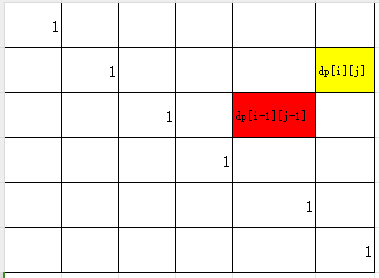
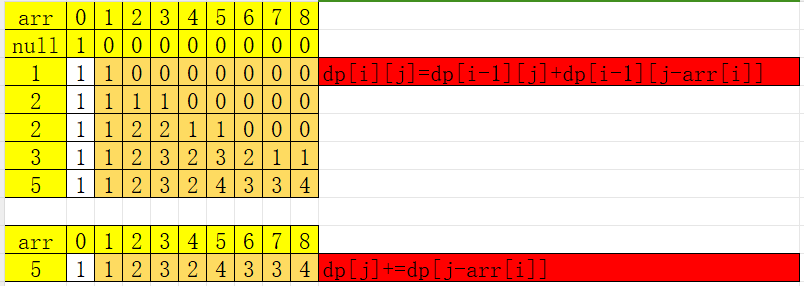

- [Typora 代码块折叠](https://blog.csdn.net/shisanxiang_/article/details/136006137)

# 数论

## 质数

- `质数`与`合数`是针对`>1`的自然数定义的
- 定义：在大于1的整数中，如果只包含1和本身这两个约数，就被成为质数，或者叫素数。

### 试除法（判定）

- d|n


## 堆排序(3)

### 笔记(⭐️⭐️⭐️)

- 适合解决前k个、第k个这种不需要整个数组排序，只用排一部分的题目。

- 堆排序特点：
  1. 完全二叉树+所有父节点val>子节点val
     - [满二叉树、完全二叉树、二叉搜索树、平衡二叉树](https://zhuanlan.zhihu.com/p/106828968)
  2. 节点i的父节点=（i-1）// 2，两个子节点c1=2i+1、c2=2i+2

- 堆排序步骤
  - 构建堆：逆序调整堆
  - 调整堆：交换有序部分后，调整nums[0]

[视频讲解堆排序](https://www.bilibili.com/video/av47196993?from=search&seid=4351042127032790802&rt=V%2FymTlOu4ow%2Fy4xxNWPUZ21pzQFbVqcJSjKcQx%2BMqj0%3D)

#### ⭐️手撕堆排序 -1

- 20240903

```python
# 调整堆
def heapify(tree, n, i): 
    l_index=2*i+1
    r_index=2*i+2
    max_index=i
    if l_index<n and tree[i]<tree[l_index]:max_index=l_index#这里改小堆
    if r_index<n and tree[max_index]<tree[r_index]:max_index=r_index
    if max_index!=i:
        tree[i],tree[max_index]=tree[max_index],tree[i]
        heapify(tree,n,max_index)

# 构建堆    
def build_heap(tree, n):    
    last_index=(n-2)//2
    for i in range(last_index,-1,-1):
        heapify(tree,len(nums),i)

# 堆排序    
def heap_sort(tree, n):
    build_heap(tree,len(nums))
    for i in range(n-1,0,-1):
        tree[0],tree[i]=tree[i],tree[0]
        heapify(tree,i,0)


nums=[3,2,1,5,6,4]    
heap_sort(nums, len(nums))   
print(nums) 
```

#### python API

```python
heapq.heapify(nums)   # 第一种掉包排序实现（建立最小堆）
hp = []
for num in nums:      # 第二种掉包堆排序实现（建立最小堆）
    heapq.heappush(hp, num)   # push进一个元素 堆还是维护小顶堆

min_val = heapq.heappop()  # 弹出堆顶元素（最小值） 堆还是维护小顶堆
```


### LeetCode215.数组中的第K个最大元素（⭐️⭐️⭐️高频、HOT100 腾讯）-1

- 20240903

[LeetCode215.数组中的第K个最大元素](https://leetcode-cn.com/problems/kth-largest-element-in-an-array/)

```python
class Solution:
    # 1、堆排序手写实现 
    def findKthLargest1(self, nums: List[int], k: int) -> int:
        l=len(nums)
        def heapify(tree, n, i): 
            l_index=2*i+1
            r_index=2*i+2
            max_index=i
            if l_index<n and tree[i]>tree[l_index]:max_index=l_index#这里改小堆
            if r_index<n and tree[max_index]>tree[r_index]:max_index=r_index
            if max_index!=i:
                tree[i],tree[max_index]=tree[max_index],tree[i]
                heapify(tree,n,max_index)

        # 构建堆    
        def build_heap(tree, n):    
            last_index=(n-2)//2
            for i in range(last_index,-1,-1):
                heapify(tree,n,i)

        hp=nums[:k]
        build_heap(hp,k)
        for i in range(k,len(nums)):
            if nums[i]>hp[0]:
                hp[0]=nums[i]
                heapify(hp,k,0)
    
        return hp[0]
    
    # 2、API实现
    def findKthLargest2(self, nums: List[int], k: int) -> int:  
        import heapq
        
        hp=nums[0:k]
        heapq.heapify(hp)
        
        for i in range(k,len(nums)):
            if nums[i]>hp[0]:
                heapq.heappop(hp)
                heapq.heappush(hp,nums[i])
        
        return hp[0]
```

### 面试题 17.14. 最小K个数（⭐️高频）-1
- 20240903

[面试题 17.14. 最小K个数](https://leetcode-cn.com/problems/smallest-k-lcci/)

```python
class Solution:
    def smallestK(self, arr: List[int], k: int) -> List[int]: 
        if not k or not arr:return []
        import heapq
        arr=[-1*i for i in arr]
        hp=arr[:k]
        heapq.heapify(hp)
        
        for i in range(k,len(arr)):
            if arr[i]>hp[0]:
                heapq.heappop(hp)
                heapq.heappush(hp,arr[i])
        return [-1*i for i in hp]
```


### Leetcode347. 前 K 个高频元素（⭐️⭐️HOT100）-1

- 20240903

[Leetcode347. 前 K 个高频元素](https://leetcode-cn.com/problems/top-k-frequent-elements/)

```python
class Solution:
    def topKFrequent(self, nums: List[int], k: int) -> List[int]:
        def heapify(tree, n, i): 
            l_index=2*i+1
            r_index=2*i+2
            max_index=i
            if l_index<n and tree[i][1]>tree[l_index][1]:max_index=l_index#这里改小堆
            if r_index<n and tree[max_index][1]>tree[r_index][1]:max_index=r_index
            if max_index!=i:
                tree[i],tree[max_index]=tree[max_index],tree[i]
                heapify(tree,n,max_index)

        # 构建堆    
        def build_heap(tree, n):    
            last_index=(n-2)//2
            for i in range(last_index,-1,-1):
                heapify(tree,n,i)

        if not nums or not k: return []
        
        mapp = defaultdict(int)
        for i in range(len(nums)):
            mapp[nums[i]] += 1
        arr = list(mapp.items())  # [(1, 3), (2, 2), (3, 1)]

        hp=arr[:k]
        build_heap(hp,k)
        for i in range(k,len(arr)):
            if arr[i][1]>hp[0][1]:
                hp[0]=arr[i]
                heapify(hp,k,0)
    
        return [i[0] for i in hp]
```

## 快排(2)
### 笔记(⭐️⭐️⭐️)

#### ⭐️手撕代码 -1

- 20240904

```python
def Quick_Sort(nums: List[int],left:int,right:int) -> str:
    if left>=right:return
    l,r,pivot=left,right,left
    
    while l<r:
        # pay attention to the order: right first,then left
        # right greater than pivot
        while l<r and nums[r]>nums[pivot]:
            r-=1
        # left smaller and equal than pivot,because use the left as the pivot 因为使用左边作为支点
        while l<r and nums[l]<=nums[pivot]:
            l+=1
        
        nums[l],nums[r]=nums[r],nums[l]
        
    nums[pivot],nums[l]=nums[l],nums[pivot]
    Quick_Sort(nums,left,l-1)
    Quick_Sort(nums,l+1,right)
```

### 剑指 Offer 45. 把数组排成最小的数 -1

- 20240904
- 使用了快排和归并，快排效率高点

[剑指 Offer 45. 把数组排成最小的数](https://leetcode-cn.com/problems/ba-shu-zu-pai-cheng-zui-xiao-de-shu-lcof/)

```python
class Solution:
    def crackPassword1(self, password: List[int]) -> str:
        def quick_sort(nums,left,right):
            if left>=right:return        
            l,r,p=left,right,left
            
            while l<r:
                # 目标是：有序的结果最小，符合要求就不用交换
                while l<r and (nums[p]+nums[r])<(nums[r]+nums[p]):
                    r-=1
                while l<r and (nums[l]+nums[p])<=(nums[p]+nums[l]):
                    l+=1
                
                nums[l],nums[r]=nums[r],nums[l]
            
            nums[p],nums[l]=nums[l],nums[p]
            
            quick_sort(nums,left,l-1)
            quick_sort(nums,l+1,right)
            
        mapp=list(map(str, password))
        # mapp=[str(i) for i in password]
        quick_sort(mapp,0,len(mapp)-1)
        return "".join(mapp)
    
    
    def crackPassword2(self, password: List[int]) -> str:
        def merge(left, right):
            len_l,len_r=len(left),len(right)
            merge_arr=[0 for _ in range(len_r+len_l)]
            while len_l and len_r:
                # 什么应该排在前面,前面+后面更小
                if left[len_l-1]+right[len_r-1]>right[len_r-1]+left[len_l-1]:
                    merge_arr[len_r+len_l-1]=left[len_l-1]
                    len_l-=1
                else:
                    merge_arr[len_r + len_l - 1] = right[len_r - 1]
                    len_r -= 1
            if len_l:
                merge_arr[:len_l]=left[:len_l]
            else:
                merge_arr[:len_r]=right[:len_r]

            return merge_arr


        def merge_sort(nums):
            length=len(nums)
            if length<=1 :return nums
            mid=length//2
            # 拆
            left=merge_sort(nums[:mid])
            # 合
            right=merge_sort(nums[mid:])
            return merge(left, right)
        
        mapp=list(map(str, password))
      
        return "".join(merge_sort(mapp))
```

### Leetcode179. 最大数（⭐️高频）-1

- 20240904
- 注意：特例[0,0,0]

[Leetcode179. 最大数](https://leetcode-cn.com/problems/largest-number/)

```python
class Solution:
    def largestNumber(self, nums: List[int]) -> str:
        def quick_sort(nums,left,right):
            if left>=right:return        
            l,r,p=left,right,left
            
            while l<r:
                # 目标是：有序的结果最小，符合要求就不用交换
                while l<r and (nums[p]+nums[r])>(nums[r]+nums[p]):
                    r-=1
                while l<r and (nums[l]+nums[p])>=(nums[p]+nums[l]):
                    l+=1
                
                nums[l],nums[r]=nums[r],nums[l]
            
            nums[p],nums[l]=nums[l],nums[p]
            
            quick_sort(nums,left,l-1)
            quick_sort(nums,l+1,right)

        mapp=[str(i) for i in nums]
        quick_sort(mapp,0,len(mapp)-1)
        # nonzeroindex=-1
        # for i in range(len(mapp)):
        #     if mapp[i]!="0":
        #         nonzeroindex=i
        #         break
        # 针对特例[0,0,0]
        nonzeroindex=0
        while mapp[nonzeroindex]=="0" and nonzeroindex<len(nums)-1:
            nonzeroindex+=1
        return "".join(mapp[nonzeroindex:])
```

## 7.3、归并排序(1)
### 笔记(⭐️⭐️⭐️)

- 分治法：先分在治，核心就是对有序的序列两两合并，见【**LeetCode21: 合并两个有序链表**】
- 常用在链表排序

#### ⭐️手撕代码 -1

- 20240903

```python
def merge(left, right):
    len_l,len_r=len(left),len(right)
    merge_arr=[0 for _ in range(len_r+len_l)]
    while len_l and len_r:
        if left[len_l-1]>right[len_r-1]:
            merge_arr[len_r+len_l-1]=left[len_l-1]
            len_l-=1
        else:
            merge_arr[len_r + len_l - 1] = right[len_r - 1]
            len_r -= 1
    if len_l:
        merge_arr[:len_l]=left[:len_l]
    else:
        merge_arr[:len_r]=right[:len_r]

    return merge_arr


def merge_sort(nums):
    length=len(nums)
    if length<=1 :return nums
    mid=length//2
    # 拆
    left=merge_sort(nums[:mid])
    # 合
    right=merge_sort(nums[mid:])
    return merge(left, right)

if __name__ == '__main__':
    nums = [4, 2, 3, 6, 1, 7]
    nums = merge_sort(nums)
    print(nums)  
```
```c
#include <iostream>
using namespace std;

void merge(int arr[],int star,int mid,int end ){
    int i=star,j=mid+1;
    int *result=new int[end-star+1];
    int *p=result;
    while (i<=mid && j<=end)
    {
       if (arr[i]<arr[j])
       {
        *result=arr[i];
        i++;
       }else{
        *result=arr[j];
        j++;
       }
       result++;
    }

    while (i<=mid)
    {
        *result=arr[i];
        i++;
        result++;
    }

    while (j<=end)
    {
        *result=arr[j];
        j++;
        result++;
    }

    while (star<=end)
    {
        arr[star]=*p;
        star++;
        p++;
    }
}

void merge_sort(int arr[],int star, int end ){
    if(star<end){
        int mid =(star+end)/2;
        merge_sort(arr,star,mid);
        merge_sort(arr,mid+1,end);
        merge(arr,star,mid,end);
    }
}

int main (){
    int arr[]={2,1,77,8,0,3};

    merge_sort(arr,0,sizeof(arr)/sizeof(int)-1);

    for (int i = 0; i < sizeof(arr)/sizeof(int); i++)
    {
       cout<<arr[i]<<endl;
    }
    
    return 0;
}
```
### LeetCode148: 排序链表（⭐️⭐️⭐️高频、剑指II、HOT100 腾讯） -1

- 20240904

[LeetCode148: 排序链表](https://leetcode.cn/problems/sort-list/description/)

```python
class Solution:
    def sortList(self, head: Optional[ListNode]) -> Optional[ListNode]:
        if not head or not head.next:return head
        dummy=ListNode(-10,head)
        
        pre,cur=dummy,dummy
        
        while cur.next and cur.next.next:
            pre=pre.next
            cur=cur.next.next

        cur=pre.next
        pre.next=None
        left=self.sortList(dummy.next)
        right=self.sortList(cur)
        
        return self.merge(left,right)
    
    def merge(self, left: Optional[ListNode], right: Optional[ListNode]) -> Optional[ListNode]:
        dummy=ListNode(-1)
        
        r,l,cur=left,right,dummy
        
        while l and r:
            if l.val<r.val:
                cur.next=l
                l=l.next
            else:
                cur.next=r
                r=r.next
            cur=cur.next
        if l:cur.next=l
        else:cur.next=r
        
        return dummy.next
```


# 八、动态规划（33）

## 8.0 基础理论（⭐️⭐️⭐️）

[视频教程](https://www.bilibili.com/video/BV12W411v7rd/?spm_id_from=333.999.0.0&vd_source=6bcccf10adf3fa505b41acbe0da77a56)

### 1.⭐️⭐️计算最大不相邻数的和（⭐️⭐️）（[LeetCode198. 打家劫舍](https://leetcode.cn/problems/house-robber/)）

- 解法：

  - recursive（DFS）：（想清楚那一棵树）
  - dp

  | [1,2,4,1,7,8,3] | **1** | **2** | **4** | **1** | **7** | **8** | **3** |
  | :-------------: | :---: | :---: | :---: | :---: | :---: | :---: | ----- |
  |                 |   1   |   2   |   5   |   5   |  12   |  13   | 15    |

```python
import numpy as np

arr=[1,2,4,1,7,8,3]

def rec_opt(arr,i):
    if i==0:
        return arr[0]
    if i==1:
        return max(arr[0],arr[1])
    a=arr[i]+rec_opt(arr,i-2)
    b=rec_opt(arr,i-1)
    return max(a,b)

def dp_opt(arr):
    opt=np.zeros(len(arr))

    # 1.initialize
    opt[0]=arr[0]
    opt[1]=max(arr[0],arr[1])

    # 2.iterate dp
    for i in range(2,len(arr)):
        opt[i]=max(arr[i]+opt[i-2],opt[i-1])
    
    return opt[-1]

if __name__ == '__main__':
    # result=rec_opt(arr,6)
    result=dp_opt(arr)
    print(result)
```
### 2.⭐️⭐️⭐️和能否组成目标数（⭐️⭐️⭐️）-2

- 20240603

和上面同一个视频讲解

- 解法：

  - recursive（DFS）：（想清楚那一棵树）这里的递归需要理解出口，只需判断了a[i]
  - dp

  |        | **0** | **1** | **2** | **3** | **4** | **5** | **6** | **7** | **8** | **9** |
  | ------ | ----- | ----- | ----- | ----- | ----- | ----- | ----- | ----- | ----- | ----- |
  | **3**  | TRUE  | FALSE | FALSE | TRUE  | FALSE | FALSE | FALSE | FALSE | FALSE | FALSE |
  | **34** | TRUE  | FALSE | FALSE | TRUE  | FALSE | FALSE | FALSE | FALSE | FALSE | FALSE |
  | **4**  | TRUE  | FALSE | FALSE | TRUE  | TRUE  | FALSE | FALSE | TRUE  | FALSE | FALSE |
  | **12** | TRUE  | FALSE | FALSE | TRUE  | TRUE  | FALSE | FALSE | TRUE  | FALSE | FALSE |
  | **5**  | TRUE  | FALSE | FALSE | TRUE  | TRUE  | TRUE  | FALSE | TRUE  | TRUE  | TRUE  |
  | **2**  | TRUE  | FALSE | TRUE  | TRUE  | TRUE  | TRUE  | TRUE  | TRUE  | TRUE  | TRUE  |

```python
import numpy as np

arr=[3,34,4,12,5,2]
target=9

def rec_opt(arr,tar,i):
    if arr[i]==tar:
        return [i]
    elif i>1:
        result1=rec_opt(arr,tar-arr[i],i-1)
        result2 = rec_opt(arr, tar, i - 1)
        if result1:
            return [i,*result1]
        elif result2:
            return [ *result2]
        else:
            return None
    if i==0:
        return None

def dp_opt(arr,tar):
    opt=np.zeros((len(arr),tar+1),dtype=bool)
    opt[:,0]=True
    opt[0,arr[0]]=True
    for i in range(1,len(arr)):
        for j in range(1,tar+1):
            if opt[i-1][j]==True:
                opt[i][j]=True
            elif j>=arr[i] and opt[i-1][j-arr[i]]==True:
                 opt[i][j] = True
    x,y=opt.shape
    return opt[x-1,y-1]


if __name__ == '__main__':
    # result=rec_opt(arr,9,5)
    result = dp_opt(arr, 9)
    print(result)
```

## 8.1、普通动规系列
### LeetCode343. 整数拆分（⭐️高频）-2

- 20240610

 [LeetCode343. 整数拆分](https://leetcode.cn/problems/integer-break/submissions/)
- 注意:容易多填写一半
```python
class Solution:
    def integerBreak(self, n: int) -> int:
      dp=[0]*(n+1)
      dp[1]=1
      dp[2]=1

      for i in range(3,n+1):
         for j in range(1,i):
            a=j*(i-j)
            b=dp[j]*(i-j)
            dp[i]=max(dp[i],a,b)
      return dp
```
### LeetCode70. 爬楼梯（⭐️Hot100 腾讯）-2

- 20240610

[LeetCode70. 爬楼梯](https://leetcode.cn/problems/climbing-stairs/)

```python
class Solution:
    def climbStairs(self, n: int) -> int:
        if n<2:
            return n
        dp=[0]*(n+1)
        dp[1]=1
        dp[2]=2

        for i in range(3,n+1):
            dp[i]=dp[i-1]+dp[i-2]
        return dp[-1]
```

### LeetCode96. 不同的二叉搜索树(思路清奇）-2

- 20240610

[LeetCode96. 不同的二叉搜索树](https://leetcode.cn/problems/unique-binary-search-trees/)
[视频讲解](https://www.bilibili.com/video/BV1Qf4y1K72t/?spm_id_from=333.337.search-card.all.click&vd_source=ce61818c8667e3f2de36a179a3c6e3af)

```python
class Solution:
    def numTrees(self, n: int) -> int:
        if n<2:
            return 1
        dp=[0]*(n+1)
        dp[0]=1
        dp[1]=1
        dp[2]=2

        for i in range(3,n+1):
            for j in range(0,i):
                dp[i]+=dp[j]*dp[i-j-1]
        return dp[-1]
```

## 8.2、路径规划系列
### LeetCode62. 不同路径（⭐️Hot100 腾讯）-2

- 20240610

 [LeetCode62. 不同路径](https://leetcode.cn/problems/unique-paths/)
 ```python
 class Solution:
     def uniquePaths1(self, m: int, n: int) -> int:
         dp= np.zeros((m,n),dtype=int)
         dp[:,0]=1
         dp[0,:]=1
 
         for i in range(1,m):
             for j in range(1,n):
                 dp[i,j]=dp[i-1,j]+dp[i,j-1]
         
         return int(dp[-1,-1])
     
     def uniquePaths2(self, m: int, n: int) -> int:
         s=1
         b=1
         for i in range(m,m+n-1):
             s*=i
         for j in range(2,n):
             b*=j
         return  s/b
 ```

### LeetCode63. 不同路径 II（⭐️高频）-2
- 20240610

[LeetCode63. 不同路径 II](https://leetcode.cn/problems/unique-paths-ii/)

```python
        m,n=len(obstacleGrid),len(obstacleGrid[0])
        if m==0 or n==0 or not obstacleGrid:return 0
        dp=[[0 for _ in range(n)]for _ in range(m)]

        for i in range(n):
            if obstacleGrid[0][i]==1:
                break
            dp[0][i]=1

        for i in range(m):
            if obstacleGrid[i][0]:
                break
            dp[i][0]=1
        for i in range(1,m):
            for j in range(1,n):
                if obstacleGrid[i][j]==1:
                    dp[i][j]=0
                else:
                    dp[i][j]=dp[i-1][j]+dp[i][j-1]
        return  dp[m-1][n-1]
```
### ⭐️⭐️⭐️LeetCode64.最小路径和（⭐️⭐️⭐️高频 Hot100）-2
- 20240611

[LeetCode64.最小路径和](https://leetcode.cn/problems/minimum-path-sum/)
```python
    def minPathSum(self, grid: List[List[int]]) -> int:
        m,n=len(grid),len(grid[0])
        if m==0 or n==0 or not grid:return 0
        dp=[[0 for _ in range(n)] for _ in range(m)]
        dp[0][0]=grid[0][0]
        for i in range(1,m):
            dp[i][0]=dp[i-1][0]+grid[i][0]

        for i in range(1,n):
            dp[0][i]=dp[0][i-1]+grid[0][i]

        for i in range(1,m):
            for j in range(1,n):
                dp[i][j]=min(dp[i-1][j],dp[i][j-1])+grid[i][j]

        return  dp[m-1][n-1]
```
### ⭐️⭐️⭐️LeetCode221. 最大正方形（⭐️⭐️⭐️Hot100）-2
- 20240611

[ LeetCode221. 最大正方形](https://leetcode.cn/problems/maximal-square/)

- 转移方程比较难想:dp[i][j]表示以(i,j)为右下角形成的正方形的最大边长是多少

```python
class Solution:
    def maximalSquare(self, matrix: List[List[str]]) -> int:
        m,n=len(matrix),len(matrix[0])
        if m==0 or n==0 or not matrix:return 0
        # dp[i][j]表示以(i,j)为右下角形成的正方形的最大边长是多少
        dp=[[0 for _ in range(n)] for _ in range(m)]

        max_edge=0
        for i in range(m):
            for j in range(n):
                if i==0 or j==0:
                    dp[i][j]=int(matrix[i][j])
                elif int(matrix[i][j])==1:
                    dp[i][j]=min(dp[i-1][j-1],dp[i-1][j],dp[i][j-1])+1
                max_edge=max(max_edge,dp[i][j])
            
        return max_edge**2
```
## 8.3、打家劫舍系列
### LeetCode198. 打家劫舍（⭐️⭐️Hot100）-4

- 20240603 20240604 20240729

[LeetCode198. 打家劫舍](https://leetcode.cn/problems/house-robber/)

- 注意递归会超时

```python
class Solution:
    def rob(self, nums: List[int]) -> int:
        if not nums :return 0
        if len(nums)==1:return nums[0]
        dp=[0 for _ in range(len(nums))]
        dp[0]=nums[0]
        dp[1]=max(nums[1],dp[0])
        if len(nums)>2:
            for i in range(2,len(nums)):
                dp[i]=max(nums[i]+dp[i-2],dp[i-1])

        return dp[len(nums)-1]
```
### LeetCode213. 打家劫舍 II（⭐️⭐️高频）-3
- 20240611 20240729

[LeetCode213. 打家劫舍 II](https://leetcode.cn/problems/house-robber-ii/)

- 注意递归会超时
- 包含第一个，和不包含第一个两种情况，第一种情况可以直接用不包含最后一个来代替（有一个子集已经含在第二种情况了）

```python
class Solution:
    def dp(self,nums: List[int]):
        if not nums :return 0
        if len(nums)==1:return nums[0]
        dp=[0 for _ in range(len(nums))]
        dp[0]=nums[0]
        dp[1]=max(nums[1],dp[0])
        if len(nums)>2:
            for i in range(2,len(nums)):
                dp[i]=max(nums[i]+dp[i-2],dp[i-1])

        return dp[len(nums)-1]
    
    def rob(self, nums: List[int]) -> int:
        if not nums :
            return 0
        if len(nums)<3:
            return max(nums)
        
        result1=self.dp(nums[1:])
        result2=self.dp(nums[0:-1])

        return max(result1,result2)
```
### ⭐️⭐️LeetCode337. 打家劫舍 III（⭐️树形dp Hot100）-2

- 20240611 20240729

[LeetCode337. 打家劫舍 III](https://leetcode.cn/problems/house-robber-iii/)

[树形DP视频教程](https://www.bilibili.com/video/BV1vu4y1f7dn/?vd_source=ce61818c8667e3f2de36a179a3c6e3af)

```python
class Solution:      
    def rob(self, root: Optional[TreeNode]) -> int:
        def dfs(root:TreeNode):
            if not root:
                return 0,0
            r_rob,r_not_rob=dfs(root.right)
            l_rob,l_not_rob=dfs(root.left)
            return root.val+r_not_rob+l_not_rob,max(r_rob,r_not_rob)+max(l_rob,l_not_rob)
        return max(dfs(root))
```

## 8.4、股票问题系列

- 121、122、714、309是同一类问题；123、188是同一类问题。

### ⭐️⭐️LeetCode.121 买卖股票的最佳时机（⭐️⭐️Hot100 腾讯）-2

- 20240612 20240729

[LeetCode.121 买卖股票的最佳时机](https://leetcode.cn/problems/best-time-to-buy-and-sell-stock/description/)

- dp的方法比较难理解，只允许买一次，那么持股的最大余钱就是（之前的，-当前股价）

```python
class Solution:
    # method1:dp
    def maxProfit1(self, prices: List[int]) -> int:
        if len(prices)<2:
            return 0
        dp=[[0 for _ in range(2)] for _ in range(len(prices))]
        dp[0][0]=0#不持股最大剩余
        dp[0][1]=-prices[0]#持股最大剩余
        
        for i in range(1,len(prices)):
            #dp[i-1][1]+prices[i],如果下面积累了之前的收益,会从这里累加进去
            dp[i][0]=max(dp[i-1][0],dp[i-1][1]+prices[i])
            #这里不能写成dp[i-1][0]-prices[i],这样会积累前面买卖股票的收益（只能持股一次）
            dp[i][1]=max(dp[i-1][1],-prices[i])
           
        return dp[-1][0]
    
    # method2:dp
    def maxProfit2(self, prices: List[int]) -> int:
        
        maxprices=[0 for _ in range(len(prices))]
        maxprices[-1]=prices[-1]
        for i  in range(len(prices)-2,-1,-1):
            maxprices[i]=max(maxprices[i+1],prices[i])
            
        maxp=np.asarray(maxprices)-np.asarray(prices)
        return int(max(maxp))
    
    # method3:greedy
    def maxProfit3(self, prices: List[int]) -> int:
        low,profit=sys.maxsize,0
        
        for price in prices:
            low=min(low,price)
            profit=max(profit,price-low)

        return profit
```

### ⭐️⭐️LeetCode.122. 买卖股票的最佳时机 II（⭐️⭐️ 腾讯 HOT100）-2

- 20240612 20240729

[LeetCode.122. 买卖股票的最佳时机 II](https://leetcode.cn/problems/best-time-to-buy-and-sell-stock-ii/description/)

- 解法：
  - dp
  - greedy

```python
class Solution:
    # method1:dp
    def maxProfit1(self, prices: List[int]) -> int:
        if len(prices)<2:
            return 0
        dp=[[0 for _ in range(2)] for _ in range(len(prices))]
        dp[0][0]=0#不持股最大剩余
        dp[0][1]=-prices[0]#持股最大剩余
        
        for i in range(1,len(prices)):
            #dp[i-1][1]+prices[i],如果下面积累了之前的收益,会从这里累加进去
            dp[i][0]=max(dp[i-1][0],dp[i-1][1]+prices[i])
            #这里不能写成dp[i-1][0]-prices[i],这样会积累前面买卖股票的收益（只能持股一次）
            dp[i][1]=max(dp[i-1][1],dp[i-1][0]-prices[i])
           
        return dp[-1][0]
    
    # method2:greedy
    def maxProfit2(self, prices: List[int]) -> int:
        low,profit=sys.maxsize,0
        
        for i in range(len(prices)-1):
            if prices[i]<=prices[i+1]:
                low=min(low,prices[i])
            else:
                if low!=sys.maxsize:
                    profit+=(prices[i]-low)
                    low=sys.maxsize
        if low!=sys.maxsize:
                    profit+=(prices[-1]-low)
        return profit
```


### LeetCode714.买卖股票的最佳时机含手续费 — 这个包含了I II（⭐️⭐️⭐️高频）-2
- 20240612 20240729

[LeetCode714.买卖股票的最佳时机含手续费 ](https://leetcode.cn/problems/best-time-to-buy-and-sell-stock-with-transaction-fee/description/)

```python
class Solution:
    # method:dp
    def maxProfit(self, prices: List[int], fee: int) -> int:
        if len(prices)<2:
            return 0
        dp=[[0 for _ in range(2)] for _ in range(len(prices))]
        dp[0][0]=0#不持股最大剩余
        dp[0][1]=-prices[0]#持股最大剩余
        
        for i in range(1,len(prices)):         
            dp[i][0]=max(dp[i-1][0],dp[i-1][1]+prices[i]-fee)
            dp[i][1]=max(dp[i-1][1],dp[i-1][0]-prices[i])
           
        return dp[-1][0]
```

### ⭐⭐️⭐️LeetCode309.最佳买卖股票时机含冷冻期（⭐️⭐️⭐️高频 Hot100）-2
- 20240612 20240729

[LeetCode309.最佳买卖股票时机含冷冻期](https://leetcode.cn/problems/best-time-to-buy-and-sell-stock-with-cooldown/description/)

```python
class Solution:
    def maxProfit(self, prices: List[int]) -> int:
        if len(prices)<2:
            return 0
        dp=[[0 for _ in range(2)] for _ in range(len(prices))]
        dp[0][0]=0#不持股最大剩余
        dp[0][1]=-prices[0]#持股最大剩余
        
        for i in range(1,len(prices)):          
            dp[i][0]=max(dp[i-1][0],dp[i-1][1]+prices[i])           
            dp[i][1]=max(dp[i-1][1],dp[i-2][0]-prices[i])
            
        return dp[-1][0]
```

### ⭐️⭐️⭐️LeetCode.123. 买卖股票的最佳时机 III（⭐️⭐️⭐️难）-1
- 20240729
- 限制一定要交易两次

[LeetCode.123. 买卖股票的最佳时机 III](https://leetcode.cn/problems/best-time-to-buy-and-sell-stock-iii/description/)

```python
class Solution:
    def maxProfit(self, k: int, prices: List[int]) -> int:
        # 最多总共完成2次交易 同时最多只能完成一次交易
        if len(prices) < 2: return 0
        # dp[i][j][k]表示第i天 持股状态为j 交易次数为k的情况下所获的最大利润
        # i=0~(len(price)-1)  j: 0不持股 1持股   k: 0次交易 1次交易 2次交易
        dp=[[[0 for _ in range(3)] for _ in range(2)] for _ in range(len(prices))] 
        dp[0][0][0]=0
        dp[0][1][0]=-prices[0]
        dp[0][0][1]=float("-inf")
        dp[0][1][1]=float("-inf")
        dp[0][0][2]=float("-inf")
        dp[0][1][2]=float("-inf")
        for i in range(1, len(prices)):
            dp[i][0][0]=0
            dp[i][1][0]= max(dp[i-1][1][0],dp[i-1][0][0]-prices[i])
            dp[i][0][1]= max(dp[i-1][0][1],dp[i-1][1][0]+prices[i])
            dp[i][1][1]= max(dp[i-1][1][1],dp[i-1][0][1]-prices[i])
            dp[i][0][2]= max(dp[i-1][0][2],dp[i-1][1][1]+prices[i])
            dp[i][1][2] = float("-inf")  # 不可能事件
        # 注意最大利润可能为负
        return max(0, dp[-1][0][1], dp[-1][0][2])
```

### ⭐️⭐️LeetCode188.买卖股票的最佳时机IV — 这个包含了III（⭐️⭐️难 高频）-1
- 20240729
- 限制一定要交易K次

[LeetCode188.买卖股票的最佳时机IV](https://leetcode-cn.com/problems/best-time-to-buy-and-sell-stock-iv/)

```python
class Solution:
    def maxProfit(self, k: int, prices: List[int]) -> int:
        # 最多总共完成2次交易 同时最多只能完成一次交易
        if len(prices) < 2: return 0
        # dp[i][j][k]表示第i天 持股状态为j 交易次数为k的情况下所获的最大利润
        # i=0~(len(price)-1)  j: 0不持股 1持股   k: 0次交易 1次交易 2次交易
        dp=[[[0 for _ in range(k+1)] for _ in range(2)] for _ in range(len(prices))] 
        dp[0][0][0]=0
        dp[0][1][0]=-prices[0]
        for i in range(1,k+1):
            dp[0][0][i]=dp[0][1][i]=float("-inf")
        for i in range(1, len(prices)):
            dp[i][0][0]=0
            dp[i][1][0]= max(dp[i-1][1][0],dp[i-1][0][0]-prices[i])
            for j in range(1,k):
                dp[i][0][j]= max(dp[i-1][0][j],dp[i-1][1][j-1]+prices[i])
                dp[i][1][j]= max(dp[i-1][1][j],dp[i-1][0][j]-prices[i])
                
            dp[i][0][k]= max(dp[i-1][0][k],dp[i-1][1][k-1]+prices[i])
            # dp[i][1][k] = float("-inf")  # 不可能事件
        # 注意最大利润可能为负
        return int(np.max(np.array(dp)[:,0,:]))
```

## 8.5、子序列、子数组、回文问题系列
### 8.5.1、子序列问题
#### LeetCode674.最长连续递增子序列（⭐️高频）-2

- 20240729 20240827

[LeetCode674.最长连续递增子序列](https://leetcode-cn.com/problems/longest-continuous-increasing-subsequence/)

```python
class Solution:
    def findLengthOfLCIS(self, nums: List[int]) -> int:
        dp=[0 for _ in range(len(nums))]
        dp[0]=1
        for i in range(1,len(nums)):
            if nums[i]>nums[i-1]:
                dp[i]=dp[i-1]+1
            else:
                dp[i]=1
        res=1
        for i in range(1,len(nums)):
            res=max(res,dp[i])
        return res
```

#### ⭐️⭐️LeetCode300.最长递增子序列（⭐️⭐️高频 Hot100）-2

- 20240729 20240827
- 略难：两层循环

[LeetCode300.最长递增子序列](https://leetcode-cn.com/problems/longest-increasing-subsequence/)

```python
class Solution:
    def lengthOfLIS(self, nums: List[int]) -> int:
        dp=[1 for _ in range(len(nums))]
        res=1
        # 对每个元素都要从前面的元素开始找 找比当前元素小的元素 得到可能的最长子序列长度=dp[j]+1
        # 不确定最长的子序列是哪个  所以要一个个比较
        for i in range(1,len(nums)):
            for j in range(i):
                if nums[j]<nums[i]:
                    dp[i]=max(dp[i],dp[j]+1)
            res=max(res,dp[i])
        return res
```

#### LeetCode1143.最长公共子序列（⭐️高频）-2

- 20240730 20240823
- 注意想清楚二维表：从空字符串开始

[LeetCode1143.最长公共子序列](https://leetcode-cn.com/problems/longest-common-subsequence/)

```python
class Solution:
    def longestCommonSubsequence(self, text1: str, text2: str) -> int:
        dp=[[0 for _ in range(len(text2)+1)] for _ in range(len(text1)+1)]
        res=0
         
        for i in range(1,len(text1)+1):
            for j in range(1,len(text2)+1):
                if text2[j-1]==text1[i-1]:
                    dp[i][j]=dp[i-1][j-1]+1
                else:
                    dp[i][j]=max(dp[i-1][j],dp[i][j-1])
            
                res=max(res,dp[i][j])
        return res
```

### 8.5.2、子数组问题

- 子数组一定是连续的

#### ⭐️LeetCode53.最大子数组和（⭐️⭐️高频 Hot100 腾讯）-1

- 20240823
- 换个思路，求以i项结尾的子数组最大和。然后遍历得出结果；

[最大子数组和](https://leetcode.cn/problems/maximum-subarray/)

```python
class Solution:
    def maxSubArray(self, nums: List[int]) -> int:
        if not len(nums):return 0
        if len(nums)==1:return nums[0]
        dp=[nums[0] for _ in nums]
        max_sum=nums[0]
        for i in range(1,len(nums)):
            dp[i]=max(dp[i-1]+nums[i],nums[i])
            if dp[i]>max_sum:max_sum=dp[i]
        return max_sum
```

#### LeetCode152.乘积最大子数组（⭐️⭐️高频 Hot100）-1

- 20240823

[LeetCode152.乘积最大子数组](https://leetcode-cn.com/problems/maximum-product-subarray/)

```python
class Solution:
    def maxProduct(self, nums: List[int]) -> int:
        if not len(nums):return 0
        if len(nums)==1:return nums[0]
        dp=[[] for i in range(2)]
        dp[0]=[nums[0] for _ in nums]
        dp[1]=[nums[0] for _ in nums]
        max_mul=nums[0]
        for i in range(1,len(nums)):
            dp[0][i]=max(dp[0][i-1]*nums[i],dp[1][i-1]*nums[i],nums[i])
            dp[1][i]=min(dp[0][i-1]*nums[i],dp[1][i-1]*nums[i],nums[i])
            if dp[0][i]>max_mul:max_mul=dp[0][i]
        return max_mul
```

#### LeetCode718.最长公共子数组（⭐️⭐️高频）-1

- 20240823
- 换个思路，求以i项结尾的子数组最大和。然后遍历得出结果；

[LeetCode718.最长重复子数组](https://leetcode-cn.com/problems/maximum-length-of-repeated-subarray/)

```python
class Solution:
    def findLength(self, nums1: List[int], nums2: List[int]) -> int:
        l1,l2=len(nums1),len(nums2)
        if not l1 or not l2:return 0
        dp=[[0 for _ in range(l2+1)] for _ in range(l1+1)]
        max_sum=0
        for i in range(1,l1+1):
            for j in range(1,l2+1):
                if nums1[i-1]==nums2[j-1]: 
                    dp[i][j]=dp[i-1][j-1]+1
                    if dp[i][j]>max_sum:
                        max_sum=dp[i][j]
        return max_sum
```

### 8.5.3、回文问题
#### LeetCode647. 回文子串（⭐️Hot100）-1

- 20240827

[LeetCode647. 回文子串](https://leetcode-cn.com/problems/palindromic-substrings/)




```python
class Solution:
    def countSubstrings(self, s: str) -> int:
        l=len(s)
        if l==0 or l==1:return l

        dp=[[0 for _ in range(l)] for _ in range(l)]
        max_count=l
        for i in range(l):
            dp[i][i]=1
            
        for i in range(l-2, -1, -1):
            for j in range(i+1, l):
                if s[i]==s[j]:
                    if j-i>2:
                        dp[i][j]=dp[i+1][j-1]
                    else:
                        dp[i][j]=1
                if dp[i][j]:
                    max_count+=1
        return max_count
```

#### LeetCode5.最长回文子串/子数组（⭐️⭐️⭐️经典 难 高频 Hot100 腾讯）-1
- 20240827

[LeetCode5.最长回文子串](https://leetcode-cn.com/problems/longest-palindromic-substring/)

```python
class Solution:
    def longestPalindrome(self, s: str) -> str:
        l=len(s)
        if l==0 or l==1:return s
        dp=[[0 for _ in range(l)] for _ in range(l)]
        max_len=0
        s_star,s_end=0,0
        for i in range(l):
            dp[i][i]=1
        for i in range(l-2,-1,-1):
            for j in range(i+1,l):
                if s[i]==s[j]:
                    if j-i>2:
                        dp[i][j]=dp[i+1][j-1]
                    else:
                        dp[i][j]=1
                    if dp[i][j]==1 and j-i>max_len:
                        s_star,s_end=i,j
                        max_len=j-i
        return s[s_star:s_end+1]
```

#### LeetCode516.最长回文子序列（⭐️⭐️经典 高频）-1

- 20240827
- 注意不等时的状态转移

[LeetCode516.最长回文子序列](https://leetcode-cn.com/problems/longest-palindromic-subsequence/)

```python
class Solution:
    def longestPalindromeSubseq(self, s: str) -> int:
        l=len(s)
        if l<2:return l
        max_l=1
        # dp[i][j]表示s[i:j+1]的最长回文子序列
        dp=[[0]*l for _ in range(l)]
        
        for i in range(l):
            dp[i][i]=1
        
        for i in range(l-2,-1,-1):
            for j in range(i+1,l):
                if s[i]==s[j]:
                    if j-i>1:
                        dp[i][j]=dp[i+1][j-1]+2
                    else:
                        # 1.j-i==1这一步可以省略，想想为什么
                        dp[i][j]=dp[i][j-1]+1
                else:
                    # 2.注意不等时的状态转移
                    dp[i][j]=max(dp[i][j-1],dp[i+1][j])
                max_l=max(max_l,dp[i][j])
        return max_l
```

## 8.6、字符串问题系列

- 在字符串的前面加上空字符之后，会让初始化操作变得简单了很多， 类似于哨兵的那种原理。

- 如果涉及到两个字符串的动规问题，一般都是二维dp

### LeetCode583: 两个字符串的删除操作（⭐️⭐️高频）-1

- 20240827

[LeetCode583: 两个字符串的删除操作](https://leetcode.cn/problems/delete-operation-for-two-strings/)


```python
class Solution:
    def minDistance(self, word1: str, word2: str) -> int:
        l1,l2=len(word1),len(word2)
        if not l1:return l2
        if not l2:return l1
        l1+=1
        l2+=1
        dp=[[0]*(l2) for _ in range(l1)]
        step=0
        for i in range(1,l1):
            dp[i][0]=i
        for j in range(1,l2):
            dp[0][j]=j
        
        for i in range(1,l1):
            for j in range(1,l2):
                if word1[i-1]==word2[j-1]:
                    dp[i][j]=dp[i-1][j-1]
                else:
                    dp[i][j]=min(dp[i-1][j],dp[i][j-1])+1
        return dp[-1][-1]
```

### LeetCode72. 编辑距离（⭐️⭐️难 Hot100）-1

- 20240827
- 编辑：增（o后面增加s）删改3个操作

[LeetCode72. 编辑距离](https://leetcode.cn/problems/edit-distance/)


```python
class Solution:
    def minDistance(self, word1: str, word2: str) -> int:
        l1,l2=len(word1),len(word2)
        if not l1:return l2
        if not l2:return l1
        l1+=1
        l2+=1
        dp=[[0]*(l2) for _ in range(l1)]
        step=0
        for i in range(1,l1):
            dp[i][0]=i
        for j in range(1,l2):
            dp[0][j]=j
        
        for i in range(1,l1):
            for j in range(1,l2):
                if word1[i-1]==word2[j-1]:
                    dp[i][j]=dp[i-1][j-1]
                else:
                    # 替，删，增
                    dp[i][j]=min(dp[i-1][j-1],dp[i-1][j],dp[i][j-1])+1
        return dp[-1][-1]
```

### 牛客Top200高频：最小编辑代码（⭐️⭐️高频）-1

- 20240827

[牛客Top200高频：最小编辑代码](https://www.nowcoder.com/practice/05fed41805ae4394ab6607d0d745c8e4?tpId=117&tags=&title=&diffculty=0&judgeStatus=0&rp=1&tab=answerKey)

```python
class Solution:
    def minEditCost(self , str1: str, str2: str, ic: int, dc: int, rc: int) -> int:
        l1,l2=len(str1),len(str2)
        if not l1:return l2*ic
        if not l2:return l1*dc
        l1+=1
        l2+=1
        dp=[[0]*(l2) for _ in range(l1)]
        step=0
        for i in range(1,l1):
            dp[i][0]=i*dc
        for j in range(1,l2):
            dp[0][j]=j*ic
        
        for i in range(1,l1):
            for j in range(1,l2):
                if str1[i-1]==str2[j-1]:
                    dp[i][j]=dp[i-1][j-1]
                else:
                    # 替，删，增
                    dp[i][j]=min(dp[i-1][j-1]+rc,dp[i-1][j]+dc,dp[i][j-1]+ic)
        return dp[-1][-1]
```

### Leetcode32. 最长有效括号（⭐️⭐️⭐️超难 高频 Hot100）-1

- 20240828
- dp[i]表示s[:i+1]的最长有效括号长度(格式正确且连续)

[Leetcode32. 最长有效括号](https://leetcode.cn/problems/longest-valid-parentheses/)

[视频讲解](https://www.bilibili.com/video/BV1MZ4y1B7fB?from=search&seid=8232076784487285058&spm_id_from=333.337.0.0/)

```python
class Solution:
    def longestValidParentheses(self, s: str) -> int:
        l=len(s)
        if l<2:return 0
        
        # dp[i]表示s[:i+1]的最长有效括号长度(格式正确且连续)
        # +2 是防止前面没有取到-2
        dp=[0 for _ in range(l+2)]
        
        res=0
        for i in range(1,l):
            if s[i]==")" and i-dp[i-1]-1>=0 and s[i-dp[i-1]-1]=="(":
                dp[i]=dp[i-1]+2+dp[i-dp[i-1]-1-1]
                res=max(res,dp[i])

        return res
```

## 8.7、背包问题系列

- 有N件物品和一个最多能背重量为W 的背包。第i件物品的重量是weights[i]，得到的价值是value[i]。每件物品只能用一次，求解将哪些物品装入背包里物品价值总和最大。

- 二维dp：

  1. 确定dp数组及其含义
     dp[i]表示从下标为 0~i 的物品里任意取， 放进容量为 j 的背包， 价值总和的最大值

  2. 二维模板

     1. 0-1背包

        ```python
        class Solution:
            def test(self, weights, bagWeight, values) -> bool:
                # dp[i][j]表示从下标为 0~i 的物品里任意取，放进容量为 j 的背包，价值总和的最大值
                # [物品个数行, 背包重量列]
                dp = [[0 for _ in range(bagWegiht+1)] for _ in range(len(weights))]   
                for j in (bagWeight, weights[0]-1, -1):  # 得放的下0物品
                    # dp[0][j] = dp[0][j-wieghts[0]] + values[0]
                    dp[0][j] = values[0]   
                for i in range(1, len(weights)):     # 遍历物品
                        for j in range(1, bagWegiht+1):   # 遍历背包容量
                            # 如果当前包的容量放不下当前物品i, 那么就不放，dp[i][j]继续保持前面的累积最大价值
                            if j < weights[i]: dp[i][j] = dp[i-1][j]
                            else:
                                # 动态转移方程（0-1背包）
                                dp[i][j] = max(dp[i-1][j], dp[i-1][j-weights[i]]+values[i])
                return dp[-1][-1]
        ```

        

     2. 完全背包

        ```python
        class Solution:
            def test(self, weights, bagWeight, values) -> bool:
                # dp[i][j]表示从下标为 0~i 的物品里任意取，放进容量为 j 的背包，价值总和的最大值
                # [物品个数行, 背包重量列]
                dp = [[0 for _ in range(bagWegiht+1)] for _ in range(len(weights)+1)]   
                
                for i in range(len(weights)):     # 遍历物品
                        for j in range(1, bagWegiht+1):   # 遍历背包容量
                            # 如果当前包的容量放不下当前物品i, 那么就不放，dp[i][j]继续保持前面的累积最大价值
                            if j < weights[i]: dp[i+1][j] = dp[i][j]
                            else:
                                # 动态转移方程(完全背包)
                                dp[i+1][j] = max(dp[i][j], dp[i+1][j-weights[i]]+values[i])
                return dp[-1][-1]
        ```

        

  3. 一维模板(状态压缩)

     1. 0-1背包

        ```python
        class Solution:
            def test(self, weights, bagWeight, values) -> bool:
                # dp[j]的定义：在容量为j时，背包能装下的物品的最大价值
                dp = [0 for _ in range(bagWegiht+1)]  
                # dp[0] = 0
                for i in range(len(weights)):     # 遍历物品
                    for j in range(bagWegiht, weights[i]-1, -1):   # 遍历背包容量
                         # if j >= weights[i]:
                             # 动态转移方程
                         dp[j] = max(dp[j], dp[j-weights[i]]+values[i])
                return dp[-1]
        ```

        

     2. 完全背包

        ```python
        class Solution:
            def test(self, weights, bagWeight, values) -> bool:
                # dp[j]的定义：在容量为j时，背包能装下的物品的最大价值
                dp = [0 for _ in range(bagWegiht+1)]  
                # dp[0] = 0
                for i in range(len(weights)):     # 遍历物品
                    for j in range(weights[i],bagWegiht+1):   # 遍历背包容量(完全背包)
                         # if j >= weights[i]:
                             # 动态转移方程
                         dp[j] = max(dp[j], dp[j-weights[i]]+values[i])
                return dp[-1]
        ```

        

### 8.7.1、0-1背包

#### LeetCode416: 分割等和子集（⭐️⭐️⭐️难 高频 Hot100）-1

- 20240828

- 理解:二维里面的i-1就是上一轮循环的数据（因为是倒序，所以这里dp的是上一轮物品i的数据）

[LeetCode416: 分割等和子集](https://leetcode.cn/problems/partition-equal-subset-sum/)

```python
class Solution:
    # 1.二维
    def canPartition1(self, nums: List[int]) -> bool:
        l,weight=len(nums),sum(nums)
        if l<2 or weight%2==1:return False
        bagweight=weight//2
        
        dp=[[0 for _ in range(bagweight+1)] for _ in range(l)]
        
        for i in range(bagweight,nums[0]-1,-1):
            dp[0][i]=nums[0]
        
        for i in range(1,l):
            for j in range(1,bagweight+1):
                if j<nums[i]:
                    dp[i][j]=dp[i-1][j]
                else:
                    dp[i][j]=max(dp[i-1][j],dp[i-1][j-nums[i]]+nums[i])
            
        return True if dp[-1][-1]==bagweight else False  
    
    # 1.一维
    def canPartition2(self, nums: List[int]) -> bool: 
        l,weight=len(nums),sum(nums)
        if l<2 or weight%2==1:return False
        bagweight=weight//2

        # dp[j]的定义：在容量为j时，背包能装下的物品的最大价值
        dp=[0 for _ in range(bagweight+1)]
        for  i in range(l):
            for j in range(bagweight,nums[i]-1,-1):
                # if j>=nums[i]:
                # 理解:二维里面的i-1就是上一轮循环的数据（因为是倒序，所以这里dp的是上一轮物品i的数据）
                dp[j]=max(dp[j],dp[j-nums[i]]+nums[i])
                    
        return True if dp[-1]==bagweight else False
```

#### LeetCode494: 目标和（⭐️⭐️⭐️难 高频 Hot100）-1

- 20240828

[LeetCode494: 目标和](https://leetcode.cn/problems/target-sum/)

```python
class Solution:
    def findTargetSumWays(self, nums: List[int], target: int) -> int:
        l,s=len(nums),sum(nums)
        if l==0 or (s-target)%2==1 or s-target<0:return 0
        new_target=(s-target)//2
        
        dp=[0 for _ in range(new_target+1)]
        # dp[0]=1 装满容量为0的背包，有一种方法，就是啥也不装
        dp[0]=1
        for i in range(l):
            for j in range(new_target,nums[i]-1,-1):
                dp[j]+=dp[j-nums[i]]
            
        return dp[-1]
```


### 8.7.2、完全背包（套模板）

- 完全背包问题：有N件物品和一个最多能背重量为W的背包。第i件物品的重量是weight[i]，得到的价值是value[i] 。每件物品都有无限个（也就是可以放入背包多次），求解将哪些物品装入背包里物品价值总和最大。和0-1背包不同的是，这里的每个物品有无限件。

#### LeetCode518.零钱兑换II（⭐️⭐️高频）-1

- 20240828



[LeetCode518.零钱兑换II](https://leetcode.cn/problems/coin-change-ii/description/)

```python
class Solution:
    def change(self, amount: int, coins: List[int]) -> int:
        l=len(coins)
        if l==0:return l
        
        dp=[0 for _ in range(amount+1)]
        dp[0]=1
        
        for i in range(l):
            for j in range(coins[i],amount+1):
                dp[j]+=dp[j-coins[i]]
        return dp[-1]
```

#### LeetCode322.零钱兑换（⭐️⭐️高频 Hot100）-1

- 20240828


[LeetCode322.零钱兑换](https://leetcode.cn/problems/coin-change/)

```python
class Solution:
    def coinChange(self, coins: List[int], amount: int) -> int:
        l=len(coins)
        if l==0:return -l
        
        dp=[float('inf') for _ in range(amount+1)]
        dp[0]=0
        
        for i in range(l):
            for j in range(coins[i],amount+1):
                dp[j]=min(dp[j-coins[i]]+1,dp[j])
        return dp[-1] if dp[-1]!=float('inf') else -1
```

#### LeetCode279.完全平方数（⭐️⭐️Hot100）-1

- 20240829

[LeetCode279.完全平方数](https://leetcode.cn/problems/perfect-squares/)

```python
class Solution:
    def numSquares(self, n: int) -> int:
        nums=[i*i for i in range(1,int(math.sqrt(n))+1)]
        
        l=len(nums)
        if l==0:return 0
        
        dp=[float('inf') for _ in range(n+1)]
        dp[0]=0
        
        for i in range(l):
            for j in range(nums[i],n+1):
                dp[j]=min(dp[j],dp[j-nums[i]]+1)
                           
        return dp[-1]
```

#### LeetCode139.单词拆分（⭐️⭐️思路新 Hot100）-1

- 20240829

[LeetCode139.单词拆分](https://leetcode.cn/problems/word-break/)

```python
class Solution:
    def wordBreak(self, s: str, wordDict: List[str]) -> bool:
        if not s :return True
        if not wordDict:return False
        # dp[i]表示s[:i]是否可以由wordDict组成
        dp=[False for _ in range(len(s)+1)]
        dp[0]=True
        
        for i in range(len(s)):
            if not dp[i] :continue
            for j in range(i+1,len(s)+1) :
                if s[i:j] in wordDict:
                    dp[j]=True
        return dp[-1]
```


### 8.7.3、总结（⭐️⭐️⭐️⭐️⭐️重点知识）

#### 常见的题型：

1. 如果是装满背包有多少种方法
   A、初始化：全局初始化为0， dp[0]=1， 啥也不能装也算一种方法
   B、动态转移方程：dp[j] += dp[j-nums[i]]
   当前容量下能否装满

2. A、初始化：全局初始化为0， dp[0] = 0， 0容量的背包不能装物品
   B、动态转移方程：dp[j] = max(dp[j], dp[j-nums[i]]+nums[i])

3. 当前容量下装满所用物品的最小个数
   A、初始化：全局初始化为float(“intf”), dp[0]=0， 0容量没法装
   B、动态转移方程：dp[j] = min(dp[j], dp[j-nums[i]]+1)

4. 遍历顺序
   A、0-1背包问题： 正向遍历物品， 逆向遍历背包容量， 且必须先遍历物品，后遍历背包容量

   ```python
    for i in range(len(weights)):     # 遍历物品
        for j in range(bagWegiht, weights[i]-1, -1):   # 遍历背包容量
   ```

   B、完全背包问题：正向遍历物品，正向遍历背包容量
   ```python
   for i in range(len(nums)):
       for j in range(nums[i], bagweight + 1):
   ```

# 九、贪心

## 9.1、峰值问题（重要）

- 找极值点这里有个比较好的技巧就是从现在看过去， 当前这个 i 位置，其实是判断的i − 1 这个点是不是一个极值点，这一点要注意。

### LeetCode162.寻找峰值/极大值（高频）-1

- 20240829

[LeetCode162.寻找峰值](https://leetcode.cn/problems/find-peak-element/)

```python
class Solution:
    def findPeakElement(self, nums: List[int]) -> int:
        l=len(nums)
        if l<2:return 0
        
        pre,cur=-float('inf'),nums[0]
        
        for i in range(1,l):
            if cur>nums[i] and cur>pre:
                return i-1
            else: 
                pre=cur
                cur=nums[i]
        if cur>pre :return l-1
```

### ⭐️⭐️⭐️LeetCode376.摆动序列 -1

- 20240829
- 端点、峰、谷

[LeetCode376.摆动序列](https://leetcode.cn/problems/wiggle-subsequence/)

```python
class Solution:
    def wiggleMaxLength(self, nums: List[int]) -> int:
        l=len(nums)
        if l<2:return l
        
        pre,post,res,arr=0,0,0,[]
        
        for i in range(1,l):
            post=nums[i]-nums[i-1]
            if (post>0 and pre<=0) or (post<0 and pre>=0):
                res+=1
                arr.append(nums[i-1])
                pre=post
        res+=1
        arr.append(nums[-1])
        print(arr)
        return res
```

## 9.2、区间类问题（最远覆盖范围）

### ⭐️⭐️LeetCode55.跳跃游戏  -1

- 20240829
- 表示可以到达的最远

[LeetCode55.跳跃游戏](https://leetcode.cn/problems/jump-game/)

```python
class Solution:
    def canJump(self, nums: List[int]) -> bool:
        l=len(nums)
        if l<2:return True
        
        # 表示可以到达的最远
        reach=0
        
        for i in range(l):
            reach=max(reach,nums[i]+i)
            if reach>=l-1:return True
            if reach<=i:return False 
```

### ⭐️⭐️LeetCode45.跳跃游戏II（难 经典）  -1

- 20240829
- 每次都去到最远

[LeetCode45.跳跃游戏II](https://leetcode.cn/problems/jump-game-ii/)

```python
class Solution:
    def jump(self, nums: List[int]) -> int:
        l=len(nums)
        if l<2:return 0
        
        # 表示可以到达的最远
        reach=0
        i_max=0
        res=0
        for i in range(l):
            reach=max(reach,nums[i]+i)
            if i_max==i:
                i_max=reach
                res+=1
            if i_max>=l-1:return res
```

### LeetCode56.合并区间（HOT100）  -1

- 20240830

[LeetCode56.合并区间](https://leetcode.cn/problems/merge-intervals/)

```python
class Solution:
    def merge(self, intervals: List[List[int]]) -> List[List[int]]:
        l=len(intervals)
        if l<2:return intervals
        
        intervals.sort(key=lambda x:x[0])
        res=[]
        
        for i in range(l-1):
            if intervals[i][1]>=intervals[i+1][0]:
                intervals[i+1][0]=intervals[i][0]
                intervals[i+1][1]=max(intervals[i+1][1],intervals[i][1])
            else:
                res.append(intervals[i])
        res.append(intervals[-1])
        return res 
```

# 十、其它题

## 10.1、常规题

### LeetCode14.最长公共前缀（高频 腾讯）  -1

- 20240830

[LeetCode14.最长公共前缀](https://leetcode.cn/problems/longest-common-prefix/)

```python
class Solution:
    def longestCommonPrefix(self, strs: List[str]) -> str:
        res=""
        l=len(strs)
        if l<2:return strs[0]

        for c in strs[0]:
            tprefix=res+c
            for i in range(1,l):
                if not strs[i].startswith(tprefix):return res
            res=tprefix
         
        return res
```

### LeetCode9. 回文数（腾讯）-1

- 20240830

[LeetCode9. 回文数](https://leetcode.cn/problems/palindrome-number/)

```python
class Solution:
    def isPalindrome(self, x: int) -> bool:
        s=str(x)
        return s==s[::-1]
```

### LeetCode344. 反转字符串（腾讯）-1

- 20240830

[LeetCode344. 反转字符串](https://leetcode.cn/problems/reverse-string/)

```python
class Solution:
    def reverseString(self, s: List[str]) -> None:
        l=len(s)
        if l<2:return s
        
        for i in range(l//2):
            s[i],s[l-i-1]=s[l-i-1],s[i]            
        return s
```

## 10.2、位运算

#### ⭐️⭐️笔记

- 异或（^）运算：

  1. a^a=0

  2. a^0=a

  3. a ^ b ^ c = a ^ c ^ b

- 与（&）运算：
  1. 1&1=1；1&0=0；0&0=0
     - a & 1 = 1：可以用这个性质判断a的最后一位是不是1

- ⭐️⭐️二进制/比特位中计算1个数的方法：
  - 判断一个数a的比特位最后一位是不是1，用 a&1就能判断出，再将a>>1向右移动一位就再重复使用 a&1就能判断一个数的比特位上有几个1；

### LeetCode136. 只出现一次的数字（异或 HOT100）-1

- 20240830

[LeetCode136. 只出现一次的数字](https://leetcode.cn/problems/single-number/)

```python
class Solution:
    def singleNumber(self, nums: List[int]) -> int:
        res=0
        for num in nums:
            res^=num
        return res
```

### LeetCode461. 汉明距离（异或 HOT100）-1

- 20240830

[LeetCode461. 汉明距离](https://leetcode.cn/problems/hamming-distance/)

```python
class Solution:
    def hammingDistance(self, x: int, y: int) -> int:
        d=x^y
        res=0
        while d:
            res+=(d&1)
            d>>=1
        return res
```

### LeetCode338. 比特位计数（HOT100）-1

- 20240830

[LeetCode338. 比特位计数](https://leetcode.cn/problems/counting-bits/)

```python
class Solution:
    def countBits(self, n: int) -> List[int]:
        def countx(x):
            res=0
            while x:
                res+=(x&1)
                x>>=1
            return res
        res=[]
        for i in range(n+1):
            res.append(countx(i))
        return res
```

## 10.3、前缀树

[视频讲解：什么是前缀树？](https://www.bilibili.com/video/BV1Az4y1S7c7?spm_id_from=333.337.search-card.all.click)

### ⭐️LeetCode208. 实现 Trie (前缀树)（HOT100）-1

- 20240831
- 设计题：回忆一下写法
  - init
  - search
  - starwith

[LeetCode208. 实现 Trie (前缀树)](https://leetcode.cn/problems/implement-trie-prefix-tree/)

```python
class Trie:
    def __init__(self):
        self.children = [None for _ in range(26)]
        self.isEnd = False
       
    def insert(self, word: str) -> None:
        cur_node = self
        for c in word:
            c = ord(c) - ord('a')
            if not cur_node.children[c]:  # 当前char在不在
                cur_node.children[c] = Trie()
            cur_node = cur_node.children[c]  # 往下查 下一个char
        # 如果没有就往下补 补到最后一个节点
        # 如果有就一直往下查 查到最后一个节点  isEnd = True
        cur_node.isEnd = True
    
    def _searchPrefix(self, word):
        # 查看前缀树中有没有以prefix为前缀的单词
        cur_node = self
        for c in word:
            c = ord(c) - ord('a')
            if not cur_node.children[c]: return None   
            cur_node = cur_node.children[c]  
        return cur_node

    def search(self, word: str) -> bool:
        # 查看前缀树中有没有单词word
        node = self._searchPrefix(word)
        # 前缀树中有以prefix为前缀的单词+这个单词的末尾str.isEnd=True => 前缀树中有单词word
        return node is not None and node.isEnd

    def startsWith(self, prefix: str) -> bool:
        # 查看前缀树中有没有以prefix为前缀的单词
        node = self._searchPrefix(prefix)
        return True if node is not None else False
```


### ⭐️⭐️⭐️LeetCode720.词典中最长的单词 -1

- 20240831
- 解法：
  - Trie
  - 暴搜、比较

[LeetCode720.词典中最长的单词](https://leetcode.cn/problems/longest-word-in-dictionary/)

```python
class Solution:
    def longestWord(self, words: List[str]) -> str:
        trie = Trie()
        for word in words:
            trie.insert(word)
        ans = ""
        for word in words:
            if (len(word) > len(ans) or (len(word) == len(ans) and word < ans)) and trie.search(word):
                ans = word
        return ans

class Trie1(object):

    def __init__(self):
        self.root = {'end':True}

    def insert(self, word):
  
        node = self.root
        for c in word:
            if c not in node:
                node[c] = {}
            node = node[c]
        node['end'] = True

    def search(self, word):

        node = self.root
        for c in word:
            # 这里判断了每个字符都是一个单词的结束字符
            if c not in node or 'end' not in node:
                return False
            node = node[c]
        return 'end' in node
```

```python
class Solution:
    def longestWord2(self, words: List[str]) -> str:
        # 如果 words 为空，直接返回空字符串
        if not words:
            return ""
        
        # 创建一个包含所有单词的集合
        s = set(words)
        
        # 初始化一个列表，用于存放满足条件的单词
        valid_words = []
        
        # 遍历 words 中的每个单词
        for w in words:
            # 检查 w 的所有前缀是否都在集合 s 中
            if all(w[:i] in s for i in range(1, len(w))):
                valid_words.append(w)
        
        # 如果有满足条件的单词，则找到最长的并且字典序最小的单词
        if valid_words:
            return min(valid_words, key=lambda x: (-len(x), x))
        else:
            return ""
```

## 10.4、前缀和

###  LeetCode560. 和为 K 的子数组（HOT100）

- 这道题一拿到就想用滑动窗口 但是发现数组中的值可能为负数 那么滑动窗口的while循环就不成立了

[LeetCode560. 和为 K 的子数组](https://leetcode.cn/problems/subarray-sum-equals-k/)

[视频讲解](https://www.bilibili.com/video/BV1d54y127ri?spm_id_from=333.999.0.0)

- 超时代码：

```python
    def subarraySum1(self, nums: List[int], k: int) -> int:
        l=len(nums)
        if l==0:return 0
        
        count=0
        
        for i in range(l):
            for j in range(i+1,l+1):
                total=sum(nums[i:j])
                if total==k:count+=1
        
        return count

    def subarraySum2(self, nums: List[int], k: int) -> int:
        l=len(nums)
        if l==0:return 0
        
        count=0
        
        for i in range(l):
            total=0
            for j in range(i,l):
                total+=nums[j]
                if total==k:count+=1
        
        return count
```

- 正解

```python
class Solution:
    def subarraySum(self, nums: List[int], k: int) -> int:
        res=0
        map={0:1}
        prefix=0
        for num in nums:
            prefix+=num
            if prefix-k in map:res+=map[prefix-k]
            if prefix in map:map[prefix]+=1
            else:map[prefix]=1
        return res
```


# 十一、手撕经典算法

## KMP
[参考](https://www.zhihu.com/question/21923021)
方法一：不右移PMT，单独处理子串第一个不匹配的情况
方法二：右移PMT，单独处理子串第一个不匹配的情况

```c
#include <iostream>
#include <vector>
using namespace std;

class Solution {
public:
    //方法一：不右移PMT，单独处理子串第一个不匹配的情况
    // int maxRepeating(string master_str, string sub_str) {
    //     int n = master_str.size(), m = sub_str.size();
    //     int max_length = 0;
    //     if (n < m) {
    //         return 0;
    //     }

    //     //1.构建next(这里其实是PMT数组)数组
    //     vector<int> next(m, 0);
    //     int i = 0, j = 1;
    //     cout << next[i] << endl;
    //     for (int idx = 1; idx < m; idx++)
    //     {
    //         while (i >= 0 && sub_str[next[i]] != sub_str[j]) {
    //             i = next[i] - 1;
    //         }
    //         if (i != -1) {
    //             next[j] = next[i] + 1;
    //         }

    //         cout << next[j] << endl;
    //         j++;
    //         i = j - 1;
    //     }

    //     //2.匹配字符串
    //     i = 0;
    //     j = 0;

    //     while (i<n&&j<m) {
    //         if ( master_str[i]==sub_str[j]) {
    //             i++;
    //             j++;
    //         }
    //         else {
    //             if (j == 0) {
    //             	//不右移PMT，单独处理子串第一个不匹配的情况
    //                 //本来不匹配的时候主串的i是不用动的，除了j=0时，不匹配的情况，就要换下一个i++
    //                 i++;
    //             }
    //             else {
    //                 j = next[j - 1];
    //             }
    //         }
    //     }
    //     if (j == m)
    //         return i - j;
    //     else
    //         return -1;
    // }

    //方法二：右移PMT，单独处理子串第一个不匹配的情况
    int maxRepeating(string master_str, string sub_str) {
        int n = master_str.size(), m = sub_str.size();
        int max_length = 0;
        if (n < m) {
            return 0;
        }

        //1.构建next数组
        //m+1 防止越界释放报错
        vector<int> next(m+1, 0);
        // int* next = new int[m];
        int i = 0,j = -1;
        next[0]=-1;
        cout << next[i] << endl;

        while (i<m)
        {
            //这里处理了进来就处理next[1]=0
            if(j == -1||sub_str[i]==sub_str[j]){
                i++;
                j++;
                //头尾匹配了多少公共前后缀就是多少
                //注意这里赋值会把next[m]也赋上，会导致越界赋值，而vector是安全的，那么在vscode中释放会报错，vs不会，所以可以采用int* next = new int[m];或者vector<int> next(m+1, 0);

                next[i]=j;
                cout << next[i] << endl;
            }else{
                j=next[j];
            }
        }
        
        //2.匹配字符串
        i = 0;
        j = 0;

        while (i<n&&j<m) {
            if (j==-1|| master_str[i]==sub_str[j]) {
                i++;
                j++;
            }
            else {
                j = next[j];
            }
        }
        if (j == m)
            return i - j;
        else
            return -1;
    }
};

int main() {
    string master_str = "abbaabbaaba";
    string sub_str = "abbaaba";

    int max_length= Solution().maxRepeating(master_str, sub_str);
    cout << endl;
    cout << max_length << endl;
    return 0;

}
```
