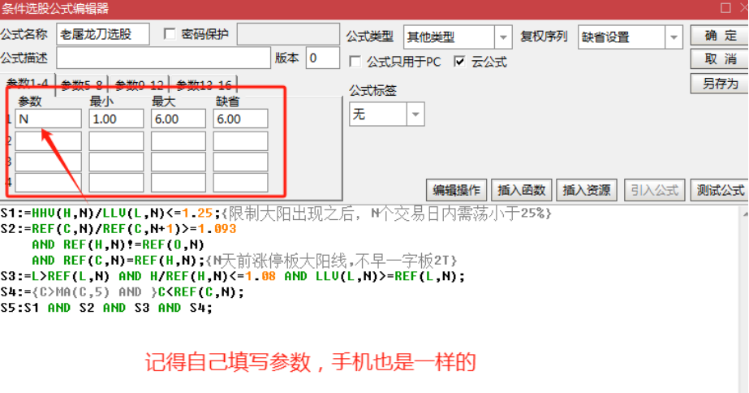
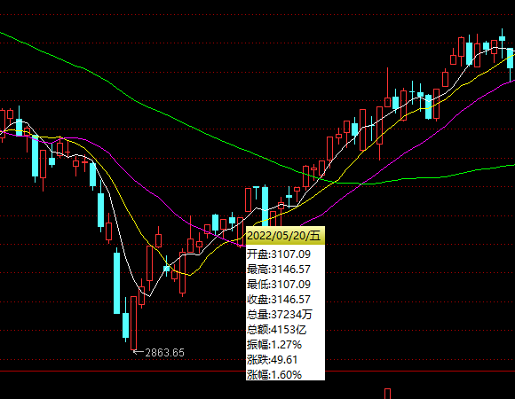
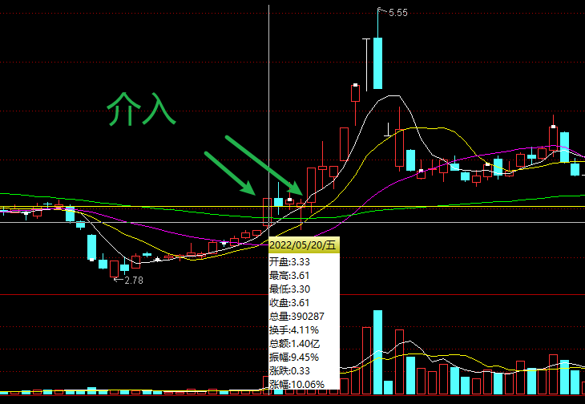

---


layout:     post
title:      "投资学习"
subtitle:   "投资学习"
date:       2024-11-18 17:00:00
author:     "Sage"
header-img: ""
header-style: text
hidden: false
catalog: true
published: true
tags:
    - invest
    - learn

---

- [Typora 代码块折叠](https://blog.csdn.net/shisanxiang_/article/details/136006137)

# 战法合集

## 屠龙刀战法


### 要点

[参考](https://zhuanlan.zhihu.com/p/651175841)

- 一: 什么是屠龙刀 
  - 1. 屠龙刀是游资经常使用的一种操盘手法，也是龙头启动前的信号，更是一日游资规避风险的核心量化交易。 
  - 2. 屠龙刀从来不谈技术，只跟着市场走，跟着资金喝口汤，只做一招，一招鲜吃遍天，一定要拥有属于自己的一招，人生很短暂把一件事情做到极致就够了。 
  - 3. 你是想一辈子一件事情做一万遍，还是想一辈子做一万件事情——来自一位游资大佬的座右铭。 
  
- 二: 红绿灯要注意的5点 
  - 1. 红灯=创业板(下午2点基本上能确定上涨红盘)。 
  - 2. 绿灯=创业板(下午2点基本上能确定下跌绿盘)。 
  - 3. 创业板是反映市场最准确的一个大盘，上证是失真的。 
  - 4. 下午2点是红灯就去上班，下午是绿灯就放假(必须严格执行)。 
  - 5. 创业板上涨家数大于下跌家数 (说明市场情绪非常好，反之则放假)。 
  
- 三: 如何30秒快速选出屠龙刀的游资票 
  - 1. 使用东方财富~找到选股器~创建选股条件~行情数据~涨跌幅~涨停板~查看结果~全部加入自选~然后观察涨停板之后2-3天的走势，如果符合屠龙刀长相，进行重点观察，结合板块最终决定是否上班。 
  - 2. 每天重复以上动作，进行观察，不符合屠龙刀的就删除，符合的重点观察。 
  
- 四: 屠龙刀个股日内买卖点 
  - 1. 找到屠龙刀的票了之后，下午2点左右，决定是否上班。 
  - 2. 最好是在均线下方进行分批买入 (控制成本和减少止损)。 
  
- 五: 屠龙刀个股仓位如何控制
  - 1. 如果创业板上涨家数大于下跌家数，则可以放心上6成仓以上。 
  - 2. 如果创业板上涨家数等于下跌家数，则控制5成以内。 
  - 3. 如果创业板上涨家数小于下跌家数，则控制2成仓，或者空仓 (建议空)。 
  - 4. 仓位管理很重要，遇到机会了再上仓位，遇到风险进行小仓位博弈。
  
- 六: 如何计算游资资金是否出完货 
  - 机构、游资出货交易时间，基本上都是9:30-10点之间，下午2点-3点之间剩下时间的则是为散户博弈时间。 
  - 涨停板后的第一天9:30-10:30点区间一个小时成交量，如果小于涨停板全天的成交量2倍，则可以判断，游资没有出完货，则可以重点关注（钱没出完，后面还有动作）。 
  
- 七: 屠龙刀个股如何止损 (重点) 
  - 止损位是屠龙刀生存的根本所在，任何时候保住本金最重。 
  - 第一止损位，如果屠龙刀破了买入当天的最低点，即触发了止损位，可以果断止损。 
  - 如何错过了第一止损位，不用过于担心，屠龙刀的个股因为有大量资金参与，极少数会出现大跌的可能。执行第二止损位，第二止损位可以设置为，涨停板的最低点，如果破了涨停板的最低点，比如止损离场（保住本金）。 
  
- 八: 什么样的屠龙刀不能做 
  - 屠龙只做模式内，上升通道的首版。 
  - 坚决不做烂板。 
  
- 九: 9:25分通过集合竞价制定当日买卖计划 (核心) 
  - 任何人都没有办法预测第二天的走势（任何人），任何计划等第二天9:25分。集合竞价开出价格，再执行屠龙刀具体计划（非常重要）。 
  - 9:25分如果是高开2个点左右，恭喜大家一般2天都是可以拿到15%-20%。 
  - 9:25分如果是平开，则执行拉高即跑路原则，锁定利润，果断离。 
  - 场4:9:25分如果是低开，则坚决执行，保本或者小幅亏损，如果不能5分钟拉起来，果断执行亏损离场。 
  - 一定要严格执行，所有的交易都是概率，把盈亏比做到极致。 
  
- 十: 做屠龙刀的三个核心条件 (总结) 
  - 第一个条件：红灯是决定上班还是放假，红灯了再去选择屠龙刀，绿灯坚决放假。 
  - 第二个条件：在均线下方分批进行买入（水下当个王八）。 
  - 第三个条件：坚决执行，9:25分，高开，平开，低开的计划。 总结：股市其实很简单，就是低买高卖，跟着资金走，不是股市复杂，复杂的是人性，把一件事情做到极致就够了，一招鲜吃遍天，各位朋友们加油！
  
- 小结
  
  - 大环境
  
    - 看大盘：大盘有赚钱效应的时候入场，搏第二天冲高离场
    - 看板块：整个板块有赚钱效应的时候入场，搏第二天游资进场拉高
    - 看个股走势，前面已经有资金进场，但资金还没有完全走完
    - 涨停板第二天，看开盘一小时资金，超过前天涨停板两倍的量就要放弃。
  
  - 第一根阳线
    - 强度要强：快速上板、不烂板；
    - 成交量不宜过大：大了可能是跑路，并且也不强
    - 上升趋势中的首板
    - 位置不高
  
  - 买点：主力成本区间
    - 如果强度大，主力的成本在阳线实体中间
    - 强度不大，主力的成本在阳线实体1/3处
    - 回调两到三天，回调深度到70%左右
    - 下午两点半开始建仓
    - 股价在均价线下方建仓
    - `重点`：入场前看当天两点半创业板是红色还是绿色，`红色上班`，`绿色休息`
  
  - 止损卖点：
    - 第一卖点：跌破买入当天最低价
    - 第二卖点：跌破第一根阳线的最低价
  
  - 卖点：
  
    - 高开两个点：等涨停，涨停板概率非常大，一旦开板第一时间就要跑。没有开板等第二天开盘冲高离场
    - 平开：看竞价，格局半个小时等冲高离场，最重要一点就是要保本
    - 低开等5分钟，没有拉升少亏就行，把止损位设置在昨天最低点
  
  - 补充：
  
    - 如果开盘冲高就要赶紧离场
  
    - 出了消息的个股要放弃
    - 板块下跌的个股要放弃
  
    - 附加条件 重点：坚决执行策略，放弃所有的幻想。
  
  - 屠龙刀的精髓：就是用2个点的亏损，然后搏第二天冲高和涨停板的钱。
  

### 公式



[选股公式](https://zhida.zhihu.com/search?content_id=236476255&content_type=Article&match_order=1&q=选股公式&zhida_source=entity)

```
S1:=HHV(H,N)/LLV(L,N)<=1.25;{限制大阳出现之后，N个交易日内需荡小于25%}
S2:=REF(C,N)/REF(C,N+1)>=1.093
AND REF(H,N)!=REF(O,N)
AND REF(C,N)=REF(H,N);{N天前涨停板大阳线,不早一字板2T}
S3:=L>REF(L,N) AND H/REF(H,N)<=1.08 AND LLV(L,N)>=REF(L,N);
S4:={C>MA(C,5) AND }C<REF(C,N);
S5:S1 AND S2 AND S3 AND S4;
```

## 凹口淘金

### 形态

- 连续一段的阴线下跌，甚至是中大阴线的连续下跌，但整个过程中都是相对缩量，甚至是地量
- 跌破主力的成本区，形成破位走势
- 止跌后形成连续的反转走势，一路反弹修复连阴的起点(基准线)
- `加速向上`，或者`突破后回踩`连阴起点可以跟进
- 止损位设置在`阴线起点`上

### 特点

- 下跌没有理由
- 下跌缩量

### 用法

- 常见于主力横盘整理末期
- 常见于利空行情下跌末期
- 常见于`弱势指数行情`末期(`高性价比`)
  - 指数杀跌行情下，个股没有放量下跌（说明该走的都已经走了，反弹起来非常快），当他回到对应的位置时可以结合热点题材介入；



- 

