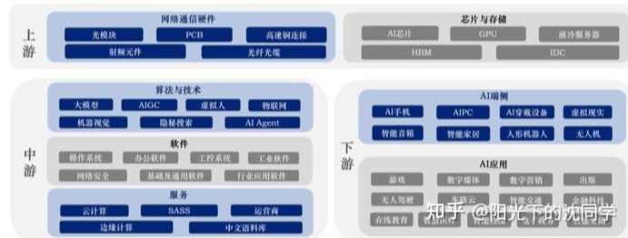

---

layout:     post
title:      "题材"
subtitle:   "投资学习"
date:       2025-02-13 17:00:00
author:     "Sage"
header-img: ""
header-style: text
hidden: false
catalog: true
published: true
tags:
    - invest
    - learn

---

- [Typora 代码块折叠](https://blog.csdn.net/shisanxiang_/article/details/136006137)

# 题材

## AI

### 概略

### 上游

### 中游

#### 大模型

- 国内

  - 科大讯飞：作为中国领先的智能语音技术提供商，科大讯飞推出了自己的大模型——星火大模型，并在2024年实现了超过200亿元的营收。

  - 旷视科技（Megvii Technology Limited）：一家专注于计算机视觉和深度学习技术研发的人工智能企业，也在探索AI大模型的应用。

  - 海天瑞声：该公司从事AI训练数据服务，因其与微软的合作以及对GPT-4的支持而受到市场关注。

  - 美格智能：尽管美格智能澄清了与DeepSeek无直接业务往来，但由于市场对其潜在联系的预期，股价一度大幅上涨。

  - 汤姆猫：汤姆猫是一家以IP为核心的娱乐公司，正在研发AI产品如AI语音机器人等，受到了机构的高度关注。

  - 智谱AI：虽然不是上市公司，但作为国内头部的大模型初创公司，智谱AI完成了新一轮融资，并与多家产业龙头企业合作。

  - 拓尔思：这家公司拥有自己的拓天大模型，并被提及为具备较大增长潜力的A股上市公司之一。

- 港/美

  - 百度（Baidu）：百度是中国最大的搜索引擎公司之一，近年来大力投资于人工智能领域，特别是其文心一言大模型平台，在AI大模型方面有显著进展。

  - 阿里巴巴（Alibaba Group）：阿里巴巴旗下的阿里云开发了通义千问大模型，并且有多家相关联的上市公司如云赛智联、润建股份、浪潮信息等被认为具有较大的未来潜力。

  - 腾讯（Tencent）：腾讯也涉足了AI大模型的研究和发展，推出了混元助手等一系列产品和服务。

#### AIGC

- 国内
  - 鸿博股份
    鸿博股份是一家主要从事印刷业务的公司，前身为福建鸿博印刷有限公司。其业务范围包括出版物印刷、包装装潢印刷品印刷等，同时涉足数字文化创意内容应用服务等领域。
  - 中文在线
    中文在线集团股份有限公司成立于2000年，是中国数字出版的先驱之一，专注于数字文化内容产业的发展。公司以数字内容生产、版权分发、IP衍生与知识产权保护为核心业务，并积极拓展国际业务和技术研发。
  - 浙文互联
    浙文互联集团股份有限公司是一家在上海证券交易所上市的互联网营销解决方案提供商。该公司通过数据和技术驱动流量运营，提供智能营销解决方案，并在多个领域如汽车、电商、游戏等行业拥有广泛的客户基础。
  - 环球印务
    环球印务是一家从事医药纸盒包装产品的设计、生产、销售的企业，同时也提供高端折叠纸盒、标签、说明书等产品和服务。
  - 北纬科技
    北纬科技主要涉及移动互联网服务，包括移动增值业务、物联网、移动支付等领域的技术研发和服务提供。
  - 神州信息
    神州信息是一家IT服务企业，提供信息技术咨询、系统集成、软件开发等服务，致力于推动数字化转型。
  - 省广集团
    省广集团是中国广告行业的重要参与者，提供包括媒体代理、品牌策划、市场调研在内的全面广告服务。
  - 昇兴股份
    昇兴股份主要从事金属包装容器的研发、生产和销售，服务于食品饮料等行业。
  - 掌阅科技
    掌阅科技是一家专注于数字阅读服务的企业，提供电子书、网络文学等数字内容，并开发了多款移动阅读应用。
  - 三维通信
    三维通信是一家提供通信网络设备及相关技术服务的高科技企业，产品广泛应用于无线通信领域。
  - 引力传媒
    引力传媒是一家集创意策划、影视制作、广告投放为一体的传媒公司，在影视内容制作方面有较强实力。
  - 视觉中国
    视觉中国是一家图片库和图像授权公司，为客户提供专业的图像素材和相关服务。
  - 风语筑
    风语筑是一家专业从事展览展示设计施工一体化服务的公司，擅长打造博物馆、科技馆等公共文化空间的设计和建设。
  - 天娱数科
    天娱数科是一家聚焦数字娱乐领域的科技公司，可能涉及游戏开发、虚拟偶像等内容。
  - 汉王科技
    汉王科技是一家以模式识别技术为核心的高科技企业，主要产品包括电纸书、手写板、人脸识别系统等。

- 港/美

  - 哔哩哔哩（Bilibili）

    哔哩哔哩是中国年轻一代的标志性品牌及领先的视频社区。成立于2009年，并于2010年正式命名为“哔哩哔哩”，它提供全方位的视频内容来满足用户的多样化兴趣1。B站以其独特的弹幕功能、用户生成内容（UGC）以及专业用户生成内容（PUGV）而闻名，涵盖生活、游戏、娱乐、动漫等多个领域。

  - 快手
    快手是北京快手科技有限公司旗下的短视频和直播应用，也是中国乃至全球领先的内容社区及社交平台之一。它最初是一个GIF制作工具，后转型为短视频社区。快手不仅让用户记录和分享生活，还帮助他们发现所需、发挥所长6。它的用户基数庞大，日活跃用户数达到了4.08亿（截至2024年Q3）。

#### 算力

- 国内
  - 上海电气
    上海电气集团股份有限公司是一家主要从事电力设备制造的大型企业集团。其业务范围涵盖火力发电、核电、风电、输配电等多个领域，是中国重要的能源装备制造商之一。
  - 常山北明
    常山北明科技股份有限公司（原名石家庄常山纺织股份有限公司）主要经营纺织品和服装的生产和销售，同时也涉足软件开发与服务等领域。
  - 鸿博股份
    鸿博股份有限公司是一家从事印刷包装的企业，提供各类包装产品和服务，包括但不限于出版物印刷、包装装潢印刷品等。
  - 广电运通
    广电运通信息技术股份有限公司专注于智能交通系统集成及运营维护服务，是城市轨道交通领域的领先企业之一。
  - 烽火通信
    烽火通信科技股份有限公司是中国领先的通信设备制造商之一，提供光通信设备、数据通信设备等产品及解决方案。
  - 拓维信息
    拓维信息系统股份有限公司是一家以教育信息化为核心业务的企业，同时涉及云计算、大数据等新兴技术领域。
  - 浙大网新
    浙大网新科技股份有限公司是一家以软件开发和技术服务为主营业务的企业，提供行业应用软件、互联网+解决方案等服务。
  - 利欧股份
    利欧集团股份有限公司是一家集水泵制造、数字营销于一体的多元化企业集团，旗下拥有多个知名品牌。
  - 莲花控股
    莲花健康产业集团股份有限公司（曾用名：河南莲花味精股份有限公司）主要从事食品加工及销售业务，特别是调味品领域。
  - 航锦科技
    航锦科技股份有限公司是一家专注于化工新材料研发与生产的高新技术企业，产品广泛应用于电子、汽车等行业。
  - 神州数码
    神州数码集团股份有限公司是中国领先的IT综合服务提供商，提供从硬件分销到解决方案的一站式服务。
  - 中科曙光
    曙光信息产业股份有限公司是一家高性能计算机制造商，致力于为用户提供高性能计算、存储、网络等产品及解决方案。
  - 工业富联
    工业富联（富士康工业互联网股份有限公司）是全球领先的电子产品制造商，提供从设计到制造的全方位服务。
  - 紫光股份
    紫光股份有限公司是一家以集成电路设计、制造为主营业务的企业，同时也是中国领先的IT基础设施提供商。
  - 浪潮信息
    浪潮电子信息产业股份有限公司是中国领先的服务器及数据中心解决方案提供商，致力于推动云计算、大数据等技术的发展。

- 港/美

#### 芯片

- 国内
  - 景嘉微
    景嘉微电子股份有限公司（代码：300474）是一家专注于高性能图形处理芯片（GPU）研发和销售的公司，产品广泛应用于计算机、服务器等领域。
  - 富满微
    富满微电子集团股份有限公司（代码：300671）主要从事集成电路的设计、开发与销售，产品包括电源管理芯片、LED驱动芯片等。
  - 全志科技
    全志科技股份有限公司（代码：300458）是一家从事智能终端应用处理器芯片设计的企业，产品应用于平板电脑、智能电视、车联网等多个领域。
  - 瑞芯微
    瑞芯微电子股份有限公司（代码：603893）专注于移动互联网及物联网系统级芯片的研发与设计，提供多媒体、通信等领域的解决方案。
  - 汇顶科技
    汇顶科技股份有限公司（代码：603160）是一家领先的生物识别技术提供商，主要产品包括指纹识别芯片、触控芯片等。
  - 海光信息
    海光信息技术股份有限公司（代码：688041）专注于高性能计算芯片的研发与生产，产品应用于数据中心、云计算等领域。
  - 合纵科技
    合纵科技股份有限公司（代码：300477）是一家从事电力设备制造的企业，产品涵盖配电自动化、智能电网等多个领域。
  - 立昂微
    立昂微电子股份有限公司（代码：605358）主要从事半导体材料的研发、生产和销售，产品包括硅片、化合物半导体等。
  - 旋极信息
    旋极信息技术股份有限公司（代码：300324）是一家以信息安全为核心业务的企业，提供信息安全产品及解决方案。
  - 英维克
    英维克科技股份有限公司（代码：002837）专注于精密温控节能设备的研发与制造，产品应用于数据中心、通信基站等领域。
  - 维信诺
    维信诺科技股份有限公司（代码：002387）是一家专注于柔性显示技术的企业，提供AMOLED显示屏及相关解决方案。
  - 江化微
    江阴江化微电子材料股份有限公司（代码：603078）主要从事湿电子化学品的研发与生产，产品应用于半导体、光伏等行业。
  - 国科微
    国科微电子股份有限公司（代码：300672）专注于集成电路设计，产品包括存储控制器、视频编解码芯片等。
  - 士兰微
    杭州士兰微电子股份有限公司（代码：600460）是一家从事集成电路设计与制造的企业，产品涵盖功率器件、模拟电路等多个领域。
  - 卓胜微
    卓胜微电子股份有限公司（代码：300782）专注于射频前端芯片的研发与生产，产品应用于智能手机、物联网设备等领域。
  - 紫光国微
    紫光国芯微电子股份有限公司（代码：002049）主要从事集成电路设计与制造，产品包括安全芯片、特种集成电路等。
  - 中芯国际
    中芯国际集成电路制造有限公司（代码：688981）是中国大陆最大的集成电路制造商之一，提供晶圆代工服务。
  - 寒武纪-U
    寒武纪科技股份有限公司（代码：688256）专注于AI芯片的研发与生产，提供高性能的人工智能处理器。
  - 东方精工
    广东东方精工科技股份有限公司（代码：002611）主要从事包装机械的研发与制造，产品广泛应用于食品、饮料等行业。
  - 龙芯中科
    龙芯中科技术股份有限公司（代码：688047）专注于高性能通用处理器的研发与生产，提供自主可控的CPU产品。

- 港/美
  - 超微电脑
    超微电脑股份有限公司（代码：SMCI）是一家全球领先的服务器制造商，提供高性能服务器及存储解决方案。
  - 博通
    博通有限公司（代码：AVGO）是一家全球领先的半导体供应商，提供广泛的无线通信、有线基础设施等领域的解决方案。
  - 英伟达
    英伟达公司（代码：NVDA）是一家全球知名的图形处理器（GPU）制造商，产品广泛应用于游戏、数据中心、人工智能等领域。

#### AI

- 国内
  - 豆神教育
    豆神教育科技股份有限公司（代码：300010）是一家专注于教育信息化和智慧教育解决方案的公司，提供教育软件、硬件及服务。
  - 趣睡科技
    趣睡科技股份有限公司（代码：301336）是一家专注于智能家居产品研发与销售的企业，产品包括智能床垫、枕头等。
  - 海康威视
    海康威视数字技术股份有限公司（代码：002415）是中国领先的安防监控设备制造商，提供视频监控系统及相关解决方案。
  - 中兴通讯
    中兴通讯股份有限公司（代码：000063）是一家全球领先的通信设备制造商，提供电信网络设备、手机终端及企业级IT解决方案。
  - 云从科技-UW
    云从科技集团股份有限公司（代码：688327）是一家专注于人工智能技术研发与应用的公司，提供人脸识别、语音识别等解决方案。
  - 商汤-W
    商汤科技有限公司（代码：00020）是一家全球领先的人工智能软件公司，提供AI赋能的软件平台及解决方案。
  - 三六零
    三六零安全科技股份有限公司（代码：601360）是中国领先的网络安全公司，提供个人及企业级网络安全产品和服务。
  - 科大讯飞
    科大讯飞股份有限公司（代码：002230）是中国领先的智能语音技术提供商，提供语音识别、合成及自然语言处理等技术。
  - 四方精创
    四方精创信息技术股份有限公司（代码：300468）是一家专注于金融科技领域的软件开发企业，提供银行、保险等行业解决方案。
  - 传智教育
    北京传智播客教育科技股份有限公司（代码：003032）是一家专注于IT职业教育的公司，提供编程、大数据等课程培训。
  - 福蓉科技
    福建福蓉科技股份有限公司（代码：603327）是一家从事铝材加工的企业，产品广泛应用于电子产品、汽车等领域。
- 港/美
  - 百度集团-SW
    百度集团股份有限公司（代码：09888）是中国最大的搜索引擎公司之一，同时涉足人工智能、自动驾驶等领域。
  - 阿里巴巴
    阿里巴巴集团控股有限公司（代码：BABA）是全球领先的电子商务平台，旗下拥有淘宝、天猫等多个知名电商平台。
  - 苹果
    苹果公司（代码：AAPL）是全球知名的消费电子品牌，主要产品包括iPhone、iPad、Mac等。
  - 微软
    微软公司（代码：MSFT）是全球领先的软件开发商，提供操作系统、办公软件及云计算服务。
  - 谷歌-A
    谷歌母公司Alphabet Inc.（代码：GOOGL）是全球最大的互联网公司之一，旗下拥有Google搜索引擎、YouTube等。
  - 腾讯控股
    腾讯控股有限公司（代码：00700）是中国最大的互联网综合服务提供商，旗下拥有微信、QQ等多个知名社交平台。
  - 优必选
    深圳市优必选科技股份有限公司（代码：09880）是一家专注于机器人研发与制造的高科技企业，提供教育、娱乐等多种用途的机器人产品。

#### 机器人

- 国内
  - 卧龙电驱
    卧龙电气驱动集团股份有限公司（代码：600580）是一家专注于电机及控制系统研发、生产和销售的企业，产品广泛应用于工业自动化、新能源汽车等领域。
  - 阿尔特
    阿尔特汽车技术股份有限公司（代码：300825）是一家提供汽车设计与咨询服务的公司，业务涵盖整车设计、工程开发等。
  - 星光股份
    星光农机股份有限公司（代码：002076）主要从事农业机械的研发、生产和销售，产品包括收割机、拖拉机等。
  - 山东玻纤
    山东玻纤集团股份有限公司（代码：605006）是一家专业从事玻璃纤维及其制品研发、生产和销售的企业。
  - 沃特股份
    深圳市沃特新材料股份有限公司（代码：002886）是一家专注于高性能功能高分子材料研发与生产的高新技术企业。
  - 内蒙一机
    内蒙古第一机械集团股份有限公司（代码：600967）是一家主要从事重型车辆及设备制造的企业，产品广泛应用于国防、矿山等领域。
  - 山东矿机
    山东矿机集团股份有限公司（代码：002526）是一家专注于煤矿机械及配套产品研发、生产和销售的企业。
  - 汇洲智能
    汇洲智能科技股份有限公司（代码：002122）是一家提供智能交通系统解决方案的企业，业务涵盖智能停车、智慧交通等领域。
  - 尤洛卡
    尤洛卡精准信息工程股份有限公司（代码：300099）是一家专注于矿山安全监测监控系统研发与生产的企业。
  - 山东威达机械股份有限公司（代码：002026）是一家主要从事机床附件及数控刀具研发、生产和销售的企业。
- 科/北
  - 泰尔股份
    泰尔重工股份有限公司（代码：002347）是一家专注于冶金设备及备件研发、生产和销售的企业。
  - 天准科技
    天准科技股份有限公司（代码：688003）是一家专注于机器视觉和工业自动化解决方案的高科技企业。
  - 禾川科技
    禾川科技股份有限公司（代码：688320）是一家从事工业自动化控制产品研发、生产和销售的企业，主要产品包括伺服系统、变频器等。
  - 埃夫特-U
    埃夫特智能装备股份有限公司（代码：688165）是一家专注于工业机器人及智能制造系统集成的高新技术企业。
  - 均普智能
    均普智能装备股份有限公司（代码：688306）是一家提供智能制造解决方案的企业，业务涵盖汽车、电子等行业。
- 港/美

### 下游

## 低空经济

- 万丰奥威（002085.SZ）：该公司是一家集汽车零部件制造、通用航空、金融投资为一体的大型企业集团，其中通用航空板块包括飞机制造、机场运营等业务。
- 中信海直（000099.SZ）：作为国内领先的直升机运营商之一，中信海直提供包括海上石油平台支持在内的多种直升机服务，并积极探索低空飞行领域的新机会。
- 宗申动力（001696.SZ）：主要从事发动机及通用机械产品的研发、生产和销售，近年来在无人机动力系统等领域有所布局。
- 中无人机（688297.SH）：专注于无人机的研发、生产和销售，是低空经济产业链中的重要一环。
- 纵横股份（688070.SH）：一家专业从事工业级无人机系统研发、生产和服务的高新技术企业，产品广泛应用于测绘、农业、安防等领域。
- 莱斯信息（未提供具体代码）：南京莱斯信息技术股份有限公司控股的高科技企业，致力于通航产品研制及解决方案。
- 金盾股份（300411.SZ）：除了传统通风设备业务外，金盾股份还涉足飞行汽车技术的研发。
- 广联航空（300900.SZ）：从事无人机整机结构件的研发、生产，拥有多个型号的无人机产品。
- 永悦科技（603897.SH）：主营不饱和聚酯树脂为主的合成树脂及无人机业务，尽管无人机业务占比不高，但显示出潜在增长空间。
- 岭南控股（未提供具体代码）：可能涉及到低空旅游等新兴业态的发展。

## 巴菲特

- 仙鹤股份 (603733)
  业务范围: 主要从事特种纸的研发、生产和销售。
  行业地位: 在特种纸领域具有较高的市场份额和技术优势。
- 国轩高科 (002074)
  业务范围: 主要从事锂离子电池及其材料的研发、生产和销售。
  行业地位: 在新能源汽车电池领域具有较强的竞争力和市场占有率。
- 中材科技 (002080)
  业务范围: 主要从事复合材料制品的研发、生产和销售。
  行业地位: 在复合材料领域具有较高的技术水平和市场影响力。
- 北新建材 (000786)
  业务范围: 主要从事建筑材料的研发、生产和销售。
  行业地位: 在建筑材料领域具有较高的市场份额和技术优势。
- 双环传动 (002472)
  业务范围: 主要从事齿轮及齿轮零件的研发、生产和销售。
  行业地位: 在齿轮制造领域具有较高的技术水平和市场占有率。
- 卫星化学 (002648)
  业务范围: 主要从事石油化工产品的研发、生产和销售。
  行业地位: 在石油化工领域具有较高的技术水平和市场影响力。

# 传统板块

## 文化传媒

- 光线传媒（300251）：主要从事电影、电视剧制作与发行的公司。
- 金逸影视（002905）：集电影院线、影院投资、电影发行等业务于一体的综合性影视公司。
- 万达电影（002739）：中国领先的院线运营商之一，旗下拥有众多电影院。
- 华谊兄弟（300027）：知名的影视娱乐公司，业务涵盖电影、电视剧制作与发行、艺人经纪等。
- 中国电影（600977）：中国最大的电影发行商之一，同时也是重要的电影院线运营商。

## 游戏

- 中青宝 (300052)
  业务范围: 主要从事网络游戏的研发和运营。
  行业地位: 在国内网络游戏市场具有一定的影响力。
- 电魂网络 (603258)
  业务范围: 主要从事网络游戏的研发和运营，特别是电竞游戏。
  行业地位: 在电竞游戏领域有一定的市场份额。
- 吉比特 (603444)
  业务范围: 主要从事网络游戏的研发和运营，尤其是手机游戏。
  行业地位: 在手机游戏市场具有较高的知名度和市场份额。
- 巨人网络 (002558)
  业务范围: 主要从事网络游戏的研发和运营，包括PC端和移动端游戏。
  行业地位: 在网络游戏市场具有较强的竞争力。
- 完美世界 (002624)
  业务范围: 主要从事网络游戏的研发和运营，涵盖PC端、移动端和主机游戏。
  行业地位: 在国内外游戏市场具有较高的知名度和市场份额。
- 三七互娱 (002555)
  业务范围: 主要从事网络游戏的研发和运营，特别是在网页游戏和移动游戏领域。
  行业地位: 在网页游戏和移动游戏市场具有较强的竞争力。

## 酿酒行业

- 贵州茅台（600519）：中国著名的白酒制造商，主要生产茅台酒。
- 五粮液（000858）：中国著名的白酒制造商，主要生产五粮液系列白酒。
- 泸州老窖（000568）：中国著名的白酒制造商，主要生产泸州老窖系列白酒。

## 房地产开发

- 万科A（000002）：中国领先的房地产开发商之一，业务涵盖住宅、商业地产等多个领域。
- 保利发展（600048）：中国大型房地产开发商，业务涉及住宅、商业地产等多个领域。
- 招商蛇口（001979）：中国大型房地产开发商，业务涉及住宅、商业地产等多个领域。

## 贵金属

- 山东黄金（600547）：主要从事黄金开采和销售的公司。
- 紫金矿业（601899）：主要从事铜、金、锌等矿产资源的开采和销售。

## 农牧饲渔

- 温氏股份（300498）：主要从事畜禽养殖及销售的公司。
- 牧原股份（002714）：主要从事生猪养殖及销售的公司。

## 航空机场

- 上海机场（600009）：上海浦东国际机场和虹桥国际机场的运营者。
- 白云机场（600004）：广州白云国际机场的运营者。

## 房地产服务

- 我爱我家（000560）：提供房地产经纪服务的公司。
- 世联行（002285）：提供房地产顾问服务的公司。

## 工程建设

- 中国建筑（601668）：中国大型建筑工程承包商。
- 中国中铁（601390）：中国大型铁路工程承包商。

## 电池

- 宁德时代（300750）：全球领先的锂离子电池制造商。
- 比亚迪（002594）：主要从事电动汽车和电池制造的公司。

## 医药商业

- 国药股份（600511）：主要从事医药批发和零售的公司。
- 九州通（600998）：主要从事医药批发和零售的公司。

## 钢铁行业

- 宝钢股份（600019）：中国最大的钢铁制造商之一。
- 鞍钢股份（000898）：中国大型钢铁制造商。
