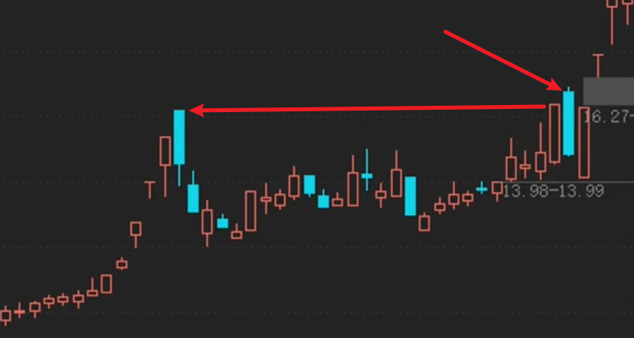
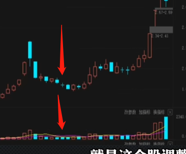

---


layout:     post
title:      "投资学习"
subtitle:   "投资学习"
date:       2024-11-18 17:00:00
author:     "Sage"
header-img: ""
header-style: text
hidden: false
catalog: true
published: true
tags:
    - invest
    - learn

---

- [Typora 代码块折叠](https://blog.csdn.net/shisanxiang_/article/details/136006137)

# 公式

## 参考

[文章：波有蛋](https://www.zhihu.com/people/84-58-98-95-62)

[视频：通达信](https://www.bilibili.com/video/BV1gZ4y1g7Xy/?spm_id_from=333.999.0.0)


# 技术指标

## 量比

- 计算：股市开盘后平均每分钟成交量与过去5个交易日平均每分钟成交量的比值
- <0.5:
  - 强势一字跟踪
  - 否则无人问津
- 0.8-1.5：正常水平
  - 主力没动作
- 1.5-2.5：温和放量
  - 异动：主力可能介入
  - 长期底部横盘后的可以介入（回踩均线介入）
  - 如果是高位温和放量下跌可以退出
- 2.5-5：明显放量
  - 量价齐升持股
- 5-10：剧烈放量
  - 根据位置判断：地位进、高位出
- 10：异常放量（顶底信号）


# 选股

## 参考

- DY阿楠论股

## 操作

### 盘后操作

- 大筛

  1. 量比排序选前200：加入自选

  2. 筛选涨跌幅2-5%的票
  3. 删ST
  4. 删除流通市值超过15亿`短线操作`

- 看K线：筛选个股
  1. 看高位低位
  2. 看放量，温和放量or放大量
  3. 与热点是否关联，做熟悉的领域
  4. 中阳or大阳
  5. 低位长期横盘首次放量

### 盘中操作

- 大筛

  1. 量比大于2%

  2. 换手率2%-8%

  3. 换手续越高，量比越低表示高度控盘，筹码集中

     

# 形态

## 跌停板洗盘



### 分析

- 在一次涨停后，眼看要突破前期高点，开始主升浪；此时很多散户也想搭上便车，主力在此时选择跌停，有些散户会认为主力在此出货，然后被洗掉，接着主力开始一波主升浪；

### 注意点

- 涨停突破要在低位，那么跌停上车不用再担心连续跌停了；

### 代码

```cmake
{参数设置}
N := 20; {近N日的最高价作为比较目标}

{涨停条件}
ZT_YESTERDAY := (REF(C, 1) / REF(C, 2) - 1 >= 0.098) AND (REF(H, 1) = REF(C, 1)); {昨日涨停}

{突破前期高点}
HHVHIGH := HHV(H, N); {过去N日内最高价}
YESTERDAYHHV := REF(HHVHIGH, 2); {昨天之前的N日内最高价}
BREAKOUT := REF(C, 1) > YESTERDAYHHV; {昨日收盘价突破前一天之前的N天内最高价}

{当天跌停}
DT_TODAY := (REF(C, 1) / C - 1 >= 0.05) AND (L = C); {今日跌停}

{综合条件}
(ZT_YESTERDAY AND BREAKOUT) AND DT_TODAY;
```

 

## 缩量阴线洗盘

### 分析

- 在一次涨停后，连续缩量下跌，回到起始点；

### 代码

```
{缩量阴线1}
N:=2;
ZT := C / REF(C, 1) > 1.097 AND C=H; 
ZTND := REF(ZT, N); 

VS := VOL < MA(VOL, 5); 
FD := EVERY(VS AND C < REF(C, 1), 1);

CS := ABS(C - REF(L, N)) <= REF(H, N) * 0.02; 


SELECT: ZTND AND FD AND CS;

20.65*0.02 0.39
```

## 缩量十字星



### 分析

- 卖方力量枯竭，买方还没进场，此时形成缩量的十字星表示多空双方力量平衡，形式准备逆转；

### 注意点

- 十字星要是一路下来形成的，不能有过反抽
  - 有过反抽表示空方力量并未枯竭，双方一直在PK，并且多方一直在试探，均宣告失败，这些试探可能是由于股票热度太高，散户一直在试探底部，总之战况不明朗，不能介入；

- 设下3-5%的止损点：防止主力诱多，故意不出货，形成空方力量枯竭的假象（用3-5%的损失博取10%的利益）
