---


layout:     post
title:      "投资学习"
subtitle:   "投资学习"
date:       2024-11-18 17:00:00
author:     "Sage"
header-img: ""
header-style: text
hidden: false
catalog: true
published: true
tags:
    - invest
    - learn

---

- [Typora 代码块折叠](https://blog.csdn.net/shisanxiang_/article/details/136006137)

# 心法

- 买入逻辑不存在就要果断出局：摆脱贪婪的控制、不要心存侥幸；股市里面最毒的毒药就是希望，不能知行合一最后短线成中线、中线成长线、最后成了贡献；
- 盈亏同源：今天因为侥幸守住了一只牛股，以后就会因为希望守到一只黑天鹅；当你想抓住市场上每一次的机会，就必然无法躲过无处不在的风险；这个市场坑比肉多，踏空根本不可怕，没有确定性和风险分析切不可贸然出手；
- 操作首先考虑的是风险：一只股票要考虑他如果下跌了会去哪里，自己能否承受的了，再去考虑利润；
- 买是徒弟、卖是师傅、空仓是祖师爷，空仓要从容面对市场的诱惑、心态平和才能胜利

# 公式

- ## 参考


[文章：波有蛋](https://www.zhihu.com/people/84-58-98-95-62)

[视频：通达信](https://www.bilibili.com/video/BV1gZ4y1g7Xy/?spm_id_from=333.999.0.0)


# 技术指标

## 量比

- 计算：股市开盘后平均每分钟成交量与过去5个交易日平均每分钟成交量的比值
- <0.5:
  - 强势一字跟踪
  - 否则无人问津
- 0.8-1.5：正常水平
  - 主力没动作
- 1.5-2.5：温和放量
  - 异动：主力可能介入
  - 长期底部横盘后的可以介入（回踩均线介入）
  - 如果是高位温和放量下跌可以退出
- 2.5-5：明显放量
  - 量价齐升持股
- 5-10：剧烈放量
  - 根据位置判断：地位进、高位出
- 10：异常放量（顶底信号）


# 选股

## 热门个股

### 参考

DY阿楠论股

### 操作

#### 盘后操作

- 大筛

  1. 量比排序选前200：加入自选

  2. 筛选涨跌幅2-5%的票
  3. 删ST
  4. 删除流通市值超过15亿`短线操作`

- 看K线：筛选个股
  1. 看高位低位
  2. 看放量，温和放量or放大量
  3. 与热点是否关联，做熟悉的领域
  4. 中阳or大阳
  5. 低位长期横盘首次放量

#### 盘中操作

- 大筛

  1. 量比大于2%

  2. 换手率2%-8%

  3. 换手续越高，量比越低表示高度控盘，筹码集中


## 下跌好久的横盘股票

### 参考

[招宝哥](https://www.douyin.com/user/MS4wLjABAAAASfOQJ_WTAjhL7qqsAICbJI1svJ00yjHa6xjVlu1bz86jCyNFK3rb5PDbrmn2gOvt?from_tab_name=main&modal_id=7455606634253995298&relation=1&vid=7446712580338421042)

### 原则

- `基本面`良好
- 长期下跌后处在`相对底部`,横盘`一段时间`没有出现`新低`.
- 相较于之前，最近明显开始`温和放量`.

### 卖出

入手到符合3个步骤的票，就是`不获利就不出`,那只要短时间出现了浮亏，就`格局`或者`补仓`.

## 内外盘口语言

[招宝哥](https://www.douyin.com/user/MS4wLjABAAAASfOQJ_WTAjhL7qqsAICbJI1svJ00yjHa6xjVlu1bz86jCyNFK3rb5PDbrmn2gOvt?from_tab_name=main&modal_id=7454512253837020442&relation=1&vid=7446712580338421042)

- 内盘小于外盘，股价不跌反而涨：主力可能是`诱多出货`（高位）.
  - 主力高位主动出货，但是不击穿散户的价格，并且在快要击穿的时候，不出了向上买一点，让散户看到希望，接着看多，主力接着卖
  - `理解`:当股价连续拉升，散户心态一致看多，这个时候散户作为主力的对手盘，他的挂单是买单多，卖单少。此时主力顺势出货给大量挂买单的散户，但是出到一定的程度会停一下，向上买一点（因为卖单少，所以只要一点点就能拉升股价），拉升股价.就出现了主动卖的比主动买的的少反而股价上涨的情况，因为主力此时在和散户逆向操作；

| 散户看好 |      | 被动挂单 | 主动交易 |
| :------: | :--: | :------: | :------: |
|    卖    | 主力 |    /     |    2     |
|          | 散户 |    1     |    /     |
|    买    | 主力 |    /     |    1     |
|          | 散户 |    3     |    /     |

- 外盘大于内盘，股价不涨反跌：主力可能是`打压吸筹`（低位）.
  - 主力低位挂单卖给散户，让散户主动买不高价格，然后主动再卖一点散户的挂单就把价格打下去.
  - 注意这里主力不会主动卖太多，这样就会让散户主动低价买到股票。主力只要在卖一挂单让散户失去信心,自我怀疑,就达到目的了；
  - `理解`:当股票基本面良好，散户看好，挂单就会买多卖少，并且会主动买；此时主力作为对手盘，还没有足够的筹码，不希望股价涨上去，就会在卖一挂大量的卖点让散户买，这样散户买了很多也不能把股价买上去，此时主力再主动卖一点（由于卖单少），价格就被打下去了.慢慢的散户就会怀疑这个股票基本面良好是不是自己判断错了，从而不买了，此时股价就被压住了；

| 散户看好 |      | 被动挂单 | 主动交易 |
| :------: | :--: | :------: | :------: |
|    卖    | 主力 |    4     |    2     |
|          | 散户 |    1     |    1     |
|    买    | 主力 |    2     |    /     |
|          | 散户 |    2     |    4     |

- 外盘小于内盘，股价放量下跌：主力出货，跑

- 内外盘都很少，成交量稀少：没有参考价值

# 形态

## 跌停板洗盘


### 分析

- 在一次涨停后，眼看要突破前期高点，开始主升浪；此时很多散户也想搭上便车，主力在此时选择跌停，有些散户会认为主力在此出货，然后被洗掉，接着主力开始一波主升浪；

### 注意点

- 涨停突破要在低位，那么跌停上车不用再担心连续跌停了；

### 代码

```cmake
{参数设置}
N := 20; {近N日的最高价作为比较目标}

{涨停条件}
ZT_YESTERDAY := (REF(C, 1) / REF(C, 2) - 1 >= 0.098) AND (REF(H, 1) = REF(C, 1)); {昨日涨停}

{突破前期高点}
HHVHIGH := HHV(H, N); {过去N日内最高价}
YESTERDAYHHV := REF(HHVHIGH, 2); {昨天之前的N日内最高价}
BREAKOUT := REF(C, 1) > YESTERDAYHHV; {昨日收盘价突破前一天之前的N天内最高价}

{当天跌停}
DT_TODAY := (REF(C, 1) / C - 1 >= 0.05) AND (L = C); {今日跌停}

{综合条件}
(ZT_YESTERDAY AND BREAKOUT) AND DT_TODAY;
```

 

## 缩量阴线洗盘

### 分析

- 在一次涨停后，连续缩量下跌，回到起始点；

### 代码

```
{缩量阴线1}
N:=2;
ZT := C / REF(C, 1) > 1.097 AND C=H; 
ZTND := REF(ZT, N); 

VS := VOL < MA(VOL, 5); 
FD := EVERY(VS AND C < REF(C, 1), 1);

CS := ABS(C - REF(L, N)) <= REF(H, N) * 0.02; 


SELECT: ZTND AND FD AND CS;

20.65*0.02 0.39
```

## 缩量十字星


### 分析

- 卖方力量枯竭，买方还没进场，此时形成缩量的十字星表示多空双方力量平衡，形式准备逆转；

### 注意点

- 十字星要是一路下来形成的，不能有过反抽
  - 有过反抽表示空方力量并未枯竭，双方一直在PK，并且多方一直在试探，均宣告失败，这些试探可能是由于股票热度太高，散户一直在试探底部，总之战况不明朗，不能介入；

- 设下3-5%的止损点：防止主力诱多，故意不出货，形成空方力量枯竭的假象（用3-5%的损失博取10%的利益）

# 买卖点

## 分时买点

[参考B站：牛散赵哥](https://www.bilibili.com/video/BV1KrkxYFEFi/?spm_id_from=333.999.0.0)

### W底

#### 形态

- W底：一底高过一底

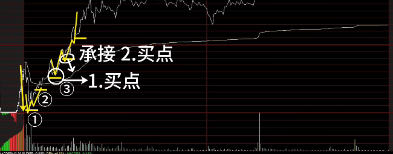

#### 分析和要点

- 一底高过一底说明做空的力量已经不足，当越过均线回踩不破均线就是买点；如果还需要确定性可以再等一个W底确认；

### 阶梯式拉伸

#### 形态

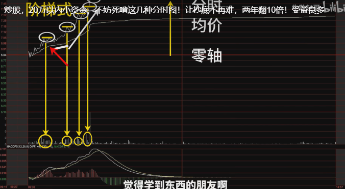

#### 分析和要点

- 零轴、均价、分时由下到上
- 阶梯是提升，并且有量能配合
- 分时不可以跌破均线
- 每一个台阶就是买点

### 盘整后拉伸

#### 形态

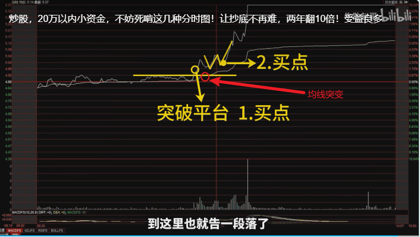

#### 分析和要点

- 盘整要有30分钟以上，振幅不要超过3%
- 均线最好慢慢抬升
- 第一次远离均线，并且均线迅速变换，成交量放大，突破平台就是买点1
- W底的高点是第二个买点

## 识别真假突破

[参考B站：牛散赵哥](https://www.bilibili.com/video/BV1hV4y1R7r9/?spm_id_from=333.999.0.0&vd_source=ce61818c8667e3f2de36a179a3c6e3af)

### 强势突破

- 强势突破：平台整理后放量拉伸、图片了横盘阶段的所有高点、整个过程强势有力，没有丝毫犹豫，给所有套牢盘解套

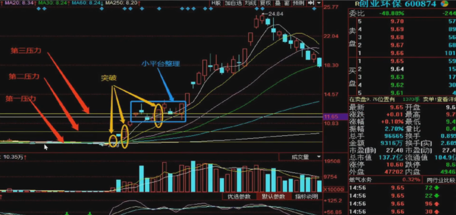

### 头肩底

 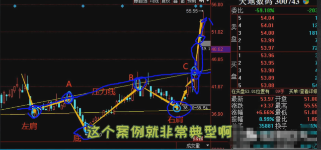

鸿雁头

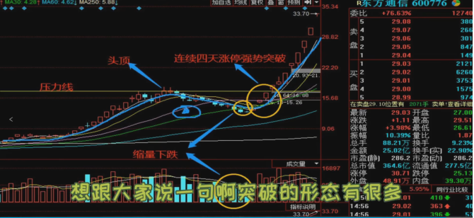


## 万能基准线

### 参考

[DY招宝哥](https://www.douyin.com/video/7446712580338421042)

### 持有形态

1、在单边上升趋势里面找到一根不再创新高的K线标记为0

2、往回数三根K线标记为123，要求K线低点1>2>3，三根K线可以不连续

3、3号K线最低点画一根水平线作为基准线，只要后续没有跌破这个基准线就一直拿着，如果跌破赶紧跑

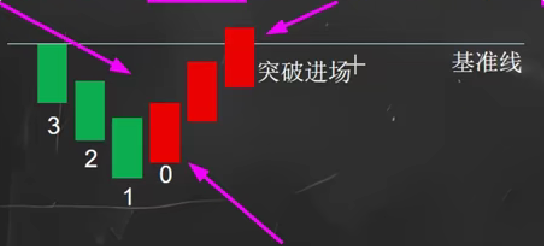

## 三只乌鸦

- 是`看跌信号`，但并非每次出现都意味着市场会下跌。分辨其真假需结合以下因素：

1. `成交量`
  - 真信号：三只乌鸦伴随成交量放大，表明抛压增加，下跌可能性大。
  - 假信号：若成交量萎缩，抛压有限，可能是假信号。

2. `市场环境`
  - 真信号：在上涨趋势末期出现，可能预示趋势反转。
  - 假信号：在震荡或下跌趋势中出现，可能只是短期调整。

3. `价格位置`
  - 真信号：出现在关键阻力位或超买区域，反转可能性高。
  - 假信号：出现在支撑位或超卖区域，可能只是短期回调。

4. `后续走势`
  - 真信号：后续价格继续下跌并跌破支撑位，信号有效。
  - 假信号：若价格迅速反弹并突破阻力位，可能是假信号。

5. `技术指标`
  - 真信号：其他指标如MACD、RSI等也显示超买或背离，信号更可靠。
  - 假信号：若指标未显示超买或背离，信号可能无效。

6. `基本面`
  - 真信号：若基本面恶化，如经济数据不佳或利空消息，信号更可信。
  - 假信号：若基本面良好，信号可能只是短期调整。

- 对应`红三兵`不解释

## 持股原则(总结)

### 上升趋势

#### 斜率大

- 原则:

  - 破趋势就走(大量获利了结`放量`)
  - 如果快速收回前高或者趋势,马上跟进

  - 如果下跌停止,重新画趋势线,确认涨回趋势,马上跟进

- 举例
  - 2024.10.08:上证指数
  - 2024.12.09:山东威达

#### 斜率中

- 原则:综合

  - 如果快速收回趋势,马上跟进

  - 如果下跌停止,重新画趋势线,涨回前高,确认后马上跟进

- 举例
  - 2024.10.08:上证指数
  - 2024.12.09:山东威达

#### 斜率小(支撑位)

- 原则:综合以下支撑位的低位确认离场
  - 趋势线
  - 万能基准线
  - 放量阳线后缩量回调的低点,或者阳线的低点
  - 上一个`突破平台`(多空火拼的位置,产生了大量的成交,这个位置的空头都死了,所以到了这个位置已经是支撑位)
- 对于看好的股票,可以给相邻的两个支撑位

### 下降趋势

#### 斜率大

- 原则
  - 马上离场


# 识别主力

## 主力出货

[5种分时图看穿主力出货](https://www.bilibili.com/video/BV1Vb421E7Bi/?spm_id_from=333.999.0.0&vd_source=ce61818c8667e3f2de36a179a3c6e3af)

### 钓鱼线形态

- 如果近期涨幅较大，分时图中出现快速拉伸并回落，这个时候多数是主力出货，拉伸是诱多，这个时候追进去多数次日被埋

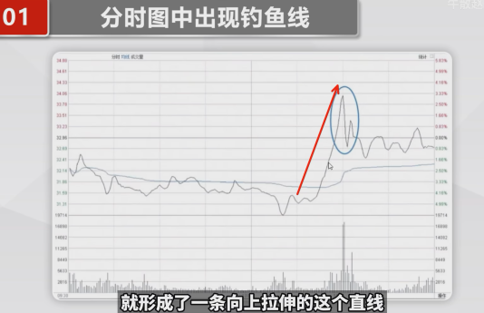

### 跌破平台

- 股价在盘中横盘震荡后突然下跌，跌破箱体平台，伴有成交量放大，是主力出货的信号。 
- 股价跌破平台并且跌破均线。


### 均价线阻力

- 股价处于均价线下方，试图回升但受阻，未能有效突破，说明市场走弱，应警惕。
- 但是纠缠在一起的不算

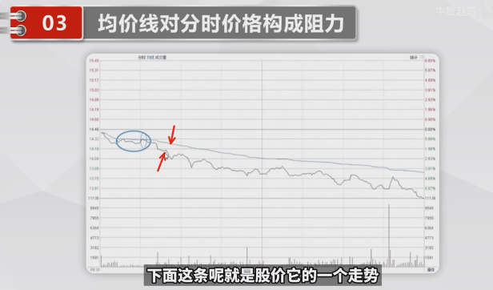

### 双顶形态

- 股价在盘中连续两次在同一价位触顶回落，形成双顶或M头形态，跌破颈线时应下车。
- 通常双顶第二个顶成交量比前面低

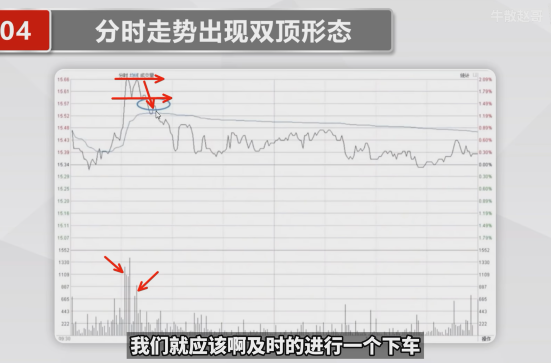

### 破前低点

- 股价由升转跌，跌破前期调整低点，尤其是多次跌破，提示卖出时机。

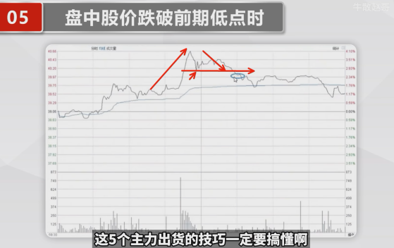

## 早盘去留

[早盘低开是去是留，开盘30分钟分时图告诉你方向](https://www.bilibili.com/video/BV1oD421774i/?spm_id_from=333.999.0.0&vd_source=ce61818c8667e3f2de36a179a3c6e3af)

### 可持有

#### 低开快速上板

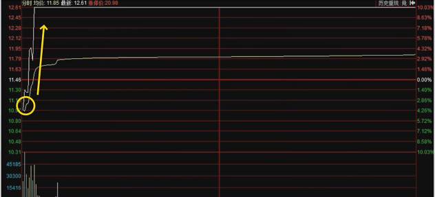

#### 上涨，每次回调不破均线

-小心第二种

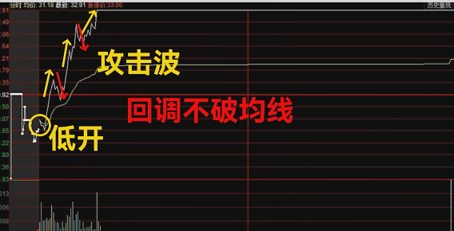

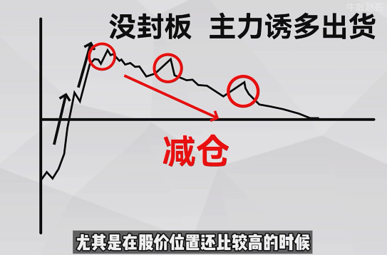

#### 拉伸被主力狙击

- 回调先减一半
- 如果跌破均线直接减完，否则持有

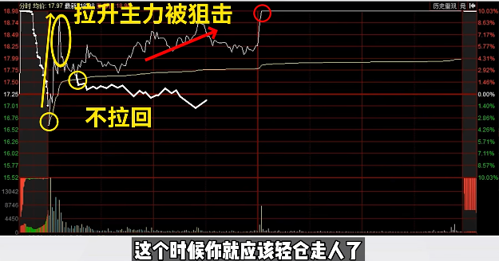

#### 低开在均线下方震荡

- 一半出现在高位主力出货

- 半小时拉回均线上还可以持有
- 如果被均线压制，靠近均线减仓

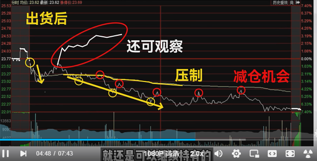

#### 低开后上冲回落

- 上冲W底破就可以减仓
- 破0轴不拉回减仓
- 破均线不拉回减仓
- 拉伸不能破前高减仓
- 再到均线清仓

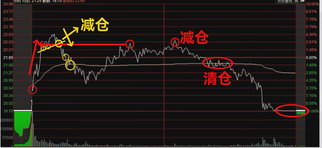

#### 跌停开盘

- 直接排单
- 如果单子快速减少，撤单（有主力要翘板）
- 一般翘板能到5-7%，如果滞涨，回调的均线，减仓
- 如果拉红，要观察是否是热点题材，如果是小心地天，不是直接减仓

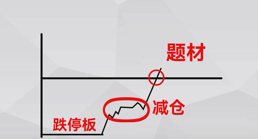

## 早盘操盘思路

[早盘出现这种情况一定要减仓](https://www.bilibili.com/video/BV1Yb4y1T7YB?spm_id_from=333.788.videopod.sections&vd_source=ce61818c8667e3f2de36a179a3c6e3af)

### 集合竞价

- 股价波动小，成交量小，说明没有主力介入
- 股价波动大，成交量大，说明主力已经参与
- 大单若隐若现，辨别主力意图，再入场

### 早盘半小时

- 低开：
  - 大幅低开，跌停开盘，说明主力跑路

- 平开：

- 高开：

  - 上升初期，主力完成建仓

  - 震荡期，利好消息刺激

  - 上涨末期，主力诱多

  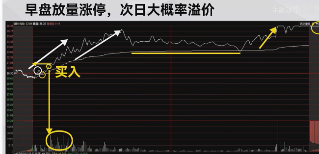

  - 出现放量拐点
  - 突破均线

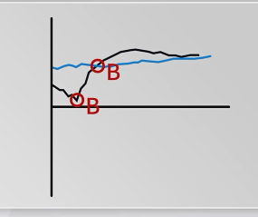

- 早盘15min强势突破前高

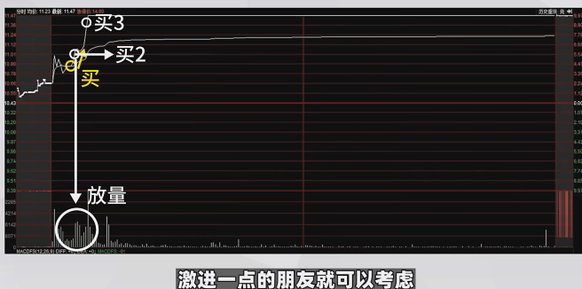

## 盘口分时分析

[参考](https://www.bilibili.com/video/BV1na4y1r72X/?spm_id_from=333.337.search-card.all.click&vd_source=ce61818c8667e3f2de36a179a3c6e3af)

### 分析原则

1. 找到量价异动区间
2. 分析异动的原因 - 是跟风，还是走独立
3. 分析成文属性 - 买入的强度
4. 分析行为的性质 - 股票是否有持续性(有没有`价值`)
5. 出现时机:结合日线最好是出现在
   - 突破
   - 突破后整理加速
