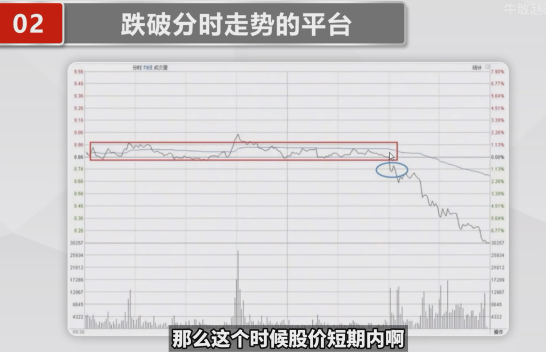
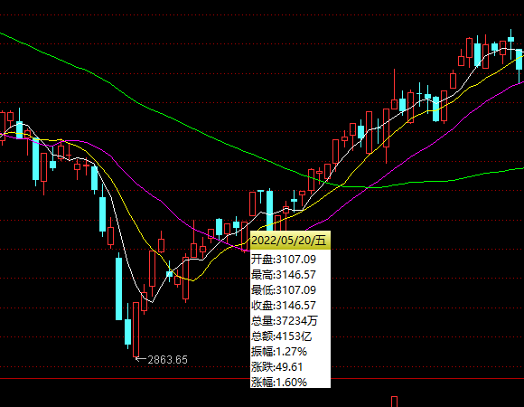
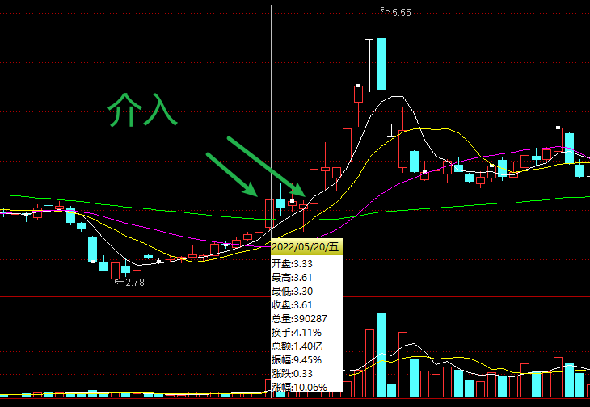

---


layout:     post
title:      "投资学习"
subtitle:   "投资学习"
date:       2024-11-18 17:00:00
author:     "Sage"
header-img: ""
header-style: text
hidden: false
catalog: true
published: true
tags:
    - invest
    - learn

---

- [Typora 代码块折叠](https://blog.csdn.net/shisanxiang_/article/details/136006137)

# 心法

- 买入逻辑不存在就要果断出局：摆脱贪婪的控制、不要心存侥幸；股市里面最毒的毒药就是希望，不能知行合一最后短线成中线、中线成长线、最后成了贡献；
- 盈亏同源：今天因为侥幸守住了一只牛股，以后就会因为希望守到一只黑天鹅；当你想抓住市场上每一次的机会，就必然无法躲过无处不在的风险；这个市场坑比肉多，踏空根本不可怕，没有确定性和风险分析切不可贸然出手；
- 操作首先考虑的是风险：一只股票要考虑他如果下跌了会去哪里，自己能否承受的了，再去考虑利润；
- 买是徒弟、卖是师傅、空仓是祖师爷，空仓要从容面对市场的诱惑、心态平和才能胜利

# 公式

## 参考

[文章：波有蛋](https://www.zhihu.com/people/84-58-98-95-62)

[视频：通达信](https://www.bilibili.com/video/BV1gZ4y1g7Xy/?spm_id_from=333.999.0.0)


# 技术指标

## 量比

- 计算：股市开盘后平均每分钟成交量与过去5个交易日平均每分钟成交量的比值
- <0.5:
  - 强势一字跟踪
  - 否则无人问津
- 0.8-1.5：正常水平
  - 主力没动作
- 1.5-2.5：温和放量
  - 异动：主力可能介入
  - 长期底部横盘后的可以介入（回踩均线介入）
  - 如果是高位温和放量下跌可以退出
- 2.5-5：明显放量
  - 量价齐升持股
- 5-10：剧烈放量
  - 根据位置判断：地位进、高位出
- 10：异常放量（顶底信号）


# 选股

## 参考

- DY阿楠论股

## 操作

### 盘后操作

- 大筛

  1. 量比排序选前200：加入自选

  2. 筛选涨跌幅2-5%的票
  3. 删ST
  4. 删除流通市值超过15亿`短线操作`

- 看K线：筛选个股
  1. 看高位低位
  2. 看放量，温和放量or放大量
  3. 与热点是否关联，做熟悉的领域
  4. 中阳or大阳
  5. 低位长期横盘首次放量

### 盘中操作

- 大筛

  1. 量比大于2%

  2. 换手率2%-8%

  3. 换手续越高，量比越低表示高度控盘，筹码集中

     

# 形态

## 跌停板洗盘


### 分析

- 在一次涨停后，眼看要突破前期高点，开始主升浪；此时很多散户也想搭上便车，主力在此时选择跌停，有些散户会认为主力在此出货，然后被洗掉，接着主力开始一波主升浪；

### 注意点

- 涨停突破要在低位，那么跌停上车不用再担心连续跌停了；

### 代码

```cmake
{参数设置}
N := 20; {近N日的最高价作为比较目标}

{涨停条件}
ZT_YESTERDAY := (REF(C, 1) / REF(C, 2) - 1 >= 0.098) AND (REF(H, 1) = REF(C, 1)); {昨日涨停}

{突破前期高点}
HHVHIGH := HHV(H, N); {过去N日内最高价}
YESTERDAYHHV := REF(HHVHIGH, 2); {昨天之前的N日内最高价}
BREAKOUT := REF(C, 1) > YESTERDAYHHV; {昨日收盘价突破前一天之前的N天内最高价}

{当天跌停}
DT_TODAY := (REF(C, 1) / C - 1 >= 0.05) AND (L = C); {今日跌停}

{综合条件}
(ZT_YESTERDAY AND BREAKOUT) AND DT_TODAY;
```

 

## 缩量阴线洗盘

### 分析

- 在一次涨停后，连续缩量下跌，回到起始点；

### 代码

```
{缩量阴线1}
N:=2;
ZT := C / REF(C, 1) > 1.097 AND C=H; 
ZTND := REF(ZT, N); 

VS := VOL < MA(VOL, 5); 
FD := EVERY(VS AND C < REF(C, 1), 1);

CS := ABS(C - REF(L, N)) <= REF(H, N) * 0.02; 


SELECT: ZTND AND FD AND CS;

20.65*0.02 0.39
```

## 缩量十字星


### 分析

- 卖方力量枯竭，买方还没进场，此时形成缩量的十字星表示多空双方力量平衡，形式准备逆转；

### 注意点

- 十字星要是一路下来形成的，不能有过反抽
  - 有过反抽表示空方力量并未枯竭，双方一直在PK，并且多方一直在试探，均宣告失败，这些试探可能是由于股票热度太高，散户一直在试探底部，总之战况不明朗，不能介入；

- 设下3-5%的止损点：防止主力诱多，故意不出货，形成空方力量枯竭的假象（用3-5%的损失博取10%的利益）

# 买点

## 分时买点

[参考](https://www.bilibili.com/video/BV1KrkxYFEFi/?spm_id_from=333.999.0.0)

### W底

#### 形态

- W底：一底高过一底


#### 分析和要点

- 一底高过一底说明做空的力量已经不足，当越过均线回踩不破均线就是买点；如果还需要确定性可以再等一个W底确认；

### 阶梯式拉伸

#### 形态


#### 分析和要点

- 零轴、均价、分时由下到上
- 阶梯是提升，并且有量能配合
- 分时不可以跌破均线
- 每一个台阶就是买点

### 盘整后拉伸

#### 形态


#### 分析和要点

- 盘整要有30分钟以上，振幅不要超过3%
- 均线最好慢慢抬升
- 第一次远离均线，并且均线迅速变换，成交量放大，突破平台就是买点1
- W底的高点是第二个买点

## 识别真假突破

[参考](https://www.bilibili.com/video/BV1hV4y1R7r9/?spm_id_from=333.999.0.0&vd_source=ce61818c8667e3f2de36a179a3c6e3af)

### 强势突破

- 强势突破：平台整理后放量拉伸、图片了横盘阶段的所有高点、整个过程强势有力，没有丝毫犹豫，给所有套牢盘解套


### 头肩底

 

鸿雁头


# 识别主力

## 主力出货

[5种分时图看穿主力出货](https://www.bilibili.com/video/BV1Vb421E7Bi/?spm_id_from=333.999.0.0&vd_source=ce61818c8667e3f2de36a179a3c6e3af)

### 钓鱼线形态

- 如果近期涨幅较大，分时图中出现快速拉伸并回落，这个时候多数是主力出货，拉伸是诱多，这个时候追进去多数次日被埋


### 跌破平台

- 股价在盘中横盘震荡后突然下跌，跌破箱体平台，伴有成交量放大，是主力出货的信号。 
- 股价跌破平台并且跌破均线。



### 均价线阻力

- 股价处于均价线下方，试图回升但受阻，未能有效突破，说明市场走弱，应警惕。
- 但是纠缠在一起的不算


### 双顶形态

- 股价在盘中连续两次在同一价位触顶回落，形成双顶或M头形态，跌破颈线时应下车。
- 通常双顶第二个顶成交量比前面低


### 破前低点

- 股价由升转跌，跌破前期调整低点，尤其是多次跌破，提示卖出时机。


## 早盘去留

[早盘低开是去是留，开盘30分钟分时图告诉你方向](https://www.bilibili.com/video/BV1oD421774i/?spm_id_from=333.999.0.0&vd_source=ce61818c8667e3f2de36a179a3c6e3af)

### 可持有

#### 低开快速上板


#### 上涨，每次回调不破均线

-小心第二种


#### 拉伸被主力狙击

- 回调先减一半
- 如果跌破均线直接减完，否则持有


#### 低开在均线下方震荡

- 一半出现在高位主力出货

- 半小时拉回均线上还可以持有
- 如果被均线压制，靠近均线减仓


#### 低开后上冲回落

- 上冲W底破就可以减仓
- 破0轴不拉回减仓
- 破均线不拉回减仓
- 拉伸不能破前高减仓
- 再到均线清仓


#### 跌停开盘

- 直接排单
- 如果单子快速减少，撤单（有主力要翘板）
- 一般翘板能到5-7%，如果滞涨，回调的均线，减仓
- 如果拉红，要观察是否是热点题材，如果是小心地天，不是直接减仓


## 早盘操盘思路

[早盘出现这种情况一定要减仓](https://www.bilibili.com/video/BV1Yb4y1T7YB?spm_id_from=333.788.videopod.sections&vd_source=ce61818c8667e3f2de36a179a3c6e3af)

### 集合竞价

- 股价波动小，成交量小，说明没有主力介入
- 股价波动大，成交量大，说明主力已经参与
- 大单若隐若现，辨别主力意图，再入场

### 早盘半小时

- 低开：
  - 大幅低开，跌停开盘，说明主力跑路

- 平开：

- 高开：

  - 上升初期，主力完成建仓

  - 震荡期，利好消息刺激

  - 上涨末期，主力诱多

  

  - 出现放量拐点
  - 突破均线


- 早盘15min强势突破前高


# 战法合集

## 屠龙刀战法


### 要点

[参考](https://zhuanlan.zhihu.com/p/651175841)

- 一: 什么是屠龙刀 
  - 1. 屠龙刀是游资经常使用的一种操盘手法，也是龙头启动前的信号，更是一日游资规避风险的核心量化交易。 
  - 2. 屠龙刀从来不谈技术，只跟着市场走，跟着资金喝口汤，只做一招，一招鲜吃遍天，一定要拥有属于自己的一招，人生很短暂把一件事情做到极致就够了。 
  - 3. 你是想一辈子一件事情做一万遍，还是想一辈子做一万件事情——来自一位游资大佬的座右铭。 
  
- 二: 红绿灯要注意的5点 
  - 1. 红灯=创业板(下午2点基本上能确定上涨红盘)。 
  - 2. 绿灯=创业板(下午2点基本上能确定下跌绿盘)。 
  - 3. 创业板是反映市场最准确的一个大盘，上证是失真的。 
  - 4. 下午2点是红灯就去上班，下午是绿灯就放假(必须严格执行)。 
  - 5. 创业板上涨家数大于下跌家数 (说明市场情绪非常好，反之则放假)。 
  
- 三: 如何30秒快速选出屠龙刀的游资票 
  - 1. 使用东方财富~找到选股器~创建选股条件~行情数据~涨跌幅~涨停板~查看结果~全部加入自选~然后观察涨停板之后2-3天的走势，如果符合屠龙刀长相，进行重点观察，结合板块最终决定是否上班。 
  - 2. 每天重复以上动作，进行观察，不符合屠龙刀的就删除，符合的重点观察。 
  
- 四: 屠龙刀个股日内买卖点 
  - 1. 找到屠龙刀的票了之后，下午2点左右，决定是否上班。 
  - 2. 最好是在均线下方进行分批买入 (控制成本和减少止损)。 
  
- 五: 屠龙刀个股仓位如何控制
  - 1. 如果创业板上涨家数大于下跌家数，则可以放心上6成仓以上。 
  - 2. 如果创业板上涨家数等于下跌家数，则控制5成以内。 
  - 3. 如果创业板上涨家数小于下跌家数，则控制2成仓，或者空仓 (建议空)。 
  - 4. 仓位管理很重要，遇到机会了再上仓位，遇到风险进行小仓位博弈。
  
- 六: 如何计算游资资金是否出完货 
  - 机构、游资出货交易时间，基本上都是9:30-10点之间，下午2点-3点之间剩下时间的则是为散户博弈时间。 
  - 涨停板后的第一天9:30-10:30点区间一个小时成交量，如果小于涨停板全天的成交量2倍，则可以判断，游资没有出完货，则可以重点关注（钱没出完，后面还有动作）。 
  
- 七: 屠龙刀个股如何止损 (重点) 
  - 止损位是屠龙刀生存的根本所在，任何时候保住本金最重。 
  - 第一止损位，如果屠龙刀破了买入当天的最低点，即触发了止损位，可以果断止损。 
  - 如何错过了第一止损位，不用过于担心，屠龙刀的个股因为有大量资金参与，极少数会出现大跌的可能。执行第二止损位，第二止损位可以设置为，涨停板的最低点，如果破了涨停板的最低点，比如止损离场（保住本金）。 
  
- 八: 什么样的屠龙刀不能做 
  - 屠龙只做模式内，上升通道的首版。 
  - 坚决不做烂板。 
  
- 九: 9:25分通过集合竞价制定当日买卖计划 (核心) 
  - 任何人都没有办法预测第二天的走势（任何人），任何计划等第二天9:25分。集合竞价开出价格，再执行屠龙刀具体计划（非常重要）。 
  - 9:25分如果是高开2个点左右，恭喜大家一般2天都是可以拿到15%-20%。 
  - 9:25分如果是平开，则执行拉高即跑路原则，锁定利润，果断离。 
  - 场4:9:25分如果是低开，则坚决执行，保本或者小幅亏损，如果不能5分钟拉起来，果断执行亏损离场。 
  - 一定要严格执行，所有的交易都是概率，把盈亏比做到极致。 
  
- 十: 做屠龙刀的三个核心条件 (总结) 
  - 第一个条件：红灯是决定上班还是放假，红灯了再去选择屠龙刀，绿灯坚决放假。 
  - 第二个条件：在均线下方分批进行买入（水下当个王八）。 
  - 第三个条件：坚决执行，9:25分，高开，平开，低开的计划。 总结：股市其实很简单，就是低买高卖，跟着资金走，不是股市复杂，复杂的是人性，把一件事情做到极致就够了，一招鲜吃遍天，各位朋友们加油！
  
- 小结
  
  - 大环境
  
    - 看大盘：大盘有赚钱效应的时候入场，搏第二天冲高离场
    - 看板块：整个板块有赚钱效应的时候入场，搏第二天游资进场拉高
    - 看个股走势，前面已经有资金进场，但资金还没有完全走完
    - 涨停板第二天，看开盘一小时资金，超过前天涨停板两倍的量就要放弃。
  
  - 第一根阳线
    - 强度要强：快速上板、不烂板；
    - 成交量不宜过大：大了可能是跑路，并且也不强
    - 上升趋势中的首板
    - 位置不高
  
  - 买点：主力成本区间
    - 如果强度大，主力的成本在阳线实体中间
    - 强度不大，主力的成本在阳线实体1/3处
    - 回调两到三天，回调深度到70%左右
    - 下午两点半开始建仓
    - 股价在均价线下方建仓
    - `重点`：入场前看当天两点半创业板是红色还是绿色，`红色上班`，`绿色休息`
  
  - 止损卖点：
    - 第一卖点：跌破买入当天最低价
    - 第二卖点：跌破第一根阳线的最低价
  
  - 卖点：
  
    - 高开两个点：等涨停，涨停板概率非常大，一旦开板第一时间就要跑。没有开板等第二天开盘冲高离场
    - 平开：看竞价，格局半个小时等冲高离场，最重要一点就是要保本
    - 低开等5分钟，没有拉升少亏就行，把止损位设置在昨天最低点
  
  - 补充：
  
    - 如果开盘冲高就要赶紧离场
  
    - 出了消息的个股要放弃
    - 板块下跌的个股要放弃
  
    - 附加条件 重点：坚决执行策略，放弃所有的幻想。
  
  - 屠龙刀的精髓：就是用2个点的亏损，然后搏第二天冲高和涨停板的钱。
  

### 公式


[选股公式](https://zhida.zhihu.com/search?content_id=236476255&content_type=Article&match_order=1&q=选股公式&zhida_source=entity)

```
S1:=HHV(H,N)/LLV(L,N)<=1.25;{限制大阳出现之后，N个交易日内需荡小于25%}
S2:=REF(C,N)/REF(C,N+1)>=1.093
AND REF(H,N)!=REF(O,N)
AND REF(C,N)=REF(H,N);{N天前涨停板大阳线,不早一字板2T}
S3:=L>REF(L,N) AND H/REF(H,N)<=1.08 AND LLV(L,N)>=REF(L,N);
S4:={C>MA(C,5) AND }C<REF(C,N);
S5:S1 AND S2 AND S3 AND S4;
```

## 凹口淘金

### 形态

- 连续一段的阴线下跌，甚至是中大阴线的连续下跌，但整个过程中都是相对缩量，甚至是地量
- 跌破主力的成本区，形成破位走势
- 止跌后形成连续的反转走势，一路反弹修复连阴的起点(基准线)
- `加速向上`，或者`突破后回踩`连阴起点可以跟进
- 止损位设置在`阴线起点`上

### 特点

- 下跌没有理由
- 下跌缩量

### 用法

- 常见于主力横盘整理末期
- 常见于利空行情下跌末期
- 常见于`弱势指数行情`末期(`高性价比`)
  - 指数杀跌行情下，个股没有放量下跌（说明该走的都已经走了，反弹起来非常快），当他回到对应的位置时可以结合热点题材介入；
  - 
  - 

# 量价分析（江浙陈某）

[参考](https://space.bilibili.com/1609483218/channel/collectiondetail?sid=794805)

## 基本概念

- 量能市价格的验证
  - 趋势体现在股价中，量能是用来验证趋势，确认是不是真的。例如：
    - 价格上涨、量能上涨
    - 价格下跌、量能下跌
    - 价格新高、量能新高
  - 趋势验证了，虽然不知道能不能后面还涨，起码目前趋势是正常健康的，至少可以持股不动；
- 量分成成交量（VOL）和成交金额（AMO）
  - 涨幅较小看成交量
  - 涨幅较大看成交金额
- 量在趋势和突破角度做验证
  - 趋势验证：验证一段时间的量是不是逐步放大
    - 是不是量价齐升或者量价齐跌（除去重大事件，或者点火涨停导致情绪突然一致的情况，这是正常涨跌应该对应的量能）
    - 这里要`特别说明`：上涨到一定程度加速会出现缩量，因为场内看多人区域一致，导致卖盘减少，很少的量就能拉升股价；
    - 这里`补充`：在主要的下降趋势中，除了跌关键支撑位时会放量(和向上突破一样，向下突破前低也要放量)，大部分时间，是出于缩量下跌的状态（人们往往不能接受亏损后直接割肉）；所以当成交量持续萎缩，底部图形就已经出现，交易者可以考虑在`均线形成多头排列并且大盘看好`之后进场做多。
  - 突破验证：只看突破那一天是否放量，形成有效突破
    - 突破前多空在一个平衡状态，突破那一天，看多的力量增强，体现在买股票的人增多（假设卖单还是那些不动），那么成交量就要放大才能把股价拉升，同时解放了空头的套牢盘，换成了多头，后市才有向上的力量；
- 量能要定性的看不要定量的看
  - 每个阶段，不同环境下的成交量不可以直接对比

## 成交量的本质

- 市场是由于分歧促成交易，所以
  - 放量：表示分歧加大
    - 一般发生在低位突破、高位反转
  - 缩量：表示一致
    - 看空：当前价格没人买
    - 看多：当前价格没人卖
    - 一般发生在上升中期（调整，这里暂时不讨论涨停导致的一致性增加），下跌末期（没人买了）
  - 堆量：一般是主力控盘（完美执行的放量缩量）
  - 不规则放大缩小:
    - 在没有突发利好或大盘稳定的情况下，多数是主力行为。关键是后续的量能表现，如果不能持续择优出货可能。

## 涨跌停时的量价关系

### 涨停时的量价关系

- 涨停时的成交量较小，说明卖盘较小，将继续上涨(`封成比`)
- 涨停时的成交量较大，首先应判断量能出现在封板前后，出现在涨停前优于涨停后(`分歧量`)
- 涨停时的成交量很大，首先判断涨停板是否破开，再判断破板前是否存在撤单操作(`涨停出货`,看成交速度)

### 跌停时的量价关系

- 跌停时的成交量较小，说明买盘较小，将继续下跌(`封成比`)
- 跌停时的成交量较大，首先应判断量能出现在封板前后，出现在跌停后优于跌停前(`分歧量`)
- 跌停时的成交量很大，首先判断跌停板是否破开，再判断破板前是否存在撤单操作(`空头陷阱`)

## 六种量形

- 高量柱:某阶段最高量柱
- 低量柱:某阶段最低量柱
- 平量柱:与前一日持平量柱
- 倍量柱:大于前一日一倍以上的量柱
- 梯量柱:比前一日逐步走高的量柱
  - 上升初始共振，可得知趋势健康可持有
- 缩量柱:比前一日逐步走低的量柱
  - 上升一段时间后缩量背离，说明场内一致继续看多

## 量级

- 当天要是中阳线

- 有效量柱三大原则:基柱
  - 第一原则:独当一面，三日不破实底(转势)
  - 第二原则:异动后，量价背离(启动信号后相对分析）
  - 第三原则:先者优先，跳空补空
- 符合以上条件的基柱多为“倍量柱”和“高量柱”，前者更优其他量柱只在特殊情境下才考虑为有效

- 量级的运用
  - 第一:以“基柱”为基准
  - 第二:以“基柱”后三日“最低价”为参考
  - 第三:以“缺口上沿”为补充
