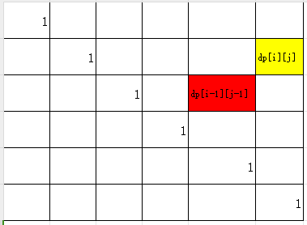
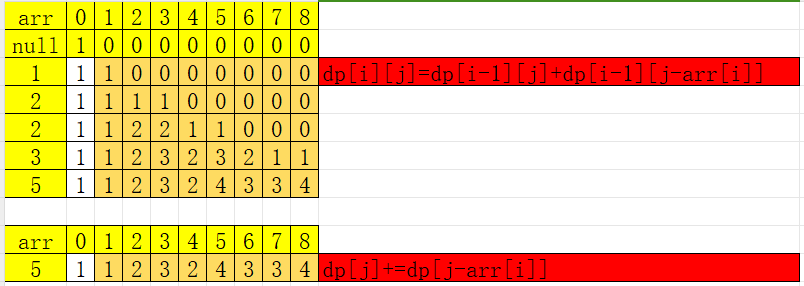
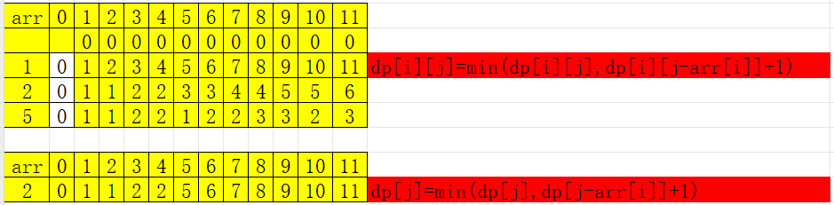

---


layout:     post
title:      "leetcode-基础刷题笔记"
subtitle:   "leetcode刷题"
date:       2024-05-16 17:00:00
author:     "Sage"
header-img: ""
header-style: text
hidden: false
catalog: true
published: true
tags:
    - leetcode
    - recursive
    - structure design
---

# 一、链表篇（21）
## 1.1、删除链表元素
### LeetCode237. 删除链表中的节点（ 腾讯）-3

- 20240526

[LeetCode237. 删除链表中的节点](https://leetcode.cn/problems/delete-node-in-a-linked-list/)
```python
class Solution(object):
    def deleteNode(self, node):
        node.val=node.next.val
        node.next=node.next.next
```
```c++
class Solution
{
public:
    void deleteNode(ListNode *node)
    {
        node->val = node->next->val;
        node->next = node->next->next;
    }
};
```
### ⭐️LeetCode19. 删除链表的倒数第 N 个结点（ 高频、剑指II、HOT100）-4

-  20240526 20240528

[LeetCode19. 删除链表的倒数第 N 个结点.](https://leetcode.cn/problems/remove-nth-node-from-end-of-list/)

>1. 这里可以假设只有一个节点，思考清边界问题；
>2. 假设只有一个节点，找倒数第一个节点，快指针和慢指针都指向头节点，那么快指针走一步就为空，此时慢指针就指向了倒数第一个的位置；
>3. 但是要删除头结点所以要指向头结点的头部dummy节点；
>4. 注意：这里的头结点可能会删除所以返回的是dummy.next
- 快慢指针

```python
class Solution(object):
    def removeNthFromEnd(self, head, n):
        dummy=ListNode(-1,head)
        slow,fast=dummy,dummy
        for i in range(n):
            fast=fast.next
        while fast.next:
            fast=fast.next
            slow=slow.next
        slow.next=slow.next.next
        return dummy.next
```
```c++
class Solution
{
public:
    ListNode *removeNthFromEnd(ListNode *head, int n)
    {
        ListNode *dummy=new ListNode(-1,head);
        ListNode *slow=dummy,*fast=dummy;

        while (n)
        {
           n--;
           fast=fast->next;
        }

        while (fast->next)
        {
           fast=fast->next;
           slow=slow->next;
        }

        slow->next=slow->next->next;
        return dummy->next;
    }
};
```
### LeetCode83. 删除排序链表中的重复元素 I-3

- 20240526

[LeetCode83. 删除排序链表中的重复元素.](https://leetcode.cn/problems/remove-duplicates-from-sorted-list/)

- 快慢指针

```python
class Solution:
    #method1
    def deleteDuplicates1(self,node):
        if not node or not node.next:
            return node
        
        pre,cur=node,node

        while cur:
            if cur.val!=pre.val:
                pre.next=cur
                pre=cur
            cur=cur.next
        pre.next=cur  
        return node
    
    #method2
    def deleteDuplicates2(self,node):
        if not node or not node.next:
            return node
        
        pre,cur=node,node

        while cur:
            while cur and cur.val==pre.val  :
                cur=cur.next
            pre.next=cur
            pre=cur

        return node
```
```c++
class Solution
{
public:
    ListNode *deleteDuplicates1(ListNode *head)
    {
        if (!head)
            return head;

        ListNode *pre = head;
        ListNode *cur = head;

        while (cur)
        {
            if (cur->val!=pre->val)
            {
                pre->next=cur;
                pre=cur;
            }
            cur=cur->next;
        }
        pre->next=cur;
        return head;
    }

    ListNode *deleteDuplicates2(ListNode *head){
        if (!head)return head;

        ListNode *pre = head;
        ListNode *cur = head;

        while (cur)
        {
            while (cur and cur->val==pre->val)
            {
                cur=cur->next;
            }
            pre->next=cur;
            pre=cur;
        }
        
        return head;
    }
};
```


### ⭐️⭐️⭐️LeetCode82. 删除排序链表中的重复元素 II（难、高频、剑指II）-3

- 20240526

[LeetCode82. 删除排序链表中的重复元素.](https://leetcode.cn/problems/remove-duplicates-from-sorted-list-ii/)

- 快慢指针

```python
class Solution:
    #method1
    def deleteDuplicates1(self,node):
        if not node or not node.next:
            return node
                
        dummy=ListNode(1)
        dummy.next=node

        pre,cur=dummy,node

        while cur:
            #cur只要相同就向前走，(为空也是不相同)
            if (cur.next and cur.val!=cur.next.val) or not cur.next:
                if pre.next!=cur:
                    #有删除：通过pre.nenx指针删除
                    pre.next=cur.next
                else:
                    #没删除：直接前进
                    pre=cur

            cur=cur.next           
        
        return dummy.next

    #method2
    def deleteDuplicates2(self,node):
        if not node or not node.next:
            return node
        
        dummy=ListNode(1)
        dummy.next=node
  
        pre,cur=dummy,node

        while cur:
            #cur停止包含：不相等和空（空也是不相等)
            #cur停止都会判断：
            #   1.pre和cur不相邻：删除pre到cur（包含cur）
            #   2.pre和cur相邻：接收cur，pre和cur前移判断后面的
            while cur.next and cur.val==cur.next.val:
                cur=cur.next
            
            if pre.next!=cur:
                #移动了，有删除：通过pre.nenx指针删除
                pre.next=cur.next
            else:
                #没移动，没删除：直接前进
                pre=cur
            cur=cur.next           

        return dummy.next
```
```c++
class Solution
{
public:
    // method1
    ListNode *deleteDuplicates1(ListNode *head)
    {
        if (!head)
            return head;
        ListNode *dummy = new ListNode(1);
        dummy->next = head;

        ListNode *pre = dummy;
        ListNode *cur = head;

        while (cur)
        {
            if ((cur->next and cur->val != cur->next->val) || !cur->next)
                if (pre->next == cur)
                {
                    pre = cur;
                }
                else
                {
                    pre->next = cur->next;
                }

            cur = cur->next;
        }

        return dummy->next;
    }

    // method2
    ListNode *deleteDuplicates2(ListNode *head)
    {
        if (!head)
            return head;
        ListNode *dummy = new ListNode(1);
        dummy->next = head;

        ListNode *pre = dummy;
        ListNode *cur = head;

        while (cur)
        {
            while (cur->next and cur->val == cur->next->val)
                cur = cur->next;

            if (pre->next == cur)
            {
                pre = cur;
            }
            else
            {
                pre->next = cur->next;
            }

            cur = cur->next;
        }

        return dummy->next;
    }
};
```
## 1.2、翻转/旋转链表
### ⭐️剑指 Offer II 024. 反转链表（⭐️高频、剑指II、HOT100 腾讯）-4

- 20240526 2024/5/28

[剑指 Offer II 024. 反转链表.](https://leetcode.cn/problems/fan-zhuan-lian-biao-lcof/)

```python
class Solution:
    #头结点有可能被删除,这是要创建一个节点指向头结点,同时用快指针自己和next比较,pre只记录不操作
    def reverseList(self, head: ListNode) -> ListNode:
        if not head or not head.next:
            return head

        pre, cur = None, head
        while cur :
            temp=cur.next
            cur.next=pre
            pre=cur
            cur=temp

        return pre
```
```c++
class Solution {
public:
    ListNode* reverseList(ListNode* head) {
        ListNode *pre=nullptr,*cur=head;

        while (cur)
        {
            ListNode *temp=cur->next;
            cur->next=pre;
            pre=cur;
            cur=temp;
        }
        return pre;
    }
};
```
### ⭐️⭐️⭐️LeetCode25. K 个一组翻转链表（⭐️⭐️⭐️难）（高频）-4

- 20240526 2024/5/28

[LeetCode25. K 个一组翻转链表.](https://leetcode.cn/problems/reverse-nodes-in-k-group/)

- 注意：
  - k_end没有参与逆序，是下一轮开始的k_star，所以不用tmp来记录下一轮的起点
  - 这里长度不够保持原有顺序

```python
class Solution:
    def reverse(self, start, end):
        pre,cur=None,start

        while cur!=end:
            temp=cur.next
            cur.next=pre
            pre=cur
            cur=temp
        
        return pre

    def reverseKGroup(self, head, k):
        if not head or not head.next:
            return head

        dummy=ListNode(1)
        dummy.next=head
        #rear 记录已经反转序列的末端
        rear=dummy
        k_star,k_end=head,head

        while k_end:
            for i in range(k):             
                if not k_end:
                    # 注意：这里长度不够保持原有顺序
                    # break
                    rear.next=k_star
                    return dummy.next
                k_end=k_end.next 
                     
            rear.next=Solution().reverse(k_star,k_end)
            rear=k_star
            k_star=k_end

        return dummy.next
```
```c++
class Solution
{
public:
    ListNode *reverse(ListNode *head,ListNode *end)
    {
        ListNode* pre=nullptr;
        ListNode* cur=head;
        while (cur!=end)
        {
            ListNode* tmp=cur->next;
            cur->next=pre;
            pre=cur;
            cur=tmp;
        }
        return pre;
    }

    ListNode *reverseKGroup(ListNode *head, int k)
    {
        if (!head||!head->next)
        {
            return head;
        }

        ListNode* dummy=new ListNode(-1);
        dummy->next=head;

        ListNode* rear=dummy;
        ListNode* k_star=head;
        ListNode* k_end=head;

        while (k_end)
        {
            for (int i = 0; i < k; i++)
            {
                if (!k_end)
                {
                    rear->next=k_star;
                    return dummy->next;
                }
                k_end=k_end->next;                
            }

            rear->next=Solution().reverse(k_star,k_end);
            rear=k_star;
            k_star=k_end;
        }
        
        return dummy->next;
    }
};
```


### LeetCode61. 旋转链表（腾讯）-2

- 20240526

[LeetCode61. 旋转链表.](https://leetcode.cn/problems/rotate-list/)
方法1：旋转数组：先整体逆序，再前k个逆序，最后k后面逆序
方法2：计算链表的长度len，同时把链表转为循环链表，找到新的起点newhead的index=len-k,断开newhead之前的节点，返回newhead

```python
class Solution:
    #计算链表的长度len，同时把链表转为循环链表，找到新的起点newhead的index=len-k,断开newhead之前的节点，返回newhead
    def rotateRight(self, head: Optional[ListNode], k: int) -> Optional[ListNode]:
        if not head or not head.next:
            return head
        if k==0:
            return head

        len=0
        p=head
        while p.next:
            len+=1
            p=p.next
        len += 1
        p.next=head
        k=k%len

        index=len-k

        split = head
        for i in range(index-1):
            split = split.next
        newHead=split.next
        split.next=None
        return newHead
```
```c++
ListNode *rotateRight(ListNode *head, int k)
{
    if (!head or !head->next or k == 0)
        return head;

    int len = 0;

    ListNode *end = head;

    while (end->next)
    {
        end = end->next;
        len++;
    }
    len++;
    end->next = head;

    k = k % len;

    int index = len - k;

    end = head;
    for (int i = 0; i < index - 1; i++)
    {
        end = end->next;
    }

    ListNode *newhead = end->next;
    end->next = nullptr;

    return newhead;
}
```


## 1.3、交换链表节点

### ⭐️LeetCode24. 两两交换链表中的节点（⭐️高频）-3

- 20240526 2024/5/28

[LeetCode24. 两两交换链表中的节点.](https://leetcode.cn/problems/swap-nodes-in-pairs/)

```python
class Solution:
    def swapPairs(self, head: Optional[ListNode]) -> Optional[ListNode]:
        if not head or not head.next:
            return head
        dummy=ListNode(-1)
        dummy.next=head
        rear=dummy
        pre,cur=head,head.next

        while cur:
            temp=cur.next
            cur.next=pre
            rear.next=cur

            rear = pre
            if temp and temp.next:
                pre=temp
                cur=temp.next
            else:
                rear.next = temp
                break

        return dummy.next
```
```c++
class Solution
{
public:
    ListNode *swapPairs(ListNode *head)
    {
        if (!head || !head->next)
        {
            return head;
        }

        ListNode* dummy=new ListNode(-1);
        dummy->next=head;

        ListNode* pre=head;
        ListNode* cur=head->next;
        ListNode* rear=dummy;

        while (cur)
        {
            rear->next=cur;
            ListNode* tmp=cur->next;
            cur->next=pre;
            rear=pre;

            if(!tmp ||!tmp->next){
                rear->next=tmp;
                return dummy->next;
            }

            pre=tmp;
            cur=pre->next; 
        }
        
         return dummy->next;
    }
};
```


## 1.4、环形/相交/回文链表

### LeetCode141. 环形链表（腾讯）-2

- 20240527

[LeetCode141. 环形链表](https://leetcode.cn/problems/linked-list-cycle/)

LeetCode141. 环形链表，判断一个链表是否有环，直接双指针搞定，很简单：

```python
class Solution:
    def hasCycle(self, head: ListNode) :
        if head is None or head.next is None:
            return None

        slow,fast=head,head

        while fast and fast.next:
            slow = slow.next
            fast = fast.next.next
            if slow==fast:
                return True

        return False
```
### ⭐️⭐️⭐️LeetCode142. 环形链表II（⭐️⭐️⭐️高频、剑指II、HOT100 腾讯）-2

- 20240227

[LeetCode142. 环形链表II](https://leetcode.cn/problems/linked-list-cycle-ii/)

- 解法

  - hash法直接可以解

  - [数学法]（https://leetcode.cn/problems/linked-list-cycle-ii/solutions/441131/huan-xing-lian-biao-ii-by-leetcode-solution/）

```python
class Solution:
    # method 1:hash法
    def detectCycle1(self, head: ListNode) :
        only_set=set()

        while head:
            if head in only_set:
                return head
            only_set.add(head)
            head=head.next
        return None
    
    # method 2：数学法
    def detectCycle2(self, head: ListNode) :
        if not head or not head.next:
            return None
        
        fast,slow=head,head

        while fast and fast.next:
            fast=fast.next.next
            slow=slow.next
            if fast==slow:
                slow=head
                while slow!=fast:
                    slow=slow.next
                    fast=fast.next
                return slow
        return None
```

```c++
#include <iostream>
#include <unordered_set>

using namespace std;

struct ListNode
{
    int val;
    ListNode *next;
    ListNode() : val(0), next(nullptr) {}
    ListNode(int x) : val(x), next(nullptr) {}
    ListNode(int x, ListNode *next) : val(x), next(next) {}
};

class Solution
{
public:
    ListNode *detectCycle1(ListNode *head) 
    {
        unordered_set<ListNode*> only_set;

        while (head)
        {
            if(only_set.count(head))return head;
            only_set.insert(head);
            head=head->next;
        }
        
         return nullptr;
    }

     ListNode *detectCycle2(ListNode *head) 
    {
        if (!head || !head->next) return nullptr;
        
        ListNode* fast=head;
        ListNode* slow=head;

        while (fast&&fast->next)
        {
            fast=fast->next->next;
            slow=slow->next;

            if (fast==slow)
            {
                slow=head;
                while (fast!=slow)
                {   
                   slow=slow->next;
                   fast=fast->next;
                }
                return slow;
            }
            
        }
         return nullptr;
    }
};

int main()
{
    ListNode *a = new ListNode(1);
    ListNode *b = new ListNode(2);
    ListNode *c = new ListNode(3);
    ListNode *d = new ListNode(4);
    ListNode *e = new ListNode(5);
    a->next = b;
    b->next = c;
    c->next = d;
    d->next = e;

    e->next=c;
    bool result = Solution().detectCycle2(a);

    cout << result << endl;

    return 0;
}
```
### ⭐️⭐️⭐️LeetCode160.相交链表（⭐️⭐️⭐️高频、剑指II、HOT100 腾讯）-2

- 20240527

[LeetCode160.相交链表.](https://leetcode.cn/problems/intersection-of-two-linked-lists/)

[题解](https://leetcode.cn/problems/intersection-of-two-linked-lists/solutions/12624/intersection-of-two-linked-lists-shuang-zhi-zhen-l/)

- 注意：这里的p，q一定要取过None，这样在无交集的时候不会进入死循环，并且可以返回None

```python
class Solution:
    #method1：数学法
    def getIntersectionNode1(self, headA: ListNode, headB: ListNode) -> Optional[ListNode]:
        if not headA or not headB:return None

        p,q=headA,headB
        
        # 这里已经处理不相交的情况，最后都是None
        while p!=q:
            # 这里的p，q一定要取过None，这样在无交集的时候不会进入死循环，并且可以返回None
            p=headB if not p else p.next
            q=headA if not q else q.next

        return p
    
    #method2: hash法
    def getIntersectionNode2(self, headA: ListNode, headB: ListNode) -> Optional[ListNode]:
        if not headA or not headB:return None

        a_set=set()
 
        while headA:
            a_set.add(headA)
            headA=headA.next
        
        while headB:
            if headB in a_set:return headB
            headB=headB.next
        
        return None
```
```c++
class Solution
{
public:
    // method1
    ListNode *getIntersectionNode1(ListNode *headA, ListNode *headB)
    {
        if (!headA || !headB)
            return nullptr;

        ListNode *p = headA, *q = headB;

        while (p != q)
        {
            // 对比python的判别式
            p = p == nullptr ? headB : p->next;
            q = q == nullptr ? headA : q->next;
        }

        return p;
    }

    // method2
    ListNode *getIntersectionNode2(ListNode *headA, ListNode *headB)
    {
        unordered_set<ListNode *> only_set;

        while (headA)
        {
            only_set.insert(headA);
            headA = headA->next;
        }

        while (headB)
        {
            if (only_set.count(headB))
            {
                return headB;
            }
            headB = headB->next;
        }

        return nullptr;
    }
};
```


### ⭐️⭐️⭐️LeetCode234.回文链表（⭐️⭐️⭐️高频、剑指II、HOT100）-2

- 20240528

[LeetCode234.回文链表](https://leetcode.cn/problems/palindrome-linked-list/)

- 注意
  - 回文是指正着读和反着读是一样的，所以只有一个元素就是回文
  - 体会C++中stack的top和pop用法
  - 体会Python中stack的用法
- 解法：
  - 存一半在stack中
  - 翻转前一半

```python
class Solution(object):
    #method1
    def isPalindrome1(self, head: Optional[ListNode]) -> bool:
        if not head :return False

        slow,fast=head,head
        stack=[]
        while fast and fast.next:
            stack.append(slow.val)
            slow=slow.next
            fast=fast.next.next
        # 链表为奇数，中间的元素天然回文，直接跳过去
        if fast:slow=slow.next

        while slow:
            if slow.val!=stack.pop():
                return False
            slow=slow.next
        
        return True
    
    #method1
    def isPalindrome2(self, head: Optional[ListNode]) -> bool:
        if not head :return False

        dummy=ListNode(-1)
        dummy.next=head

        slow,fast=head,head
        rear=None

        while fast and fast.next:
            fast=fast.next.next
            
            tmp=slow.next
            slow.next=rear
            rear=slow
            slow=tmp

        if fast:slow=slow.next
        
        while slow:
            if rear.val!=slow.val:
                return False
            rear=rear.next
            slow=slow.next
   
        return True
```
```c++
class Solution
{
public:
    // method1
    bool isPalindrome1(ListNode* head)
    {
        if (!head) return false;
                
        stack<int> mystack;
        ListNode* fast=head;
        ListNode* slow=head;

        while (fast && fast->next)
        {
            mystack.push(slow->val);
            fast=fast->next->next;
            slow=slow->next;
        }
        if(fast)slow=slow->next;

        while (slow)
        {
            if (slow->val!=mystack.top())return false;
            slow=slow->next;
            mystack.pop();
        }

        return true;
    }

    // method2
    bool isPalindrome2(ListNode* head){
        if (!head)return false;
        
        ListNode* fast=head;
        ListNode* slow=head;
        ListNode* rear=nullptr;
        ListNode* temp=nullptr;

        while (fast && fast->next)
        {
            fast=fast->next->next;

            temp=slow->next;
            slow->next=rear;
            rear=slow;
            slow=temp;
        }

        if(fast)slow=slow->next;

        while (slow)
        {
            if (slow->val!=rear->val)return false;
            slow=slow->next;
            rear=rear->next;
        }

        return true;
};
```


## 1.5、链表合并

### LeetCode1: 两数之和-2

- 20240528

[LeetCode1: 两数之和](https://leetcode.cn/problems/two-sum/)

- 解法
  - 方法一：轮询-从索引的下一个开始找target-v
  - 方法二：hash-字典
- 注意：
  - C++ 中unordered_map的find，end方法的使用
  - C++中人工构造vector：例如{0,1}

```python
class Solution:
    # method1
    def twoSum1(self,nums,target):
        for k,v in enumerate(nums):
            for i in range(k+1,len(nums)):
                if nums[i]==target-v:
                    return [k,i]
        return []
    # method2
    def twoSum2(self,nums,target):
        dic={}
        for k,v in enumerate(nums):
            if target-v not in dic:
                dic[v]=k
            else:
                return [k,dic[target-v]]
        
        return []
```
```c++
class Solution {
public:
    vector<int> twoSum1(vector<int>& nums, int target) {
        vector<int> result={};
        for (int i = 0; i < nums.size(); i++)
        {
            for (int j = i+1; j < nums.size(); j++)
            {
                if (target==nums[i]+nums[j])
                {
                    result={i,j};
                    return result;
                }
            }
        }
        return result;  
    }

    vector<int> twoSum2(vector<int>& nums, int target) {
        unordered_map<int,int> dict;
        for (int i = 0; i < nums.size(); i++)
        {
            auto it=dict.find(target-nums[i]);
            if(it==dict.end()){
                dict[nums[i]]=i;
            }else{
                return {i,dict[target-nums[i]]};
            }
        }
        
        return {};  
    }
};
```


### ⭐️LeetCode2: 两数相加（⭐️腾讯 HOT100）-2

- 20240528

[LeetCode2: 两数相加.](https://leetcode.cn/problems/add-two-numbers/)

- 列竖式加法

```python
class Solution:
    def addTwoNumbers(self, l1: Optional[ListNode], l2: Optional[ListNode]) -> Optional[ListNode]:
        dummy=ListNode(-1)
        rear=dummy
        sum=0
        while l1 or l2:
            if l1:
                sum+=l1.val
                l1=l1.next
            if l2:
                sum+=l2.val
                l2=l2.next
            newNode=ListNode(sum%10)
            rear.next=newNode
            rear=newNode
            sum=sum//10
        if sum:rear.next=ListNode(sum)
        
        return dummy.next
```
```c++
class Solution {
public:
    ListNode* addTwoNumbers(ListNode* l1, ListNode* l2) {
        ListNode * dummy=new ListNode(-1);
        ListNode* rear=dummy;
        int sum=0;
        while (l1 || l2)
        {
            if (l1)
            {
                sum+=l1->val;
                l1=l1->next;
            }

            if (l2)
            {
                sum+=l2->val;
                l2=l2->next;
            }

            ListNode* newNode=new ListNode(sum % 10);
            rear->next=newNode;
            rear=newNode;
            sum=sum/10;
        }
        if (sum)rear->next=new ListNode(sum);
        
        return dummy->next;
    }  
};
```


### ⭐️⭐️⭐️LeetCode445: 两数相加II（高频、剑指II、HOT100）-2

- 20240528

[LeetCode445: 两数相加II.](https://leetcode.cn/problems/add-two-numbers-ii/submissions/)

- 题目不难记得思路即可
- 这道题和上一题的区别就是最高位的顺序相反，所以在上一题的基础上加个逆序就解决了：

```python
class Solution:
    def reverse(self,l: Optional[ListNode]):
        pre,cur=None,l
        while cur:
            temp=cur.next
            cur.next=pre
            pre=cur
            cur=temp

        return pre

    def addTwoNumbers(self, l1: Optional[ListNode], l2: Optional[ListNode]) -> Optional[ListNode]:
        l1=self.reverse(l1)
        l2=self.reverse(l2)

        dummy=ListNode(0)
        p=dummy
        last=0
        while l1 or l2:
            val=(l1.val if l1 else 0)+(l2.val if l2 else 0)+last
            p.next=ListNode(val%10)
            last=val//10

            if l1:
                l1=l1.next
            if l2:
                l2=l2.next

            p=p.next
        if last>0:
            p.next=ListNode(last)
        return self.reverse(dummy.next)
```
```c++
class Solution {
public:
    ListNode* reverse(ListNode* head){
        ListNode* pre=nullptr;
        ListNode* cur=head;
        ListNode* tmp=nullptr;

        while (cur)
        {
            tmp=cur->next;
            cur->next=pre;
            pre=cur;
            cur=tmp;
        }
        
        return pre;
    }

    ListNode* add(ListNode* l1, ListNode* l2) {
        ListNode * dummy=new ListNode(-1);
        ListNode* rear=dummy;
        int sum=0;
        while (l1 || l2)
        {
            if (l1)
            {
                sum+=l1->val;
                l1=l1->next;
            }

            if (l2)
            {
                sum+=l2->val;
                l2=l2->next;
            }

            ListNode* newNode=new ListNode(sum % 10);
            rear->next=newNode;
            rear=newNode;
            sum=sum/10;
        }
        if (sum)rear->next=new ListNode(sum);
        
        return dummy->next;
    }  

    ListNode* addTwoNumbers(ListNode* l1, ListNode* l2){
        l1=reverse(l1);
        l2=reverse(l2);
        ListNode* result=add(l1,l2);
        return reverse(result);
    }
};
```


### ⭐️⭐️⭐️LeetCode21: 合并两个有序链表（高频、剑指II、HOT100 腾讯）-2

- 20240528

[LeetCode21: 合并两个有序链表.](https://leetcode.cn/problems/merge-two-sorted-lists/submissions/)

- 归并排序的基础

```python
class Solution:
    def mergeTwoLists(self, list1: Optional[ListNode], list2: Optional[ListNode]) -> Optional[ListNode]:
        dummy=ListNode(-1)
        p=dummy

        while list1 and list2:
            if list1.val<list2.val:
                p.next=list1
                list1=list1.next

            else:
                p.next = list2
                list2 = list2.next
            p = p.next

        if list1:
            p.next=list1
        else:
            p.next=list2

        return dummy.next
```
```c++
class Solution
{
public:
    ListNode *mergeTwoLists(ListNode *list1, ListNode *list2)
    {
        ListNode *dummy = new ListNode(-1);
        ListNode *rear = dummy;
        ListNode *tmp = nullptr;

        while (list1 && list2)
        {
            if (list1->val < list2->val)
            {
                tmp=new ListNode(list1->val);
                list1=list1->next;
                
            }else{
                tmp=new ListNode(list2->val);
                list2=list2->next;
            }
            rear->next=tmp;
            rear=tmp;
        }

        if(!list1)rear->next=list2;
        if(!list2)rear->next=list1;

        return dummy->next;
    }
};
```


### ⭐️⭐️LeetCode23: 合并K个排序链表（⭐️⭐️高频、HOT100 腾讯）-2

- 20240529

[LeetCode23: 合并K个排序链表](https://leetcode.cn/problems/merge-k-sorted-lists/submissions/)

- 解法：

  - 方法一：两两合并

  - 方法二：实时建堆，高效取出最小值
    - 注意堆的使用（涉及多个元素选最大值，选择堆，c++中是优先队列）
    - 这里小心，除了列表判空，还有列表里的元素判空：[[]]

```python
class Solution:
    def mergeTwoLists(self, list1: Optional[ListNode], list2: Optional[ListNode]) -> Optional[ListNode]:
        dummy=ListNode(-1)
        rear=dummy
        while list1 and list2:
            if list1.val<list2.val:
                tmp=ListNode(list1.val)
                list1=list1.next
            else:
                tmp=ListNode(list2.val)
                list2=list2.next
            rear.next=tmp
            rear=tmp
            
        if not list1:
            rear.next=list2

        if not list2:
            rear.next=list1
           
        return dummy.next
    #method1
    def mergeKLists1(self, lists: List[Optional[ListNode]]) -> Optional[ListNode]:
        if not lists or len(lists)==0:return None
        result=lists[0]
        for i in range(1,len(lists)):
            result=self.mergeTwoLists(result,lists[i])
        return result

    def mergeKLists2(self, lists: List[Optional[ListNode]]) -> Optional[ListNode]:
        import heapq
        if not lists or len(lists)==0:return None
        dummy=ListNode(-1)
        rear=dummy

        heap=[]
        for i in range(len(lists)):
            # 这里小心，除了列表判空，还有列表里的元素判空：[[]]
            if lists[i]:
                heapq.heappush(heap,(lists[i].val,i))
                lists[i]=lists[i].next
        
        while heap:
            val,index=heapq.heappop(heap)
            tmp=ListNode(val)
            rear.next=tmp
            rear=tmp

            if lists[index]:
                heapq.heappush(heap,(lists[index].val,index))
                lists[index]=lists[index].next
        
        return dummy.next

```
```c++
class Solution {
public:
    ListNode *mergeTwoLists(ListNode *list1, ListNode *list2)
    {
        ListNode *dummy = new ListNode(-1);
        ListNode *rear = dummy;
        ListNode *tmp = nullptr;

        while (list1 && list2)
        {
            if (list1->val < list2->val)
            {
                tmp=new ListNode(list1->val);
                list1=list1->next;
                
            }else{
                tmp=new ListNode(list2->val);
                list2=list2->next;
            }
            rear->next=tmp;
            rear=tmp;
        }

        if(!list1)rear->next=list2;
        if(!list2)rear->next=list1;

        return dummy->next;
    }

    // Method 1: Merge lists one by one
    ListNode* mergeKLists1(std::vector<ListNode*>& lists) {
        if (lists.empty())return nullptr;

        ListNode* result=lists[0];
        for (int i = 1; i < lists.size(); i++)
        {
            result=mergeTwoLists(result,lists[i]);
        }

        return result;
    }

    // Method 2: Use a priority queue (min-heap)
    ListNode* mergeKLists2(std::vector<ListNode*>& lists) {
        if (lists.empty())return nullptr;

        ListNode* dummy=new ListNode(-1);
        ListNode* rear=dummy;

        // 注意优先队列的使用
        auto cmp=[](ListNode* a ,ListNode* b){return a->val>b->val;};
        priority_queue<ListNode*,vector<ListNode*>,decltype(cmp)> heap(cmp);

        for (int i = 0; i < lists.size(); i++)
        {
            // 这里小心，除了列表判空，还有列表里的元素判空：[[]]
            if(lists[i])heap.push(lists[i]);
            
        }

        while (!heap.empty())
        {
            ListNode * node=heap.top();
            heap.pop();
            rear->next=node;
            rear=node;
            if(node->next)heap.push(node->next);
        }
        rear->next=nullptr;      
        
        return dummy->next;
    }
};
```


## 1.6、重排链表
### ⭐️⭐️⭐️LeetCode148: 排序链表（⭐️⭐️⭐️高频、剑指II、HOT100）-2

- 20240529
- recursive

[LeetCode148: 排序链表](https://leetcode.cn/problems/sort-list/description/)

- 解法：
  - 方法一：归并排序
    - 对比(LeetCode234):注意防止一直死循环，两个的时候无法分开，这样就能停在中间（奇数）或前半段的最后一个元素（偶数）
    - 归并排序的基础：LeetCode21: 合并两个有序链表
  - 方法二：使用heapq库

```python
class Solution:  
    def merge_sort(self,l_l:Optional[ListNode],l_r:Optional[ListNode])-> Optional[ListNode]:
        dummy=ListNode(-1)
        rear=dummy

        while l_l and l_r:
            if l_r.val<l_l.val:
                tmp=l_r.next
                rear.next=l_r
                rear=l_r
                l_r=tmp
            else:
                tmp=l_l.next
                rear.next=l_l
                rear=l_l
                l_l=tmp
        if l_l:
            rear.next=l_l
        if l_r:
            rear.next=l_r

        return dummy.next
    # method1 merge_sort
    def sortList1(self, head: Optional[ListNode]) -> Optional[ListNode]:
        if not head or not head.next:return head

        # 注意防止一直死循环，两个的时候无法分开，这样就能停在中间（奇数）或前半段的最后一个元素（偶数）
        slow,fast=head,head.next

        while fast and fast.next:
            fast=fast.next.next
            slow=slow.next
        
        mid=slow.next
        slow.next=None

        left=self.sortList1(head)
        right=self.sortList1(mid)

        return self.merge_sort(left,right)
         
    # method2
    def sortList2(self, head: Optional[ListNode]) -> Optional[ListNode]:
        import heapq

        dummy=ListNode(-1)
        rear=head

        heap=[] 
        while rear:
            heapq.heappush(heap,rear.val)
            rear=rear.next
        rear=dummy
        while heap:
            tmp=ListNode(heapq.heappop(heap))
            rear.next=tmp
            rear=tmp

        return dummy.next
```
```c++
class Solution {
public:
    // 合并两个有序链表
    ListNode* merge_sort(ListNode *list1, ListNode *list2) {
        ListNode *dummy = new ListNode(-1);
        ListNode *rear = dummy;
        ListNode *tmp = nullptr;

        while (list1 && list2)
        {
            if (list1->val < list2->val)
            {
                tmp=list1->next;
                rear->next=list1;
                rear=list1;
                list1=tmp;
                
            }else{
                tmp=list2->next;
                rear->next=list2;
                rear=list2;
                list2=tmp;
            }         
        }

        if(!list1)rear->next=list2;
        if(!list2)rear->next=list1;

        return dummy->next;
    }

    // 方法1：使用合并排序
    ListNode* sortList(ListNode* head) {
        if(!head||!head->next)return head;

        ListNode* fast=head->next;
        ListNode* slow=head;

        while (fast&&fast->next)    
        {
            fast=fast->next->next;
            slow=slow->next;
        }
         
        ListNode *mid = slow->next;
        slow->next=nullptr;

        ListNode* left=sortList(head);
        ListNode* right=sortList(mid);
        
        return merge_sort(left,right);
    }
};
```


### ⭐️⭐️LeetCode143: 重排链表（⭐️⭐️高频、剑指II）-2

- 20240529

[LeetCode143: 重排链表](https://leetcode.cn/problems/reorder-list/)

- 链表分成两份，后一半翻转

```python
class Solution:
    def reverse(self, head: Optional[ListNode]) :
        # 这里不用这句
        # if not head or not head.next:return head

        pre,cur=None,head

        while cur:
            tmp=cur.next
            cur.next=pre
            pre=cur
            cur=tmp
        
        return pre
   
    def reorderList(self, head: Optional[ListNode]) :
        dummy=ListNode(-1)
        rear=dummy

        fast,slow=head.next,head

        while fast and fast.next:
            fast=fast.next.next
            slow=slow.next
        right=self.reverse(slow.next)
        slow.next=None
        while right:
            rear.next=head
            head=head.next   
            
            rear.next.next=right
            right=right.next     
            
            rear=rear.next.next

        # 最多只能余出前半段的一个元素
        rear.next=head

        return dummy.next
```
```c++
class Solution {
public:
    // 反转链表
    ListNode* reverse(ListNode* head) {
        ListNode* pre=nullptr;
        ListNode* cur= head;
        ListNode* tmp=nullptr;

        while (cur)
        {
            tmp=cur->next;
            cur->next=pre;
            pre=cur;
            cur=tmp;
        }

        return pre;
    }

    // 重排链表
     ListNode* reorderList(ListNode* head) {
        if(!head||!head->next)return head;

        ListNode* dummy=new ListNode(-1);
        ListNode* rear=dummy;
        
        ListNode* slow=head;
        ListNode* fast= head->next;

        while (fast&&fast->next)
        {
            fast=fast->next->next;
            slow=slow->next;
        }

        ListNode* mid=slow->next;
        slow->next=nullptr;

        mid=reverse(mid);
        while (mid)
        {
            rear->next=head;
            head=head->next;
            rear->next->next=mid;
            mid=mid->next;

            rear=rear->next->next;
        }
        rear->next=head;

        return dummy->next;
    }
};
```

## 1.7、LRU缓存

### ⭐️⭐️⭐️LeetCode146：LRU 缓存（⭐️⭐️⭐️高频、剑指II、HOT100 腾讯）-2

- 20240529

[LeetCode146. LRU 缓存](https://leetcode.cn/problems/lru-cache/)
[B站讲解视频](https://www.bilibili.com/video/BV12z4y1o7jy/?spm_id_from=333.337.search-card.all.click)

- structure design
- 实现功能
  - 增加
  - 查询
- 维护：
  - 一个双向链表（快速增删）：包含一个双向head节点，一个双向tail节点
  - 维护一个字典（快速查找）
  - capacity(容量)
- 逻辑：
  - 新的放在头部
  - 容量满了在尾部删

```python
class ListNode:
    def __init__(self,key,val):
        self.key=key
        self.val=val
        self.pre=None
        self.next=None

class LRUCache:

    def __init__(self, capacity: int):
        self.capacity=capacity
        self.count=0
        self.ListNodeDict=dict()
        self.head=ListNode(-1,-1)
        self.tail=ListNode(-1,-1)
        self.head.next=self.tail
        self.tail.pre=self.head


    def get(self, key: int) -> int:
        if key not in self.ListNodeDict:
            return -1
        else:
            self.update(self.ListNodeDict[key])
            return self.ListNodeDict[key].val

    def put(self, key: int, value: int) -> None:
        if key in self.ListNodeDict:
            tempNode=self.ListNodeDict[key]
            tempNode.val=value
            self.update(tempNode)
        else:
            tempNode=ListNode(key,value)
            self.addHead(tempNode)

    def update(self, node):
        node.pre.next=node.next
        node.next.pre=node.pre

        node.next=self.head.next
        node.next.pre=node

        self.head.next=node
        node.pre=self.head

    def addHead(self, node):
        if len(self.ListNodeDict)>=self.capacity:
            #这里在删除节点前要先处理
            self.ListNodeDict.pop(self.tail.pre.key)
            self.count -= 1
            
            self.tail.pre.pre.next=self.tail
            self.tail.pre=self.tail.pre.pre
            

        node.next = self.head.next
        node.next.pre = node

        self.head.next = node
        node.pre = self.head

        self.ListNodeDict[node.key]=node
        self.count += 1

    def printn(self):
        p=self.head.next
        while p.next:
            print(p.key,p.val)
            p=p.next

```
## 1.8、其它

### LeetCode146： 重复子串(字符串) -2

- 20240529

[LeetCode146](https://leetcode.cn/problems/maximum-repeating-substring/description/)

```python
class Solution:
    def maxRepeating(self, sequence: str, word: str) -> int:
        repeats=0

        for i in range(1,len(sequence)//len(word)+1):
            if word*i in sequence:
                repeats=i
        return repeats
```

```c++
class Solution {
public:
    int maxRepeating(const std::string& sequence, const std::string& word) {
        int repeats = 0;
        std::string repeatedWord = word;
         while (sequence.find(repeatedWord) != std::string::npos) {
            repeatedWord += word;
            repeats++;
        }
         
        return repeats;
    }
};
```


# 2

# 三、回溯、DFS、BFS篇（14）
## 3.1、回溯
### 3.1.1、组合问题
#### ⭐️⭐️LeetCode39: 组合总和（⭐️⭐️经典 HOT100）-2

- 20240603 20240604

[LeetCode39: 组合总和](https://leetcode.cn/problems/combination-sum/)

[K神题解](https://leetcode.cn/problems/combination-sum/solutions/2363929/39-zu-he-zong-he-hui-su-qing-xi-tu-jie-b-9zx7/)

- 解法：
  - 解法一：排序后提前减枝，每一次遍历用的是同一个state，所以要复制
  - 解法二：用的state的是临时拼的（传值，不用复制）

```python
class Solution:
    def combinationSum1(self, candidates: List[int], target: int) -> List[List[int]]:
        def backtrack(
            state: list[int], target: int, choices: list[int], start: int, res: list[list[int]]
        ):
            """回溯算法：子集和 I"""
            # 子集和等于 target 时，记录解
            if target == 0:
                res.append(list(state))
                return
            # 遍历所有选择
            # 剪枝二：从 start 开始遍历，避免生成重复子集
            for i in range(start, len(choices)):
                # 剪枝一：若子集和超过 target ，则直接结束循环
                # 这是因为数组已排序，后边元素更大，子集和一定超过 target
                if target - choices[i] < 0:
                    break
                # 尝试：做出选择，更新 target, start
                state.append(choices[i])
                # 进行下一轮选择
                backtrack(state, target - choices[i], choices, i, res)
                # 回退：撤销选择，恢复到之前的状态
                state.pop()

        state = []  # 状态（子集）
        candidates.sort()  # 对 candidates 进行排序
        start = 0  # 遍历起始点
        res = []  # 结果列表（子集列表）
        backtrack(state, target, candidates, start, res)
        return res

    def combinationSum2(self, candidates: List[int], target: int) -> List[List[int]]:

        def dfs(candidates, begin, size, path, res, target):
            if target < 0:
                return
            if target == 0:
                res.append(path)
                return

            for index in range(begin, size):
                dfs(candidates, index, size, path + [candidates[index]], res, target - candidates[index])

        size = len(candidates)
        if size == 0:
            return []
        path = []
        res = []
        dfs(candidates, 0, size, path, res, target)
        return res
```

```c++
#include <bits/stdc++.h>

using namespace std;

class Solution{
public:
    vector<vector<int>> combinationSum(vector<int> &candidates, int target)
    {
        vector<int> state;                          // 状态（子集）
        sort(candidates.begin(), candidates.end()); // 对 candidates 进行排序
        int start = 0;                              // 遍历起始点
        vector<vector<int>> res;                    // 结果列表（子集列表）

        dfs(start, target, candidates, state, res);
        return res;
    }
    
private:
    void dfs(int start, int sum, vector<int> &candidates, vector<int> &state, vector<vector<int>> &res)
    {
        // 1. 递归出口
        if (0 == sum)
        {
            res.push_back(state);
            return;
        }

        // 2.深度搜索
        for (int i = start; i < candidates.size(); i++)
        {
            if (sum < candidates[i])
                break;
            state.push_back(candidates[i]);
            dfs(i, sum - candidates[i], candidates, state, res);
            state.pop_back();
        }
    }
};

int main()
{
    vector<int> candidates = {2,3,6,7};
    int target = 7;
    Solution s = Solution();
    vector<vector<int>> res = s.combinationSum(candidates, target);

    for (int i = 0; i < res.size(); i++)
    {
        for (int j = 0; j < res[i].size(); j++)
        {
            cout << res[i][j] << " ";
        }
        cout << endl;
    }
}
```


#### ⭐️⭐️⭐️LeetCode40: 组合总和II（⭐️⭐️⭐️经典 高频、HOT100）-2

- 20240604 20240608

[LeetCode40: 组合总和II](https://leetcode.cn/problems/combination-sum-ii/)

```python
class Solution:
    def combinationSum2(self, candidates: List[int], target: int) -> List[List[int]]:
        def backtrack(start:int,candidates: List[int], target: int,state:List[int],res:List[List[int]])-> List[List[int]]:
            if target==0:
                res.append(list(state))
                return
            for i in range(start,len(candidates)):
                if candidates[i]>target:
                    break
                # 重复值开头的直接略去
                if i>start  and candidates[i]==candidates[i-1]:
                    continue
                backtrack(i+1,candidates,target-candidates[i],state+[candidates[i]],res)
                
        state,res=[],[]
        # 重复值放在一起
        candidates.sort()
        backtrack(0,candidates,target,state,res)

        return res
```


#### ⭐️⭐️LeetCode17. 电话号码的字母组合(⭐️⭐️HOT100）-1

- 20240604

[LeetCode17. 电话号码的字母组合](https://leetcode.cn/problems/letter-combinations-of-a-phone-number/description/)

- 循环要循环一个变量len(digits)的长度,无法完成；

```python
class Solution:
    def letterCombinations(self, digits: str) -> List[str]:        
        if not digits:return []
        mapp = {'2':'abc', '3':'def', '4':'ghi', '5':'jkl', '6':'mno',
             '7':'pqrs', '8':'tuv', '9':'wxyz'}
        
        def backtrack(start:int,digits:str,state:str,res:List[str]):
            if start==len(digits):
                res.append(state)
                return
            # 循环做的话要求循环一个变量len(digits),无法完成
            for i in mapp[digits[start]]:
                backtrack(start+1,digits,state+i,res)
                
        state,res="",[]
        backtrack(0,digits,state,res)
               
        return res
```

```c++
class Solution
{
public:
    vector<string> letterCombinations(string digits)
    {
        vector<string> combinations;
        if (digits.empty())
        {
            return combinations;
        }
        unordered_map<char, string> phoneMap{
            {'2', "abc"},{'3', "def"},{'4', "ghi"},{'5', "jkl"},
            {'6', "mno"},{'7', "pqrs"},{'8', "tuv"},{'9', "wxyz"}};
        string combination;
        backtrack(0, digits, phoneMap, combination, combinations);
        return combinations;
    }

private:
    // 注意传值是否引用
    void backtrack(int start, string& str, unordered_map<char, string>& phoneMap, string combination, vector<string>& res)
    {
        if (str.size() == combination.size())
        {
            res.push_back(combination);
            return;
        }

        char num = str[start];
        string chars = phoneMap[num];
  
        for (int i = 0; i < chars.size(); i++)
            backtrack(start+1,str, phoneMap, combination+chars[i], res);
    }
};
```


### 3.1.2、子集问题
#### ⭐️⭐️⭐️LeetCode78：子集（⭐️⭐️⭐️经典 高频、Hot100 腾讯）-2

- 20240604 20240608

[LeetCode78：子集](https://leetcode.cn/problems/subsets/description/)

```python
class Solution:    
    def subsets(self, nums: List[int]) -> List[List[int]]:
        def backtrack(start:int,nums:List[int],state:List[int],res:List[List[int]]):
           res.append(state)
           if start==len(nums):
               return
           for i in range(start,len(nums)):
               backtrack(i+1,nums,state+[nums[i]],res)
        
        res,state=[],[]
        backtrack(0,nums,state,res)
        return res
```


#### ⭐️⭐️⭐️LeetCode90：子集II（⭐️⭐️⭐️经典 高频、Hot100）-2

- 20240604 20240608

[LeetCode90：子集II](https://leetcode.cn/problems/subsets-ii/description/)

- 和LeetCode40类似，要剔除同一个数作为起点开始搜的

```python
class Solution:
    def subsetsWithDup(self, nums: List[int]) -> List[List[int]]:
        def backtrack(start:int,num:List[int],state:List[int],res=List[List[int]]):
            res.append(state)
            if start==len(nums):
                return
            for i in range(start,len(nums)):
                if i>start and nums[i]==nums[i-1]:
                    continue
                backtrack(i+1,nums,state+[nums[i]],res)

        
        state,res=[],[]
        nums.sort()
        backtrack(0,nums,state,res) 
               
        return res
```

#### ⭐️LeetCode491: 递增子序列（⭐️高频）-2

- 20240604 20240605

[LeetCode491: 递增子序列](https://leetcode.cn/problems/non-decreasing-subsequences/description/)

```python
class Solution:
    def findSubsequences(self, nums: List[int]) -> List[List[int]]:
        def backtrack(start:int,nums:List[int],state:List[int],res:List[List[int]]):
            if len(state)>1:
                res.append(state)
            if start==len(nums):
                return
            
            used=[]
            for i in range(start,len(nums)):
                # 注意不能排序，所以不能用之前的方法
                # if i>start and nums[i]==nums[i-1]:
                if nums[i] in used:
                    continue
                if not state or (state and nums[i]>=state[-1]):
                    used.append(nums[i])
                    backtrack(i+1,nums,state+[nums[i]],res)

        state,res=[],[]
        backtrack(0,nums,state,res)
        return res
```

```c++
class Solution
{
public:
    vector<vector<int>> findSubsequences(vector<int> &nums)
    {
        vector<vector<int>> res;
        vector<int> state;
        backtrack(0, nums, state, res);
        return res;
    }

private:
    void backtrack(int start, vector<int> &nums, vector<int> &state, vector<vector<int>> &res)
    {
        if(state.size()>1){
            res.push_back(state);
        }
        
        vector<int> used;
        for (int i = start; i < nums.size(); i++)
        {
            int len=state.size();
            if (len>0&&nums[i]<state[len-1] || find(used.begin(), used.end(), nums[i]) != used.end())
            {
                continue;
            }
            
            used.push_back(nums[i]);
            state.push_back(nums[i]);
            backtrack(i+1,nums,state,res);
            state.pop_back();
        }
        
    }
};
```


### 3.1.3、全排列问题
#### ⭐️⭐️LeetCode46. 全排列（⭐️⭐️经典 HOT100 腾讯）-2

- 20240604 20240609

[LeetCode46. 全排列](https://leetcode.cn/problems/permutations/)

[题解](https://leetcode.cn/problems/permutations/solutions/9914/hui-su-suan-fa-python-dai-ma-java-dai-ma-by-liweiw/)

- 解法：
  - 解法1：dfs
  - 解法2：起始点和轮询点交换，次数和递归的次数是一样的

```python
class Solution:
    def permute1(self, nums: List[int]) -> List[List[int]]:
        def backtrack(start:int,num:List[int],state:List[int],res:List[List[int]]):
            if len(state)==len(num):
                res.append(state)
                return
            
            for i in range(start,len(num)):
                print(1111111)
                if num[i] not in state:
                    backtrack(0,num,state+[num[i]],res)

        state,res=[],[]
        backtrack(0,nums,state,res)
        return res

    def permute2(self, nums):
        """
        :type nums: List[int]
        :rtype: List[List[int]]
        """
        def backtrack(first = 0):
            # 所有数都填完了
            if first == n:  
                res.append(nums[:])
            for i in range(first, n):
                # 动态维护数组
                nums[first], nums[i] = nums[i], nums[first]
                # 继续递归填下一个数
                backtrack(first + 1)
                # 撤销操作
                nums[first], nums[i] = nums[i], nums[first]
        
        n = len(nums)
        res = []
        backtrack()
        return res
```


#### ⭐️⭐️⭐️LeetCode47: 全排列II（⭐️⭐️⭐️经典 高频、HOT100）-2

- 20240604 20240609

[LeetCode47: 全排列II](https://leetcode.cn/problems/permutations-ii/description/)


```python
class Solution:
    def permute1(self, nums: List[int]) -> List[List[int]]:
        def backtrack(start:int,nums:List[int],state:List[int],used:List[bool],res:List[List[int]]):
            if len(state)==len(nums):
                res.append(state)
                return
            more=[]
            for i in range(start,len(nums)):
                # 减枝1：同一个值出发的
                # 这里不能用i>start，因为都是从0开始遍历，前面的可能没有取
                if nums[i] in more:
                    continue

                # 减枝2：同一个位置的值重复取
                if not used[i]:
                    more.append(nums[i])
                    used[i]=True
                    backtrack(0,nums,state+[nums[i]],used,res)
                    used[i]=False
        used=[False for _ in nums]
        state,res=[],[]
        backtrack(0,nums,state,used,res)
        return res

    def permute2(self, nums):
        """
        :type nums: List[int]
        :rtype: List[List[int]]
        """
        def backtrack(first = 0):
            # 所有数都填完了
            if first == n:  
                res.append(nums[:])
            for i in range(first, n):
                if(first!=i and nums[first]==nums[i]):
                    continue
                # 动态维护数组
                nums[first], nums[i] = nums[i], nums[first]
                # 继续递归填下一个数
                backtrack(first + 1)
                # 撤销操作
                nums[first], nums[i] = nums[i], nums[first]
        
        n = len(nums)
        res = []
        backtrack()
        return res
```

### 3.1.4、切割问题
#### ⭐️LeetCode93: 复原IP地址（⭐️高频）-2

- 20240604 20240609

[LeetCode93: 复原IP地址](https://leetcode.cn/problems/restore-ip-addresses/description/)

- 注意1:是'0'不是0
- 出口：这里要pop恢复现场

```python
class Solution:
    def restoreIpAddresses(self, s: str) -> List[str]:
        def isMeeting(ip:str):
            if len(ip)<1 or len(ip)>3:
                return False
            # 1.注意这里是'0'不是0
            if len(ip)>1 and ip[0]=='0':
                return False
            if len(ip)==3 and int(ip[0])*100+int(ip[1])*10+int(ip[2])>255:
                return False
            return True
        
        def backtrack(start:int,ipadr:str,state:List[str],res:List[str],depth:int):
            if depth==3:
                # 这里要pop恢复现场
                if isMeeting(ipadr[start:]):
                    state.append(ipadr[start:])
                    res.append(".".join(state))
                    state.pop()
                return
            for i in range(start,len(ipadr)):
                if isMeeting(ipadr[start:i+1]):
                    state.append(ipadr[start:i+1])
                    backtrack(i+1,ipadr,state,res,depth+1)
                    state.pop()
                

        res,state=[],[]
        backtrack(0,s,state,res,0)
        return res
```


## 3.2、DFS和BFS
### 3.2.1、网格类问题
#### ⭐️⭐️⭐️LeetCode200: 岛屿数量（⭐️⭐️⭐️经典 高频、HOT100）-2

- 20240604 20240609

[LeetCode200: 岛屿数量](https://leetcode.cn/problems/number-of-islands/description/)

[题解](https://leetcode.cn/problems/number-of-islands/solutions/211211/dao-yu-lei-wen-ti-de-tong-yong-jie-fa-dfs-bian-li-/)

- 解法：一次递归一个岛

```python
class Solution:
    def numIslands(self, grid: List[List[str]]) -> int:
        width,heigh=len(grid),len(grid[0])
        def dfs(x:int,y:int):
            if x<0 or y<0 or x>=width or y>=heigh or grid[x][y]=="0":
                return
            grid[x][y]="0"
            dfs(x+1,y)
            dfs(x,y+1)
            dfs(x-1,y)
            dfs(x,y-1)
        
        count=0
        for x in range(width):
            for y in range(heigh):
                if grid[x][y]=="1":
                    count+=1
                	dfs(x,y)
        return count
```

#### ⭐️LeetCode695: 岛屿的最大面积（⭐️高频）-2
- 20240604 20240609

[LeetCode695: 岛屿的最大面积](https://leetcode.cn/problems/max-area-of-island/description/)

- 这里的岛屿面积，可以用全局变量，也可以采用dfs函数的返回值返回

```python
class Solution:
    def maxAreaOfIsland(self, grid: List[List[int]]) -> int:
        width,heigh=len(grid),len(grid[0])
        maxArea=0
        calcArea=0
        def dfs(x:int,y:int):
            if x<0 or y<0 or x>=width or y>=heigh or grid[x][y]==0:
                return
            nonlocal calcArea
            calcArea+=1
            grid[x][y]=0
            afs(x+1,y)
            dfs(x,y+1)
            dfs(x-1,y)
            dfs(x,y-1)
       
        count=0
        for x in range(width):
            for y in range(heigh):
                if grid[x][y]==1:
                    dfs(x,y)
                maxArea=max(maxArea,calcArea)
                calcArea=0
        return maxArea
```


#### LeetCode79. 单词搜索（⭐️HOT100）-2

- 20240604 20240609

[LeetCode79. 单词搜索](https://leetcode.cn/problems/word-search/description/)

```python
class Solution:
    def exist(self, board: List[List[str]], word: str) -> bool:
        
        width,heigh=len(board),len(board[0])

        def dfs(x:int,y:int,index:int):
            if x<0 or y<0 or x>=width or y>=heigh or board[x][y]!=word[index]:
                return False
        
            if index==len(word)-1:
                return True
            
            # 防止向回搜索
            board[x][y]=""
            result= dfs(x+1,y,index+1) or dfs(x,y+1,index+1) or dfs(x-1,y,index+1) or dfs(x,y-1,index+1)
            board[x][y]=word[index]
            return result
                
        for x in range(width):
            for y in range(heigh):
                if board[x][y]==word[0]:
                    if dfs(x,y,0):
                        return True

        return False
```


### 3.2.2、括号问题
#### ⭐️LeetCode22. 括号生成（⭐️HOT100）-2

- 20240606 20240609

[LeetCode22. 括号生成](https://leetcode.cn/problems/generate-parentheses/description/)

- 注意代码的简化

```python
class Solution:
    def generateParenthesis(self, n: int) -> List[str]:
        def backtrack(left:int,right:int,state:str,res:List[str]):
            # left<0 or right <0可以在调用前判断，减少递归次数
            if left>right or left<0 or right <0:
                return
            if not left and not right:
                res.append(state)
                return
            
            for i in range(2):
                if not i :
                    # 这里需要恢复现场，但是传入left+1，可以不用（理解一下）
                    left-=1
                    backtrack(left,right,state+"(",res)
                    left+=1
                else:
                    right-=1
                    backtrack(left,right,state+")",res)
                    right+=1

        state,res="",[]
        backtrack(n,n,state,res)
        return res
```


### 3.2.3、图问题
#### LeetCode207. 课程表（⭐️⭐️⭐️HOT100 难）-1

- 20240606

[LeetCode207. 课程表](https://leetcode.cn/problems/course-schedule/description/)

- 解法：
  - 解法1：BFS 队列
  - 解法2：DFS 栈

```python
class Solution:
    # Method1:BFS 队列
    def canFinish1(self, numCourses: int, prerequisites: List[List[int]]) -> bool:
        
        indeg=[0 for _ in range(numCourses) ] 
        graph=[[] for _ in range(numCourses) ] 
        result=0
        for post,pre in prerequisites:
            graph[pre].append(post)
            indeg[post]+=1
        
        q=[]
        for k,v in enumerate(indeg):
            if v==0:
                q.append(k)
        while q:
            temp=q.pop(0)
            result+=1
            for k in graph[temp]:
                indeg[k]-=1
                if indeg[k]==0:
                    q.append(k)
        return result==numCourses
    
    # Method2:DFS 栈
    def canFinish2(self, numCourses: int, prerequisites: List[List[int]]) -> bool:
        graph=[[] for _ in range(numCourses)]
        visited=[0]*numCourses
        valid=True
        result=[]

        for post,pre in prerequisites:
            graph[pre].append(post)

        def backtrack(start:int):
            nonlocal valid
            visited[start]=1
            for post in graph[start]:
                if visited[post]==0:
                    backtrack(post)
                    if not valid:
                        return
                elif visited[post]==1:
                    valid=False
                    return
            if valid:
                visited[start]=2
                result.append(start)
        
        for i in range(numCourses):
            if valid and not visited[i]:
                backtrack(i)
        
        return valid
```

#### ⭐️⭐️⭐️LeetCode210. 课程表II（⭐️⭐️⭐️HOT100 难）-2

- 20240606 20240610

[LeetCode210. 课程表II](https://leetcode.cn/problems/course-schedule-ii/description/)

- 解法：

  - 解法1：BFS 队列

  - 解法2：DFS 栈

```python
class Solution:
    # Method1:BFS 队列
    def findOrder1(self, numCourses: int, prerequisites: List[List[int]]) -> bool:
        q=queue.Queue()
        indeg=[0]*numCourses
        edges=collections.defaultdict(list)
        result=[]
        for post,pre in prerequisites:
            edges[pre].append(post)
            indeg[post]+=1
        
        for k,v in enumerate(indeg):
            if v==0:
                q.put(k)
        while q.qsize():
            temp=q.get()
            result.append(temp)
            for k in edges[temp]:
                indeg[k]-=1
                if indeg[k]==0:
                    q.put(k)
        if len(result)==numCourses:
            return result
        return [0]
    
    # Method2:DFS 栈
    def findOrder2(self, numCourses: int, prerequisites: List[List[int]]) -> bool:
        graph=[[] for _ in range(numCourses)]
        visited=[0]*numCourses
        valid=True
        result=[]

        for post,pre in prerequisites:
            graph[pre].append(post)

        def backtrack(start:int):
            nonlocal valid
            visited[start]=1
            for post in graph[start]:
                if visited[post]==0:
                    backtrack(post)
                    if not valid:
                        return
                elif visited[post]==1:
                    valid=False
                    return
            if valid:
                visited[start]=2
                result.append(start)
        
        for i in range(numCourses):
            if valid and not visited[i]:
                backtrack(i)
        
        return result[::-1] if valid else []
```


# 四、数组和哈希表(26)
## 4.1、重建数组（高频）
### ⭐️⭐️⭐️LeetCode283.移动零（⭐️⭐️⭐️难，HOT100）-2

- 20240529

[ LeetCode283.移动零](https://leetcode.cn/problems/move-zeroes/)

- 方法1(难想)：0和最近的非0元素交换，只要一次循环unzeroIndex是寻找0元素的索引

```python
#one cycle is slow()
class Solution:
    def moveZeroes(self, nums: List[int]) -> None:
        unzeroIndex=0
        for i in range(len(nums)):
            if  nums[i]  :
                # 这叫表示unzeroIndex目前指向了0
                if unzeroIndex!=i:
                    nums[unzeroIndex]=nums[i]
                    nums[i]=0
                unzeroIndex+=1
```
```python
class Solution:
    def moveZeroes(self, nums: List[int]) -> None:
        unzeroIndex=0
        for i in range(len(nums)):
            if  nums[i]  :
                nums[unzeroIndex]=nums[i]
                unzeroIndex+=1
        for j in range(unzeroIndex,len(nums)):
            nums[j]=0
```
### Leetcode26. 删除有序数组中的重复项（腾讯）
[Leetcode26. 删除有序数组中的重复项](https://leetcode.cn/problems/remove-duplicates-from-sorted-array/)

```python
class Solution:
    def removeDuplicates(self, nums: List[int]) -> int:
        difIndex=1
        curval=nums[0]
        for i in range(1,len(nums)):
            if  nums[i]!=curval  :
                nums[difIndex]=nums[i]
                difIndex+=1
                curval=nums[i]
        return difIndex
```
## 4.2、双指针
### 剑指offer21.调整数组顺序使奇数位于偶数前面（高频）
[剑指offer21.调整数组顺序使奇数位于偶数前面](https://leetcode.cn/problems/diao-zheng-shu-zu-shun-xu-shi-qi-shu-wei-yu-ou-shu-qian-mian-lcof/)
```python
class Solution:
    def exchange(self, nums: List[int]) -> List[int]:
        length=len(nums)
        if length<=1:return nums
        left,right=0,length-1
        while left<right:
            while left<right and nums[left]%2==1:left+=1
            while left<right and  nums[right]%2==0:right-=1

            nums[left],nums[right]=nums[right],nums[left]
            left+=1
            right-=1
        return nums
```
### LeetCode11. 盛最多水的容器（HOT100 腾讯）
[LeetCode11. 盛最多水的容器.](https://leetcode.cn/problems/container-with-most-water/)
木桶效应：要想获得更大的容量就要尝试增大短边，期望短边增加的贡献比底边减少的贡献大
```python
class Solution:
    def maxArea(self, height: List[int]) -> int:
        end=len(height)-1
        max=0
        star=0
        while(star<end):
            if height[star]<height[end]:
                temp=(end-star)*height[star]
                star+=1
            else:
                temp=(end-star)*height[end]
                end-=1
            if temp > max:
                max = temp
        return max
```
###  LeetCode167. 两数之和 II
[ LeetCode167. 两数之和 II.](https://leetcode.cn/problems/two-sum-ii-input-array-is-sorted/)
```python
class Solution:
    def twoSum(self, numbers: List[int], target: int) -> List[int]:
        num_dict=dict()
        for k,v in enumerate(numbers):
            if target-v not in num_dict:
                num_dict[v]=k
            else:
                return [num_dict[target-v]+1,k+1]
```
```python
class Solution:
    def twoSum(self, numbers: List[int], target: int) -> List[int]:
        left, right = 0, len(numbers) - 1
        res = []
        while left < right:
            cur_sum = numbers[left] + numbers[right]
            if cur_sum == target: 
                return [left+1, right+1]
            elif cur_sum > target: right -= 1
            else: left += 1

```
### LeetCode15.三数之和（高频 HOT100 腾讯）
[LeetCode15.三数之和.](https://leetcode.cn/problems/3sum/)
```python
class Solution:
    def threeSum(self, nums: List[int]) -> List[List[int]]:
        res=[]
        length=len(nums)
        if length<3:return res
        nums.sort()
        for i in range(length-2):
            if nums[i]>0:break
            if i>0 and nums[i]==nums[i-1]:continue
            left=i+1
            right = length - 1
            target=-nums[i]
            while left<right:
                if nums[left]+nums[right]==target:
                    if  [nums[i],nums[left],nums[right]] not in res:
                        res.append([nums[i],nums[left],nums[right]])
                    left += 1
                    right -= 1
                if nums[left]+nums[right]<target:left+=1
                if nums[left]+nums[right]>target:right-=1

        return res
```
### LeetCode16.最接近的三数之和（腾讯）
[ LeetCode16.最接近的三数之和](https://leetcode.cn/problems/3sum-closest/)
```python
class Solution:
    def threeSumClosest(self, nums: List[int], target: int) -> int:
        length=len(nums)
        if length<3:return []
        gap=abs(nums[0]+nums[1]+nums[2]-target)
        res=nums[0]+nums[1]+nums[2]
        res2=[]
        nums.sort()
        for i in range(length-2):
            left=i+1
            right=length-1
            while left<right:
                temp=abs(nums[i]+nums[left]+nums[right]-target)
                tempTarget=target-nums[i]
                if temp<gap:
                    gap=temp
                    res=nums[i]+nums[left]+nums[right]
                    # res2=[nums[i],nums[left],nums[right]]
                if nums[left]+nums[right]<tempTarget:left+=1
                else:
                    right -= 1
        return res
```
### LeetCode88.合并两个有序数组（高频 腾讯）
[LeetCode88.合并两个有序数组.](https://leetcode.cn/problems/merge-sorted-array/)
这个题，主要是预防合并有序数组的惯性思维，要从头开始，这里从尾开始就有空间了
```python
class Solution:
    def merge(self, nums1: List[int], m: int, nums2: List[int], n: int) -> None:
        while m and n:
            if nums1[m-1]<nums2[n-1]:
                nums1[m+n-1]=nums2[n-1]
                n-=1
            else:
                nums1[m + n - 1] = nums1[m-1]
                m -= 1
        nums1[:n]=nums2[:n]
```
### LeetCode75. 颜色分类（难 很有特点的一道双指针题 HOT100）
[LeetCode75. 颜色分类.](https://leetcode.cn/problems/sort-colors/)
```python
class Solution:
    def sortColors(self, nums: List[int]) -> None:
        i,p0,p2=0,0,len(nums)-1
        while i<=p2:
            if nums[i]==0:
                nums[i],nums[p0]=nums[p0],nums[i]
                if i==p0:
                    i += 1
                p0+=1

            elif nums[i]==2:
                nums[i], nums[p2] = nums[p2], nums[i]
                p2 -= 1
            else:
                i+=1

```
### LeetCode4.寻找两个正序数组的中位数（难 没解开 高频 HOT100 腾讯）
## 4.3、哈希表
### LeetCode217. 存在重复元素（腾讯）
[ LeetCode217. 存在重复元素.](https://leetcode.cn/problems/contains-duplicate/)
```python
class Solution:
    def containsDuplicate(self, nums: List[int]) -> bool:
        temp_set=set(nums)
        if len(temp_set)<len(nums):
            return True
        else:
            return  False
```
### LeetCode1.两数之和（高频 HOT100）-见链表
### LeetCode128.最长连续序列（高频 HOT100）
[LeetCode128.最长连续序列](https://leetcode.cn/problems/longest-consecutive-sequence/)
```python
from typing import List

class Solution:
    def longestConsecutive(self, nums: List[int]) -> int:
        nums_set=set(nums)
        maxlength=0
        for item in nums_set:
            #从最小值开始计，防止重复计算
            if item-1 not in nums_set:
                cur_star=item
                cur_len=1
                while cur_star+1 in nums_set:
                    cur_star+=1
                    cur_len+=1
                maxlength=max(maxlength,cur_len)
        return maxlength


if __name__ == '__main__':
    nums =  [0,3,7,2,5,8,4,6,0,1]
    print(Solution().longestConsecutive(nums))
```
## 4.4、原地哈希
本质是设计一个一一映射，把对应的值放进对应的索引，那么起冲突的就是重复值；通常害死F(n)=n or F(n)=n+1
### 剑指offer03.数组中重复的数字（经典 高频）
[剑指offer03.数组中重复的数字.](https://leetcode.cn/problems/shu-zu-zhong-zhong-fu-de-shu-zi-lcof/)
```python
class Solution:
    def findRepeatNumber(self, nums: List[int]) -> int:
        result=[]
        for i in range(len(nums)):
            while nums[i]!=i:
                if nums[i]==nums[nums[i]]:
                    return nums[i]
                    break
                else:
                    #这里要注意死循环，改了nums[i]就会改了nums[nums[i]]
                    # temp=nums[nums[i]]
                    # nums[nums[i]]=nums[i]
                    # nums[i]=temp
                    # 顺序只能这样
                    nums[nums[i]], nums[i] = nums[i], nums[nums[i]]
                    #这样会死循环
                    # nums[i], nums[nums[i]] = nums[nums[i]], nums[i] 
        return -1
```
### LeetCode41.缺失的第一个正数（高频）
[LeetCode41.缺失的第一个正数.](https://leetcode.cn/problems/first-missing-positive/submissions/)
```python
class Solution:
    def firstMissingPositive(self, nums: List[int]) -> int:
        for i in range(len(nums)):
            while nums[i]-1!=i and 1<=nums[i]<=len(nums):
                if nums[nums[i]-1]==nums[i]:break
                nums[nums[i]-1],nums[i]=nums[i],nums[nums[i]-1]
        for i in range(len(nums)):
            if nums[i]!=i+1:return i+1
        return len(nums)+1
```
## 4.5、滑动窗口
### LeetCode209.长度最小的子数组（高频）
[LeetCode209.长度最小的子数组.](https://leetcode.cn/problems/minimum-size-subarray-sum/)
```python
class Solution:
    def minSubArrayLen(self, target: int, nums: List[int]) -> int:
        min_len=float('inf')
        star,w_sum,w_len=0,0,0
        for end in range(len(nums)):
            w_sum+=nums[end]
            while w_sum>=target:
                w_len=end-star+1
                min_len=min(min_len,w_len)
                w_sum-=nums[star]
                #注意顺序，减掉了nums[star]，再star++
                star += 1
        return 0 if min_len==float('inf') else min_len
```
### LeetCode3. 无重复字符的最长子串（HOT100）
[LeetCode3. 无重复字符的最长子串.](https://leetcode.cn/problems/longest-substring-without-repeating-characters/)
```python
class Solution:
    def lengthOfLongestSubstring(self, s: str) -> int:
        max_len,star,w_len=0,0,0
        s_set=set()

        for end in range(len(s)):
            while s[end] in s_set:
                s_set.remove(s[star])
                star+=1
            w_len = end - star + 1
            max_len = max(max_len, w_len)
            s_set.add(s[end])
        return max_len
```
### LeetCode76. 最小覆盖子串（HOT100）
[LeetCode76. 最小覆盖子串.](https://leetcode.cn/problems/minimum-window-substring/)
[Python中defaultdict与dict的差异详情](https://sty945.blog.csdn.net/article/details/80291834)
```python
class Solution:
    def minWindow(self, s: str, t: str) -> str:
        def isContain(w_d,t_d):
            for k,v in t_d.items():
                if v>w_d[k]:return False
            return True
        temp_dict=defaultdict(int)
        windown_dict=defaultdict(int)

        for item in t:
            temp_dict[item]+=1

        start=0
        res=""
        minLen=float('inf')
        for end in range(len(s)):
            if s[end] in temp_dict:
                windown_dict[s[end]]+=1
            else:
                continue
            while isContain(windown_dict,temp_dict):
                if minLen>end-start+1:
                    minLen=end-start+1
                    res=s[start:end+1]
                if s[start] in temp_dict:
                    windown_dict[s[start]]-=1
                start+=1
        return res
```
## 4.6、旋转模拟
理清楚思路就能做了
### LeetCode48. 旋转图像（HOT100）
[LeetCode48. 旋转图像](https://leetcode.cn/problems/rotate-image/)
```python
class Solution:
    def rotate(self, matrix: List[List[int]]) -> None:
        n=len(matrix)
        for i in range(n):
            for j in range(i+1,n):
                matrix[i][j],matrix[j][i]=matrix[j][i],matrix[i][j]

        for i in range(n):
            matrix[i]=matrix[i][::-1]
```
### LeetCode54. 螺旋矩阵（腾讯）
[LeetCode54. 螺旋矩阵](https://leetcode.cn/problems/spiral-matrix/)
```python
class Solution:
    def spiralOrder(self, matrix: List[List[int]]) -> List[int]:
        r,c=len(matrix),len(matrix[0])
        left,right,top,bottom=0,c-1,0,r-1
        loop=min(r,c) //2

        count=0
        res=[]
        for _ in range(loop):
        # while count<r*c:
            for i in range(left,right):
                res.append(matrix[top][i])
                count+=1

            for i in range(top,bottom):
                res.append(matrix[i][right])
                count += 1

            for i in range(right,left,-1):
                res.append(matrix[bottom][i])
                count += 1

            for i in range(bottom,top,-1):
                res.append(matrix[i][left])
                count += 1
            top += 1
            bottom-=1
            left+=1
            right -= 1
        if min(r,c)%2==1:
            if left==right:
                for i in range(top,bottom+1):
                    res.append(matrix[i][left])
            else:
                for i in range(left,right+1):
                    res.append(matrix[top][i])
        return  res
```
### LeetCode59.螺旋矩阵II（高频 腾讯）
[LeetCode59.螺旋矩阵II](https://leetcode.cn/problems/spiral-matrix-ii/)
```python
class Solution:
    def generateMatrix(self, n: int) -> List[List[int]]:
        matrix=[[0 for i in range(n)] for i in range(n)]

        left,right,top,bottom=0,n-1,0,n-1
        loop=n //2

        count=1
        for _ in range(loop):
            for i in range(left,right):
                matrix[top][i]=count
                count+=1

            for i in range(top,bottom):
                matrix[i][right]=count
                count += 1

            for i in range(right,left,-1):
                matrix[bottom][i]=count
                count += 1

            for i in range(bottom,top,-1):
                matrix[i][left]=count
                count += 1
            top += 1
            bottom-=1
            left+=1
            right -= 1

        if n%2==1:
             matrix[loop][loop]=count

        return  matrix
```
### LeetCode498.对角线遍历（难 高频）
[LeetCode498.对角线遍历](https://leetcode.cn/problems/diagonal-traverse/)
对角线遍历规律：
- 每一条对角线上横坐标和纵坐标的总和不变， 并且每一条对角线都是总和加1，也就是递增， 总和会从0开始增到m+n-2， m是矩阵的行数， n是矩阵的列数；
- 当遍历对角线的时候，如果是从下往上走， 那么横坐标递减到0，而纵坐标递增到最大， 如果是从上往下走，纵坐标递减到0，横坐标递增到最大
```python
class Solution:
    def findDiagonalOrder(self, mat: List[List[int]]) -> List[int]:
        rows,cols=len(mat),len(mat[0])

        index_sum=0
        res=[]

        while index_sum<=rows+cols-2:
            if index_sum<rows:
                r=index_sum
            else:
                r=rows-1
            c=index_sum-r
            while r>=0 and c<=cols-1:#两个条件，分别限制了左上部分和右下部分
                res.append(mat[r][c])
                r-=1
                c+=1
            index_sum+=1

            if index_sum<cols:
                c=index_sum
            else:
                c=cols-1
            r=index_sum-c
            while c>=0 and r<=rows-1:#两个条件，分别限制了左上部分和右下部分
                res.append(mat[r][c])
                c-=1
                r+=1
            index_sum+=1

        return res
```
## 4.7、其他
### Leetcode1668. 最大重复子串(简单)
[Leetcode1668. 最大重复子串](https://leetcode.cn/problems/maximum-repeating-substring/)
```python
class Solution:
    def maxRepeating(self, sequence: str, word: str) -> int:
        repeats=0

        for i in range(1,len(sequence)//len(word)+1):
            if word*i in sequence:
                repeats=i
        return repeats
```
### Leetcode7. 整数反转（腾讯）
[Leetcode7. 整数反转](https://leetcode.cn/problems/reverse-integer/)
```python
class Solution:
    def reverse(self, x: int) -> int:
        flag = 1
        s = str(x)
        if x==0:
            return  0
        elif x<0:
            flag=-1
            s=str(x)[1:]

        s=s[::-1]
        zero_index=0
        for i in s:
            if i=='0':
                zero_index+=1
            else:
                break
        s=flag*int(s[zero_index:])
        return s if -2**31<=s<=2**31-1 else 0
```
### Leetcode43. 字符串相乘（腾讯）
[Leetcode43. 字符串相乘](https://leetcode.cn/problems/multiply-strings/)
注意map的用法
```python
class Solution:
    def multiply(self, num1: str, num2: str) -> str:
        if num2=='0' or num1=='0':return "0"
        num1,num2=num1[::-1],num2[::-1]
        res=[0 for _ in range(len(num1)+len(num2)+1)]
        for i in range(len(num1)):
            for j in range(len(num2)):
                res[i+j]+=int(num1[i])*int(num2[j])

        for i in range(len(res)-1):
            res[i+1]+=res[i]//10
            res[i]=res[i]%10
        while res and res[-1]==0:
            res.pop()
        return ''.join(map(str,res[::-1]))
```
### Leetcode169. 多数元素（高频 HOT100 腾讯）
[Leetcode169. 多数元素](https://leetcode.cn/problems/majority-element/)
```python
class Solution:
    def majorityElement(self, nums: List[int]) -> int:
        res=nums[0]
        count=1
        for i in range(1,len(nums)):
            if count==0:
                res=nums[i]
 
            count+=(1 if res==nums[i] else -1)
        return res
```
### LeetCode31.下一个排列（高频 HOT100）
[LeetCode31.下一个排列](https://leetcode.cn/problems/next-permutation/)
[题解](https://leetcode.cn/problems/next-permutation/solutions/80560/xia-yi-ge-pai-lie-suan-fa-xiang-jie-si-lu-tui-dao-/)
```python
class Solution:
    def nextPermutation(self, nums: List[int]) -> None:
        """
        Do not return anything, modify nums in-place instead.
        """
        i=len(nums)-2
        while i>=0 and nums[i]>=nums[i+1]:
            i-=1
        k=len(nums)-1
        if i >=0:
            while nums[k]<=nums[i]:
                k-=1
            nums[i],nums[k]=nums[k],nums[i]
            nums[i + 1:] = nums[:i:-1]
        else:
            #注意要修改nums本身(in-place)不能nums=nums[::-1]
            nums[:]=nums[::-1]
        #方法2：逆序
        # start, end = i + 1, len(nums) - 1
        # while start < end:
        #     nums[start], nums[end] = nums[end], nums[start]
        #     start += 1
        #     end -= 1
        print(nums)
```
### LeetCode8. 字符串转换整数（高频 腾讯）
[LeetCode8. 字符串转换整数](https://leetcode.cn/problems/string-to-integer-atoi/)
```python
class Solution:
    def myAtoi(self, s: str) -> int:
        s = s.strip()
        if len(s) == 0: return 0
        MAX=2**31-1
        MIN=-2**31
        
        flag=1
        res=0
        if s[0]=='-':
            flag=-1
            s=s[1:]
        elif s[0]=='+':
            s = s[1:]

        for c in s:
            if '0'<=c<='9':
                res=res*10+int(c)
            else:
                break
        res*=flag
        if res>MAX:
            res=MAX
        elif res<MIN:
            res=MIN
        return res
```
# 5
# 6
# 七、排序（5）
## 7.1、堆排序
## 笔记
### LeetCode215.数组中的第K个最大元素（⭐️⭐️⭐️高频、HOT100 腾讯）
### 面试题 17.14. 最小K个数（⭐️高频）
### Leetcode347. 前 K 个高频元素（⭐️⭐️HOT100）
## 7.2、快排
## 笔记
### Leetcode179. 最大数（⭐️高频）
## 7.3、归并排序
## 笔记
分治法：先分在治，核心就是对有序的序列两两合并，见【**LeetCode21: 合并两个有序链表**】；
手撕代码
```python
class ListNode(object):
    def __init__(self, x, next=None):
        self.val = x
        self.next = next

def merge(left, right):
    len_l,len_r=len(left),len(right)
    merge_arr=[0 for _ in range(len_r+len_l)]
    while len_l and len_r:
        if left[len_l-1]>right[len_r-1]:
            merge_arr[len_r+len_l-1]=left[len_l-1]
            len_l-=1
        else:
            merge_arr[len_r + len_l - 1] = right[len_r - 1]
            len_r -= 1
    if len_l:
        merge_arr[:len_l]=left[:len_l]
    else:
        merge_arr[:len_r]=right[:len_r]


    return merge_arr

def merge_sort(nums):
    length=len(nums)
    if length<=1 :return nums
    mid=length//2
    left=merge_sort(nums[:mid])
    right=merge_sort(nums[mid:])
    return merge(left, right)

if __name__ == '__main__':
    nums = [4, 2, 3, 6, 1, 7]
    nums = merge_sort(nums)
    print(nums)  
```
```c
#include <iostream>
using namespace std;

void merge(int arr[],int star,int mid,int end ){
    int i=star,j=mid+1;
    int *result=new int[end-star+1];
    int *p=result;
    while (i<=mid && j<=end)
    {
       if (arr[i]<arr[j])
       {
        *result=arr[i];
        i++;
       }else{
        *result=arr[j];
        j++;
       }
       result++;
    }

    while (i<=mid)
    {
        *result=arr[i];
        i++;
        result++;
    }

    while (j<=end)
    {
        *result=arr[j];
        j++;
        result++;
    }

    while (star<=end)
    {
        arr[star]=*p;
        star++;
        p++;
    }
}

void merge_sort(int arr[],int star, int end ){
    if(star<end){
        int mid =(star+end)/2;
        merge_sort(arr,star,mid);
        merge_sort(arr,mid+1,end);
        merge(arr,star,mid,end);
    }
}

int main (){
    int arr[]={2,1,77,8,0,3};

    merge_sort(arr,0,sizeof(arr)/sizeof(int)-1);

    for (int i = 0; i < sizeof(arr)/sizeof(int); i++)
    {
       cout<<arr[i]<<endl;
    }
    
    return 0;
}
```
### LeetCode148: 排序链表（⭐️⭐️⭐️高频、剑指II、HOT100 腾讯）
# 八、动态规划（33）

## 8.0 基础理论

## [视频教程](https://www.bilibili.com/video/BV12W411v7rd/?spm_id_from=333.999.0.0&vd_source=6bcccf10adf3fa505b41acbe0da77a56)
### 1.⭐️⭐️计算最大不相邻数的和（⭐️⭐️）（[LeetCode198. 打家劫舍](https://leetcode.cn/problems/house-robber/)）

- 解法：

  - recursive（DFS）：（想清楚那一棵树）
  - dp

  | [1,2,4,1,7,8,3] | **1** | **2** | **4** | **1** | **7** | **8** | **3** |
  | :-------------: | :---: | :---: | :---: | :---: | :---: | :---: | ----- |
  |                 |   1   |   2   |   5   |   5   |  12   |  13   | 15    |

```python
import numpy as np

arr=[1,2,4,1,7,8,3]

def rec_opt(arr,i):
    if i==0:
        return arr[0]
    if i==1:
        return max(arr[0],arr[1])
    a=arr[i]+rec_opt(arr,i-2)
    b=rec_opt(arr,i-1)
    return max(a,b)

def dp_opt(arr):
    opt=np.zeros(len(arr))

    # 1.initialize
    opt[0]=arr[0]
    opt[1]=max(arr[0],arr[1])

    # 2.iterate dp
    for i in range(2,len(arr)):
        opt[i]=max(arr[i]+opt[i-2],opt[i-1])
    
    return opt[-1]

if __name__ == '__main__':
    # result=rec_opt(arr,6)
    result=dp_opt(arr)
    print(result)
```
### 2.⭐️⭐️⭐️和能否组成目标数（⭐️⭐️⭐️）-2

- 20240603

和上面同一个视频讲解

- 解法：

  - recursive（DFS）：（想清楚那一棵树）这里的递归需要理解出口，只需判断了a[i]
  - dp

  |        | **0** | **1** | **2** | **3** | **4** | **5** | **6** | **7** | **8** | **9** |
  | ------ | ----- | ----- | ----- | ----- | ----- | ----- | ----- | ----- | ----- | ----- |
  | **3**  | TRUE  | FALSE | FALSE | TRUE  | FALSE | FALSE | FALSE | FALSE | FALSE | FALSE |
  | **34** | TRUE  | FALSE | FALSE | TRUE  | FALSE | FALSE | FALSE | FALSE | FALSE | FALSE |
  | **4**  | TRUE  | FALSE | FALSE | TRUE  | TRUE  | FALSE | FALSE | TRUE  | FALSE | FALSE |
  | **12** | TRUE  | FALSE | FALSE | TRUE  | TRUE  | FALSE | FALSE | TRUE  | FALSE | FALSE |
  | **5**  | TRUE  | FALSE | FALSE | TRUE  | TRUE  | TRUE  | FALSE | TRUE  | TRUE  | TRUE  |
  | **2**  | TRUE  | FALSE | TRUE  | TRUE  | TRUE  | TRUE  | TRUE  | TRUE  | TRUE  | TRUE  |

```python
import numpy as np

arr=[3,34,4,12,5,2]
target=9

def rec_opt(arr,tar,i):
    if arr[i]==tar:
        return [i]
    elif i>1:
        result1=rec_opt(arr,tar-arr[i],i-1)
        result2 = rec_opt(arr, tar, i - 1)
        if result1:
            return [i,*result1]
        elif result2:
            return [ *result2]
        else:
            return None
    if i==0:
        return None

def dp_opt(arr,tar):
    opt=np.zeros((len(arr),tar+1),dtype=bool)
    opt[:,0]=True
    opt[0,arr[0]]=True
    for i in range(1,len(arr)):
        for j in range(1,tar+1):
            if opt[i-1][j]==True:
                opt[i][j]=True
            elif j>=arr[i] and opt[i-1][j-arr[i]]==True:
                 opt[i][j] = True
    x,y=opt.shape
    return opt[x-1,y-1]


if __name__ == '__main__':
    # result=rec_opt(arr,9,5)
    result = dp_opt(arr, 9)
    print(result)
```

## 8.1、普通动规系列
### LeetCode343. 整数拆分（⭐️高频）-2

- 20240610

 [LeetCode343. 整数拆分](https://leetcode.cn/problems/integer-break/submissions/)
- 注意:容易多填写一半
```python
class Solution:
    def integerBreak(self, n: int) -> int:
      dp=[0]*(n+1)
      dp[1]=1
      dp[2]=1

      for i in range(3,n+1):
         for j in range(1,i):
            a=j*(i-j)
            b=dp[j]*(i-j)
            dp[i]=max(dp[i],a,b)
      return dp
```
### LeetCode70. 爬楼梯（⭐️Hot100 腾讯）-2

- 20240610

[LeetCode70. 爬楼梯](https://leetcode.cn/problems/climbing-stairs/)

```python
class Solution:
    def climbStairs(self, n: int) -> int:
        if n<2:
            return n
        dp=[0]*(n+1)
        dp[1]=1
        dp[2]=2

        for i in range(3,n+1):
            dp[i]=dp[i-1]+dp[i-2]
        return dp[-1]
```

### LeetCode96. 不同的二叉搜索树(思路清奇）-2

- 20240610

[LeetCode96. 不同的二叉搜索树](https://leetcode.cn/problems/unique-binary-search-trees/)
[视频讲解](https://www.bilibili.com/video/BV1Qf4y1K72t/?spm_id_from=333.337.search-card.all.click&vd_source=ce61818c8667e3f2de36a179a3c6e3af)

```python
class Solution:
    def numTrees(self, n: int) -> int:
        if n<2:
            return 1
        dp=[0]*(n+1)
        dp[0]=1
        dp[1]=1
        dp[2]=2

        for i in range(3,n+1):
            for j in range(0,i):
                dp[i]+=dp[j]*dp[i-j-1]
        return dp[-1]
```

## 8.2、路径规划系列
### LeetCode62. 不同路径（⭐️Hot100 腾讯）-2

- 20240610

 [LeetCode62. 不同路径](https://leetcode.cn/problems/unique-paths/)
 ```python
 class Solution:
     def uniquePaths1(self, m: int, n: int) -> int:
         dp= np.zeros((m,n),dtype=int)
         dp[:,0]=1
         dp[0,:]=1
 
         for i in range(1,m):
             for j in range(1,n):
                 dp[i,j]=dp[i-1,j]+dp[i,j-1]
         
         return int(dp[-1,-1])
     
     def uniquePaths2(self, m: int, n: int) -> int:
         s=1
         b=1
         for i in range(m,m+n-1):
             s*=i
         for j in range(2,n):
             b*=j
         return  s/b
 ```

### LeetCode63. 不同路径 II（⭐️高频）-2
- 20240610

[LeetCode63. 不同路径 II](https://leetcode.cn/problems/unique-paths-ii/)

```python
        m,n=len(obstacleGrid),len(obstacleGrid[0])
        if m==0 or n==0 or not obstacleGrid:return 0
        dp=[[0 for _ in range(n)]for _ in range(m)]

        for i in range(n):
            if obstacleGrid[0][i]==1:
                break
            dp[0][i]=1

        for i in range(m):
            if obstacleGrid[i][0]:
                break
            dp[i][0]=1
        for i in range(1,m):
            for j in range(1,n):
                if obstacleGrid[i][j]==1:
                    dp[i][j]=0
                else:
                    dp[i][j]=dp[i-1][j]+dp[i][j-1]
        return  dp[m-1][n-1]
```
### ⭐️⭐️⭐️LeetCode64.最小路径和（⭐️⭐️⭐️高频 Hot100）-2
- 20240611

[LeetCode64.最小路径和](https://leetcode.cn/problems/minimum-path-sum/)
```python
    def minPathSum(self, grid: List[List[int]]) -> int:
        m,n=len(grid),len(grid[0])
        if m==0 or n==0 or not grid:return 0
        dp=[[0 for _ in range(n)] for _ in range(m)]
        dp[0][0]=grid[0][0]
        for i in range(1,m):
            dp[i][0]=dp[i-1][0]+grid[i][0]

        for i in range(1,n):
            dp[0][i]=dp[0][i-1]+grid[0][i]

        for i in range(1,m):
            for j in range(1,n):
                dp[i][j]=min(dp[i-1][j],dp[i][j-1])+grid[i][j]

        return  dp[m-1][n-1]
```
### ⭐️⭐️⭐️LeetCode221. 最大正方形（⭐️⭐️⭐️Hot100）-2
- 20240611

[ LeetCode221. 最大正方形](https://leetcode.cn/problems/maximal-square/)

- 转移方程比较难想:dp[i][j]表示以(i,j)为右下角形成的正方形的最大边长是多少

```python
class Solution:
    def maximalSquare(self, matrix: List[List[str]]) -> int:
        m,n=len(matrix),len(matrix[0])
        if m==0 or n==0 or not matrix:return 0
        # dp[i][j]表示以(i,j)为右下角形成的正方形的最大边长是多少
        dp=[[0 for _ in range(n)] for _ in range(m)]

        max_edge=0
        for i in range(m):
            for j in range(n):
                if i==0 or j==0:
                    dp[i][j]=int(matrix[i][j])
                elif int(matrix[i][j])==1:
                    dp[i][j]=min(dp[i-1][j-1],dp[i-1][j],dp[i][j-1])+1
                max_edge=max(max_edge,dp[i][j])
            
        return max_edge**2
```
## 8.3、打家劫舍系列
### LeetCode198. 打家劫舍（⭐️⭐️Hot100）-4

- 20240603 20240604 20240729

[LeetCode198. 打家劫舍](https://leetcode.cn/problems/house-robber/)

- 注意递归会超时

```python
class Solution:
    def rob(self, nums: List[int]) -> int:
        if not nums :return 0
        if len(nums)==1:return nums[0]
        dp=[0 for _ in range(len(nums))]
        dp[0]=nums[0]
        dp[1]=max(nums[1],dp[0])
        if len(nums)>2:
            for i in range(2,len(nums)):
                dp[i]=max(nums[i]+dp[i-2],dp[i-1])

        return dp[len(nums)-1]
```
### LeetCode213. 打家劫舍 II（⭐️⭐️高频）-3
- 20240611 20240729

[LeetCode213. 打家劫舍 II](https://leetcode.cn/problems/house-robber-ii/)

- 注意递归会超时
- 包含第一个，和不包含第一个两种情况，第一种情况可以直接用不包含最后一个来代替（有一个子集已经含在第二种情况了）

```python
class Solution:
    def dp(self,nums: List[int]):
        if not nums :return 0
        if len(nums)==1:return nums[0]
        dp=[0 for _ in range(len(nums))]
        dp[0]=nums[0]
        dp[1]=max(nums[1],dp[0])
        if len(nums)>2:
            for i in range(2,len(nums)):
                dp[i]=max(nums[i]+dp[i-2],dp[i-1])

        return dp[len(nums)-1]
    
    def rob(self, nums: List[int]) -> int:
        if not nums :
            return 0
        if len(nums)<3:
            return max(nums)
        
        result1=self.dp(nums[1:])
        result2=self.dp(nums[0:-1])

        return max(result1,result2)
```
### ⭐️⭐️LeetCode337. 打家劫舍 III（⭐️树形dp Hot100）-2

- 20240611 20240729

[LeetCode337. 打家劫舍 III](https://leetcode.cn/problems/house-robber-iii/)

[树形DP视频教程](https://www.bilibili.com/video/BV1vu4y1f7dn/?vd_source=ce61818c8667e3f2de36a179a3c6e3af)

```python
class Solution:      
    def rob(self, root: Optional[TreeNode]) -> int:
        def dfs(root:TreeNode):
            if not root:
                return 0,0
            r_rob,r_not_rob=dfs(root.right)
            l_rob,l_not_rob=dfs(root.left)
            return root.val+r_not_rob+l_not_rob,max(r_rob,r_not_rob)+max(l_rob,l_not_rob)
        return max(dfs(root))
```


## 8.4、股票问题系列

- 121、122、714、309是同一类问题；123、188是同一类问题。

### ⭐️⭐️LeetCode.121 买卖股票的最佳时机（⭐️⭐️Hot100 腾讯）-2

- 20240612 20240729

[LeetCode.121 买卖股票的最佳时机](https://leetcode.cn/problems/best-time-to-buy-and-sell-stock/description/)

- dp的方法比较难理解，只允许买一次，那么持股的最大余钱就是（之前的，-当前股价）

```python
class Solution:
    # method1:dp
    def maxProfit1(self, prices: List[int]) -> int:
        if len(prices)<2:
            return 0
        dp=[[0 for _ in range(2)] for _ in range(len(prices))]
        dp[0][0]=0#不持股最大剩余
        dp[0][1]=-prices[0]#持股最大剩余
        
        for i in range(1,len(prices)):
            #dp[i-1][1]+prices[i],如果下面积累了之前的收益,会从这里累加进去
            dp[i][0]=max(dp[i-1][0],dp[i-1][1]+prices[i])
            #这里不能写成dp[i-1][0]-prices[i],这样会积累前面买卖股票的收益（只能持股一次）
            dp[i][1]=max(dp[i-1][1],-prices[i])
           
        return dp[-1][0]
    
    # method2:dp
    def maxProfit2(self, prices: List[int]) -> int:
        
        maxprices=[0 for _ in range(len(prices))]
        maxprices[-1]=prices[-1]
        for i  in range(len(prices)-2,-1,-1):
            maxprices[i]=max(maxprices[i+1],prices[i])
            
        maxp=np.asarray(maxprices)-np.asarray(prices)
        return int(max(maxp))
    
    # method3:greedy
    def maxProfit3(self, prices: List[int]) -> int:
        low,profit=sys.maxsize,0
        
        for price in prices:
            low=min(low,price)
            profit=max(profit,price-low)

        return profit
```


### ⭐️⭐️LeetCode.122. 买卖股票的最佳时机 II（⭐️⭐️ 腾讯 HOT100）-2

- 20240612 20240729

[LeetCode.122. 买卖股票的最佳时机 II](https://leetcode.cn/problems/best-time-to-buy-and-sell-stock-ii/description/)

- 解法：
  - dp
  - greedy

```python
class Solution:
    # method1:dp
    def maxProfit1(self, prices: List[int]) -> int:
        if len(prices)<2:
            return 0
        dp=[[0 for _ in range(2)] for _ in range(len(prices))]
        dp[0][0]=0#不持股最大剩余
        dp[0][1]=-prices[0]#持股最大剩余
        
        for i in range(1,len(prices)):
            #dp[i-1][1]+prices[i],如果下面积累了之前的收益,会从这里累加进去
            dp[i][0]=max(dp[i-1][0],dp[i-1][1]+prices[i])
            #这里不能写成dp[i-1][0]-prices[i],这样会积累前面买卖股票的收益（只能持股一次）
            dp[i][1]=max(dp[i-1][1],dp[i-1][0]-prices[i])
           
        return dp[-1][0]
    
    # method2:greedy
    def maxProfit2(self, prices: List[int]) -> int:
        low,profit=sys.maxsize,0
        
        for i in range(len(prices)-1):
            if prices[i]<=prices[i+1]:
                low=min(low,prices[i])
            else:
                if low!=sys.maxsize:
                    profit+=(prices[i]-low)
                    low=sys.maxsize
        if low!=sys.maxsize:
                    profit+=(prices[-1]-low)
        return profit
```


### LeetCode714.买卖股票的最佳时机含手续费 — 这个包含了I II（⭐️⭐️⭐️高频）-2
- 20240612 20240729

[LeetCode714.买卖股票的最佳时机含手续费 ](https://leetcode.cn/problems/best-time-to-buy-and-sell-stock-with-transaction-fee/description/)

```python
class Solution:
    # method:dp
    def maxProfit(self, prices: List[int], fee: int) -> int:
        if len(prices)<2:
            return 0
        dp=[[0 for _ in range(2)] for _ in range(len(prices))]
        dp[0][0]=0#不持股最大剩余
        dp[0][1]=-prices[0]#持股最大剩余
        
        for i in range(1,len(prices)):         
            dp[i][0]=max(dp[i-1][0],dp[i-1][1]+prices[i]-fee)
            dp[i][1]=max(dp[i-1][1],dp[i-1][0]-prices[i])
           
        return dp[-1][0]
```


### ⭐️⭐️⭐️LeetCode309.最佳买卖股票时机含冷冻期（⭐️⭐️⭐️高频 Hot100）-2
- 20240612 20240729

[LeetCode309.最佳买卖股票时机含冷冻期](https://leetcode.cn/problems/best-time-to-buy-and-sell-stock-with-cooldown/description/)

```python
class Solution:
    def maxProfit(self, prices: List[int]) -> int:
        if len(prices)<2:
            return 0
        dp=[[0 for _ in range(2)] for _ in range(len(prices))]
        dp[0][0]=0#不持股最大剩余
        dp[0][1]=-prices[0]#持股最大剩余
        
        for i in range(1,len(prices)):          
            dp[i][0]=max(dp[i-1][0],dp[i-1][1]+prices[i])           
            dp[i][1]=max(dp[i-1][1],dp[i-2][0]-prices[i])
            
        return dp[-1][0]
```


### ⭐️⭐️⭐️LeetCode.123. 买卖股票的最佳时机 III（⭐️⭐️⭐️难）-1
- 20240729
- 限制一定要交易两次

[LeetCode.123. 买卖股票的最佳时机 III](https://leetcode.cn/problems/best-time-to-buy-and-sell-stock-iii/description/)

```python
class Solution:
    def maxProfit(self, k: int, prices: List[int]) -> int:
        # 最多总共完成2次交易 同时最多只能完成一次交易
        if len(prices) < 2: return 0
        # dp[i][j][k]表示第i天 持股状态为j 交易次数为k的情况下所获的最大利润
        # i=0~(len(price)-1)  j: 0不持股 1持股   k: 0次交易 1次交易 2次交易
        dp=[[[0 for _ in range(3)] for _ in range(2)] for _ in range(len(prices))] 
        dp[0][0][0]=0
        dp[0][1][0]=-prices[0]
        dp[0][0][1]=float("-inf")
        dp[0][1][1]=float("-inf")
        dp[0][0][2]=float("-inf")
        dp[0][1][2]=float("-inf")
        for i in range(1, len(prices)):
            dp[i][0][0]=0
            dp[i][1][0]= max(dp[i-1][1][0],dp[i-1][0][0]-prices[i])
            dp[i][0][1]= max(dp[i-1][0][1],dp[i-1][1][0]+prices[i])
            dp[i][1][1]= max(dp[i-1][1][1],dp[i-1][0][1]-prices[i])
            dp[i][0][2]= max(dp[i-1][0][2],dp[i-1][1][1]+prices[i])
            dp[i][1][2] = float("-inf")  # 不可能事件
        # 注意最大利润可能为负
        return max(0, dp[-1][0][1], dp[-1][0][2])
```


### ⭐️⭐️LeetCode188.买卖股票的最佳时机IV — 这个包含了III（⭐️⭐️难 高频）-1
- 20240729
- 限制一定要交易K次

[LeetCode188.买卖股票的最佳时机IV](https://leetcode-cn.com/problems/best-time-to-buy-and-sell-stock-iv/)

```python
class Solution:
    def maxProfit(self, k: int, prices: List[int]) -> int:
        # 最多总共完成2次交易 同时最多只能完成一次交易
        if len(prices) < 2: return 0
        # dp[i][j][k]表示第i天 持股状态为j 交易次数为k的情况下所获的最大利润
        # i=0~(len(price)-1)  j: 0不持股 1持股   k: 0次交易 1次交易 2次交易
        dp=[[[0 for _ in range(k+1)] for _ in range(2)] for _ in range(len(prices))] 
        dp[0][0][0]=0
        dp[0][1][0]=-prices[0]
        for i in range(1,k+1):
            dp[0][0][i]=dp[0][1][i]=float("-inf")
        for i in range(1, len(prices)):
            dp[i][0][0]=0
            dp[i][1][0]= max(dp[i-1][1][0],dp[i-1][0][0]-prices[i])
            for j in range(1,k):
                dp[i][0][j]= max(dp[i-1][0][j],dp[i-1][1][j-1]+prices[i])
                dp[i][1][j]= max(dp[i-1][1][j],dp[i-1][0][j]-prices[i])
                
            dp[i][0][k]= max(dp[i-1][0][k],dp[i-1][1][k-1]+prices[i])
            # dp[i][1][k] = float("-inf")  # 不可能事件
        # 注意最大利润可能为负
        return int(np.max(np.array(dp)[:,0,:]))
```


## 8.5、子序列、子数组、回文问题系列
### 8.5.1、子序列问题
#### LeetCode674.最长连续递增子序列（⭐️高频）-2

- 20240729 20240827

[LeetCode674.最长连续递增子序列](https://leetcode-cn.com/problems/longest-continuous-increasing-subsequence/)

```python
class Solution:
    def findLengthOfLCIS(self, nums: List[int]) -> int:
        dp=[0 for _ in range(len(nums))]
        dp[0]=1
        for i in range(1,len(nums)):
            if nums[i]>nums[i-1]:
                dp[i]=dp[i-1]+1
            else:
                dp[i]=1
        res=1
        for i in range(1,len(nums)):
            res=max(res,dp[i])
        return res
```


#### ⭐️⭐️LeetCode300.最长递增子序列（⭐️⭐️高频 Hot100）-2

- 20240729 20240827
- 略难：两层循环

[LeetCode300.最长递增子序列](https://leetcode-cn.com/problems/longest-increasing-subsequence/)

```python
class Solution:
    def lengthOfLIS(self, nums: List[int]) -> int:
        dp=[1 for _ in range(len(nums))]
        res=1
        # 对每个元素都要从前面的元素开始找 找比当前元素小的元素 得到可能的最长子序列长度=dp[j]+1
        # 不确定最长的子序列是哪个  所以要一个个比较
        for i in range(1,len(nums)):
            for j in range(i):
                if nums[j]<nums[i]:
                    dp[i]=max(dp[i],dp[j]+1)
            res=max(res,dp[i])
        return res
```


#### LeetCode1143.最长公共子序列（⭐️高频）-2

- 20240730 20240823
- 注意想清楚二维表：从空字符串开始

[LeetCode1143.最长公共子序列](https://leetcode-cn.com/problems/longest-common-subsequence/)

```python
class Solution:
    def longestCommonSubsequence(self, text1: str, text2: str) -> int:
        dp=[[0 for _ in range(len(text2)+1)] for _ in range(len(text1)+1)]
        res=0
         
        for i in range(1,len(text1)+1):
            for j in range(1,len(text2)+1):
                if text2[j-1]==text1[i-1]:
                    dp[i][j]=dp[i-1][j-1]+1
                else:
                    dp[i][j]=max(dp[i-1][j],dp[i][j-1])
            
                res=max(res,dp[i][j])
        return res
```


### 8.5.2、子数组问题

- 子数组一定是连续的

#### ⭐️LeetCode53.最大子数组和（⭐️⭐️高频 Hot100 腾讯）-1

- 20240823
- 换个思路，求以i项结尾的子数组最大和。然后遍历得出结果；

[最大子数组和](https://leetcode.cn/problems/maximum-subarray/)

```python
class Solution:
    def maxSubArray(self, nums: List[int]) -> int:
        if not len(nums):return 0
        if len(nums)==1:return nums[0]
        dp=[nums[0] for _ in nums]
        max_sum=nums[0]
        for i in range(1,len(nums)):
            dp[i]=max(dp[i-1]+nums[i],nums[i])
            if dp[i]>max_sum:max_sum=dp[i]
        return max_sum
```


#### LeetCode152.乘积最大子数组（⭐️⭐️高频 Hot100）-1

- 20240823

[LeetCode152.乘积最大子数组](https://leetcode-cn.com/problems/maximum-product-subarray/)

```python
class Solution:
    def maxProduct(self, nums: List[int]) -> int:
        if not len(nums):return 0
        if len(nums)==1:return nums[0]
        dp=[[] for i in range(2)]
        dp[0]=[nums[0] for _ in nums]
        dp[1]=[nums[0] for _ in nums]
        max_mul=nums[0]
        for i in range(1,len(nums)):
            dp[0][i]=max(dp[0][i-1]*nums[i],dp[1][i-1]*nums[i],nums[i])
            dp[1][i]=min(dp[0][i-1]*nums[i],dp[1][i-1]*nums[i],nums[i])
            if dp[0][i]>max_mul:max_mul=dp[0][i]
        return max_mul
```


#### LeetCode718.最长公共子数组（⭐️⭐️高频）-1

- 20240823
- 换个思路，求以i项结尾的子数组最大和。然后遍历得出结果；

[LeetCode718.最长重复子数组](https://leetcode-cn.com/problems/maximum-length-of-repeated-subarray/)

```python
class Solution:
    def findLength(self, nums1: List[int], nums2: List[int]) -> int:
        l1,l2=len(nums1),len(nums2)
        if not l1 or not l2:return 0
        dp=[[0 for _ in range(l2+1)] for _ in range(l1+1)]
        max_sum=0
        for i in range(1,l1+1):
            for j in range(1,l2+1):
                if nums1[i-1]==nums2[j-1]: 
                    dp[i][j]=dp[i-1][j-1]+1
                    if dp[i][j]>max_sum:
                        max_sum=dp[i][j]
        return max_sum
```


### 8.5.3、回文问题
#### LeetCode647. 回文子串（⭐️Hot100）-1

- 20240827

[LeetCode647. 回文子串](https://leetcode-cn.com/problems/palindromic-substrings/)




```python
class Solution:
    def countSubstrings(self, s: str) -> int:
        l=len(s)
        if l==0 or l==1:return l

        dp=[[0 for _ in range(l)] for _ in range(l)]
        max_count=l
        for i in range(l):
            dp[i][i]=1
            
        for i in range(l-2, -1, -1):
            for j in range(i+1, l):
                if s[i]==s[j]:
                    if j-i>2:
                        dp[i][j]=dp[i+1][j-1]
                    else:
                        dp[i][j]=1
                if dp[i][j]:
                    max_count+=1
        return max_count
```


#### LeetCode5.最长回文子串/子数组（⭐️⭐️⭐️经典 难 高频 Hot100 腾讯）-1
- 20240827

[LeetCode5.最长回文子串](https://leetcode-cn.com/problems/longest-palindromic-substring/)

```python
class Solution:
    def longestPalindrome(self, s: str) -> str:
        l=len(s)
        if l==0 or l==1:return s
        dp=[[0 for _ in range(l)] for _ in range(l)]
        max_len=0
        s_star,s_end=0,0
        for i in range(l):
            dp[i][i]=1
        for i in range(l-2,-1,-1):
            for j in range(i+1,l):
                if s[i]==s[j]:
                    if j-i>2:
                        dp[i][j]=dp[i+1][j-1]
                    else:
                        dp[i][j]=1
                    if dp[i][j]==1 and j-i>max_len:
                        s_star,s_end=i,j
                        max_len=j-i
        return s[s_star:s_end+1]
```


#### LeetCode516.最长回文子序列（⭐️⭐️经典 高频）-1

- 20240827
- 注意不等时的状态转移

[LeetCode516.最长回文子序列](https://leetcode-cn.com/problems/longest-palindromic-subsequence/)

```python
class Solution:
    def longestPalindromeSubseq(self, s: str) -> int:
        l=len(s)
        if l<2:return l
        max_l=1
        # dp[i][j]表示s[i:j+1]的最长回文子序列
        dp=[[0]*l for _ in range(l)]
        
        for i in range(l):
            dp[i][i]=1
        
        for i in range(l-2,-1,-1):
            for j in range(i+1,l):
                if s[i]==s[j]:
                    if j-i>1:
                        dp[i][j]=dp[i+1][j-1]+2
                    else:
                        # 1.j-i==1这一步可以省略，想想为什么
                        dp[i][j]=dp[i][j-1]+1
                else:
                    # 2.注意不等时的状态转移
                    dp[i][j]=max(dp[i][j-1],dp[i+1][j])
                max_l=max(max_l,dp[i][j])
        return max_l
```

## 8.6、字符串问题系列

- 在字符串的前面加上空字符之后，会让初始化操作变得简单了很多， 类似于哨兵的那种原理。

- 如果涉及到两个字符串的动规问题，一般都是二维dp

### LeetCode583: 两个字符串的删除操作（⭐️⭐️高频）-1

- 20240827

[LeetCode583: 两个字符串的删除操作](https://leetcode.cn/problems/delete-operation-for-two-strings/)


```python
class Solution:
    def minDistance(self, word1: str, word2: str) -> int:
        l1,l2=len(word1),len(word2)
        if not l1:return l2
        if not l2:return l1
        l1+=1
        l2+=1
        dp=[[0]*(l2) for _ in range(l1)]
        step=0
        for i in range(1,l1):
            dp[i][0]=i
        for j in range(1,l2):
            dp[0][j]=j
        
        for i in range(1,l1):
            for j in range(1,l2):
                if word1[i-1]==word2[j-1]:
                    dp[i][j]=dp[i-1][j-1]
                else:
                    dp[i][j]=min(dp[i-1][j],dp[i][j-1])+1
        return dp[-1][-1]
```

### LeetCode72. 编辑距离（⭐️⭐️难 Hot100）-1

- 20240827
- 编辑：增（o后面增加s）删改3个操作

[LeetCode72. 编辑距离](https://leetcode.cn/problems/edit-distance/)


```python
class Solution:
    def minDistance(self, word1: str, word2: str) -> int:
        l1,l2=len(word1),len(word2)
        if not l1:return l2
        if not l2:return l1
        l1+=1
        l2+=1
        dp=[[0]*(l2) for _ in range(l1)]
        step=0
        for i in range(1,l1):
            dp[i][0]=i
        for j in range(1,l2):
            dp[0][j]=j
        
        for i in range(1,l1):
            for j in range(1,l2):
                if word1[i-1]==word2[j-1]:
                    dp[i][j]=dp[i-1][j-1]
                else:
                    # 替，删，增
                    dp[i][j]=min(dp[i-1][j-1],dp[i-1][j],dp[i][j-1])+1
        return dp[-1][-1]
```

### 牛客Top200高频：最小编辑代码（⭐️⭐️高频）-1

- 20240827

[牛客Top200高频：最小编辑代码](https://www.nowcoder.com/practice/05fed41805ae4394ab6607d0d745c8e4?tpId=117&tags=&title=&diffculty=0&judgeStatus=0&rp=1&tab=answerKey)

```python
class Solution:
    def minEditCost(self , str1: str, str2: str, ic: int, dc: int, rc: int) -> int:
        l1,l2=len(str1),len(str2)
        if not l1:return l2*ic
        if not l2:return l1*dc
        l1+=1
        l2+=1
        dp=[[0]*(l2) for _ in range(l1)]
        step=0
        for i in range(1,l1):
            dp[i][0]=i*dc
        for j in range(1,l2):
            dp[0][j]=j*ic
        
        for i in range(1,l1):
            for j in range(1,l2):
                if str1[i-1]==str2[j-1]:
                    dp[i][j]=dp[i-1][j-1]
                else:
                    # 替，删，增
                    dp[i][j]=min(dp[i-1][j-1]+rc,dp[i-1][j]+dc,dp[i][j-1]+ic)
        return dp[-1][-1]
```

### Leetcode32. 最长有效括号（⭐️⭐️⭐️超难 高频 Hot100）-1

- 20240828
- dp[i]表示s[:i+1]的最长有效括号长度(格式正确且连续)

[Leetcode32. 最长有效括号](https://leetcode.cn/problems/longest-valid-parentheses/)

[视频讲解](https://www.bilibili.com/video/BV1MZ4y1B7fB?from=search&seid=8232076784487285058&spm_id_from=333.337.0.0/)

```python
class Solution:
    def longestValidParentheses(self, s: str) -> int:
        l=len(s)
        if l<2:return 0
        
        # dp[i]表示s[:i+1]的最长有效括号长度(格式正确且连续)
        # +2 是防止前面没有取到-2
        dp=[0 for _ in range(l+2)]
        
        res=0
        for i in range(1,l):
            if s[i]==")" and i-dp[i-1]-1>=0 and s[i-dp[i-1]-1]=="(":
                dp[i]=dp[i-1]+2+dp[i-dp[i-1]-1-1]
                res=max(res,dp[i])

        return res
```

## 8.7、背包问题系列

- 有N件物品和一个最多能背重量为W 的背包。第i件物品的重量是weights[i]，得到的价值是value[i]。每件物品只能用一次，求解将哪些物品装入背包里物品价值总和最大。

- 二维dp：

  1. 确定dp数组及其含义
     dp[i]表示从下标为 0~i 的物品里任意取， 放进容量为 j 的背包， 价值总和的最大值

  2. 二维模板

     1. 0-1背包

        ```python
        class Solution:
            def test(self, weights, bagWeight, values) -> bool:
                # dp[i][j]表示从下标为 0~i 的物品里任意取，放进容量为 j 的背包，价值总和的最大值
                # [物品个数行, 背包重量列]
                dp = [[0 for _ in range(bagWegiht+1)] for _ in range(len(weights))]   
                for j in (bagWeight, weights[0]-1, -1):  # 得放的下0物品
                    # dp[0][j] = dp[0][j-wieghts[0]] + values[0]
                    dp[0][j] = values[0]   
                for i in range(1, len(weights)):     # 遍历物品
                        for j in range(1, bagWegiht+1):   # 遍历背包容量
                            # 如果当前包的容量放不下当前物品i, 那么就不放，dp[i][j]继续保持前面的累积最大价值
                            if j < weights[i]: dp[i][j] = dp[i-1][j]
                            else:
                                # 动态转移方程（0-1背包）
                                dp[i][j] = max(dp[i-1][j], dp[i-1][j-weights[i]]+values[i])
                return dp[-1][-1]
        ```

        

     2. 完全背包

        ```python
        class Solution:
            def test(self, weights, bagWeight, values) -> bool:
                # dp[i][j]表示从下标为 0~i 的物品里任意取，放进容量为 j 的背包，价值总和的最大值
                # [物品个数行, 背包重量列]
                dp = [[0 for _ in range(bagWegiht+1)] for _ in range(len(weights)+1)]   
                
                for i in range(len(weights)):     # 遍历物品
                        for j in range(1, bagWegiht+1):   # 遍历背包容量
                            # 如果当前包的容量放不下当前物品i, 那么就不放，dp[i][j]继续保持前面的累积最大价值
                            if j < weights[i]: dp[i+1][j] = dp[i][j]
                            else:
                                # 动态转移方程(完全背包)
                                dp[i+1][j] = max(dp[i][j], dp[i+1][j-weights[i]]+values[i])
                return dp[-1][-1]
        ```

        

  3. 一维模板(状态压缩)

     1. 0-1背包

        ```python
        class Solution:
            def test(self, weights, bagWeight, values) -> bool:
                # dp[j]的定义：在容量为j时，背包能装下的物品的最大价值
                dp = [0 for _ in range(bagWegiht+1)]  
                # dp[0] = 0
                for i in range(len(weights)):     # 遍历物品
                    for j in range(bagWegiht, weights[i]-1, -1):   # 遍历背包容量
                         # if j >= weights[i]:
                             # 动态转移方程
                         dp[j] = max(dp[j], dp[j-weights[i]]+values[i])
                return dp[-1]
        ```

        

     2. 完全背包

        ```python
        class Solution:
            def test(self, weights, bagWeight, values) -> bool:
                # dp[j]的定义：在容量为j时，背包能装下的物品的最大价值
                dp = [0 for _ in range(bagWegiht+1)]  
                # dp[0] = 0
                for i in range(len(weights)):     # 遍历物品
                    for j in range(weights[i],bagWegiht+1):   # 遍历背包容量(完全背包)
                         # if j >= weights[i]:
                             # 动态转移方程
                         dp[j] = max(dp[j], dp[j-weights[i]]+values[i])
                return dp[-1]
        ```

        

### 8.7.1、0-1背包

#### LeetCode416: 分割等和子集（⭐️⭐️⭐️难 高频 Hot100）-1

- 20240828

- 理解:二维里面的i-1就是上一轮循环的数据（因为是倒序，所以这里dp的是上一轮物品i的数据）

[LeetCode416: 分割等和子集](https://leetcode.cn/problems/partition-equal-subset-sum/)

```python
class Solution:
    # 1.二维
    def canPartition1(self, nums: List[int]) -> bool:
        l,weight=len(nums),sum(nums)
        if l<2 or weight%2==1:return False
        bagweight=weight//2
        
        dp=[[0 for _ in range(bagweight+1)] for _ in range(l)]
        
        for i in range(bagweight,nums[0]-1,-1):
            dp[0][i]=nums[0]
        
        for i in range(1,l):
            for j in range(1,bagweight+1):
                if j<nums[i]:
                    dp[i][j]=dp[i-1][j]
                else:
                    dp[i][j]=max(dp[i-1][j],dp[i-1][j-nums[i]]+nums[i])
            
        return True if dp[-1][-1]==bagweight else False  
    
    # 1.一维
    def canPartition2(self, nums: List[int]) -> bool: 
        l,weight=len(nums),sum(nums)
        if l<2 or weight%2==1:return False
        bagweight=weight//2

        # dp[j]的定义：在容量为j时，背包能装下的物品的最大价值
        dp=[0 for _ in range(bagweight+1)]
        for  i in range(l):
            for j in range(bagweight,nums[i]-1,-1):
                # if j>=nums[i]:
                # 理解:二维里面的i-1就是上一轮循环的数据（因为是倒序，所以这里dp的是上一轮物品i的数据）
                dp[j]=max(dp[j],dp[j-nums[i]]+nums[i])
                    
        return True if dp[-1]==bagweight else False
```

#### LeetCode494: 目标和（⭐️⭐️⭐️难 高频 Hot100）-1

- 20240828

[LeetCode494: 目标和](https://leetcode.cn/problems/target-sum/)

```python
class Solution:
    def findTargetSumWays(self, nums: List[int], target: int) -> int:
        l,s=len(nums),sum(nums)
        if l==0 or (s-target)%2==1 or s-target<0:return 0
        new_target=(s-target)//2
        
        dp=[0 for _ in range(new_target+1)]
        # dp[0]=1 装满容量为0的背包，有一种方法，就是啥也不装
        dp[0]=1
        for i in range(l):
            for j in range(new_target,nums[i]-1,-1):
                dp[j]+=dp[j-nums[i]]
            
        return dp[-1]
```


### 8.7.2、完全背包（套模板）

- 完全背包问题：有N件物品和一个最多能背重量为W的背包。第i件物品的重量是weight[i]，得到的价值是value[i] 。每件物品都有无限个（也就是可以放入背包多次），求解将哪些物品装入背包里物品价值总和最大。和0-1背包不同的是，这里的每个物品有无限件。

#### LeetCode518.零钱兑换II（⭐️⭐️高频）-1

- 20240828



[LeetCode518.零钱兑换II](https://leetcode.cn/problems/coin-change-ii/description/)

```python
class Solution:
    def change(self, amount: int, coins: List[int]) -> int:
        l=len(coins)
        if l==0:return l
        
        dp=[0 for _ in range(amount+1)]
        dp[0]=1
        
        for i in range(l):
            for j in range(coins[i],amount+1):
                dp[j]+=dp[j-coins[i]]
        return dp[-1]
```

#### LeetCode322.零钱兑换（⭐️⭐️高频 Hot100）-1

- 20240828



[LeetCode322.零钱兑换](https://leetcode.cn/problems/coin-change/)

```python
class Solution:
    def coinChange(self, coins: List[int], amount: int) -> int:
        l=len(coins)
        if l==0:return -l
        
        dp=[float('inf') for _ in range(amount+1)]
        dp[0]=0
        
        for i in range(l):
            for j in range(coins[i],amount+1):
                dp[j]=min(dp[j-coins[i]]+1,dp[j])
        return dp[-1] if dp[-1]!=float('inf') else -1
```

#### LeetCode279.完全平方数（⭐️⭐️Hot100）-1

- 20240829

[LeetCode279.完全平方数](https://leetcode.cn/problems/perfect-squares/)

```python
class Solution:
    def numSquares(self, n: int) -> int:
        nums=[i*i for i in range(1,int(math.sqrt(n))+1)]
        
        l=len(nums)
        if l==0:return 0
        
        dp=[float('inf') for _ in range(n+1)]
        dp[0]=0
        
        for i in range(l):
            for j in range(nums[i],n+1):
                dp[j]=min(dp[j],dp[j-nums[i]]+1)
                           
        return dp[-1]
```

#### LeetCode139.单词拆分（⭐️⭐️思路新 Hot100）-1

- 20240829

[LeetCode139.单词拆分](https://leetcode.cn/problems/word-break/)

```python
```


### 8.7.3、总结（⭐️⭐️⭐️⭐️⭐️重点知识）

# 九、手撕经典算法

## KMP
[参考](https://www.zhihu.com/question/21923021)
方法一：不右移PMT，单独处理子串第一个不匹配的情况
方法二：右移PMT，单独处理子串第一个不匹配的情况

```c
#include <iostream>
#include <vector>
using namespace std;

class Solution {
public:
    //方法一：不右移PMT，单独处理子串第一个不匹配的情况
    // int maxRepeating(string master_str, string sub_str) {
    //     int n = master_str.size(), m = sub_str.size();
    //     int max_length = 0;
    //     if (n < m) {
    //         return 0;
    //     }

    //     //1.构建next(这里其实是PMT数组)数组
    //     vector<int> next(m, 0);
    //     int i = 0, j = 1;
    //     cout << next[i] << endl;
    //     for (int idx = 1; idx < m; idx++)
    //     {
    //         while (i >= 0 && sub_str[next[i]] != sub_str[j]) {
    //             i = next[i] - 1;
    //         }
    //         if (i != -1) {
    //             next[j] = next[i] + 1;
    //         }

    //         cout << next[j] << endl;
    //         j++;
    //         i = j - 1;
    //     }

    //     //2.匹配字符串
    //     i = 0;
    //     j = 0;

    //     while (i<n&&j<m) {
    //         if ( master_str[i]==sub_str[j]) {
    //             i++;
    //             j++;
    //         }
    //         else {
    //             if (j == 0) {
    //             	//不右移PMT，单独处理子串第一个不匹配的情况
    //                 //本来不匹配的时候主串的i是不用动的，除了j=0时，不匹配的情况，就要换下一个i++
    //                 i++;
    //             }
    //             else {
    //                 j = next[j - 1];
    //             }
    //         }
    //     }
    //     if (j == m)
    //         return i - j;
    //     else
    //         return -1;
    // }

    //方法二：右移PMT，单独处理子串第一个不匹配的情况
    int maxRepeating(string master_str, string sub_str) {
        int n = master_str.size(), m = sub_str.size();
        int max_length = 0;
        if (n < m) {
            return 0;
        }

        //1.构建next数组
        //m+1 防止越界释放报错
        vector<int> next(m+1, 0);
        // int* next = new int[m];
        int i = 0,j = -1;
        next[0]=-1;
        cout << next[i] << endl;

        while (i<m)
        {
            //这里处理了进来就处理next[1]=0
            if(j == -1||sub_str[i]==sub_str[j]){
                i++;
                j++;
                //头尾匹配了多少公共前后缀就是多少
                //注意这里赋值会把next[m]也赋上，会导致越界赋值，而vector是安全的，那么在vscode中释放会报错，vs不会，所以可以采用int* next = new int[m];或者vector<int> next(m+1, 0);

                next[i]=j;
                cout << next[i] << endl;
            }else{
                j=next[j];
            }
        }
        
        //2.匹配字符串
        i = 0;
        j = 0;

        while (i<n&&j<m) {
            if (j==-1|| master_str[i]==sub_str[j]) {
                i++;
                j++;
            }
            else {
                j = next[j];
            }
        }
        if (j == m)
            return i - j;
        else
            return -1;
    }
};

int main() {
    string master_str = "abbaabbaaba";
    string sub_str = "abbaaba";

    int max_length= Solution().maxRepeating(master_str, sub_str);
    cout << endl;
    cout << max_length << endl;
    return 0;

}
```
